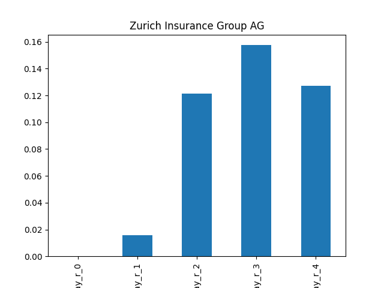
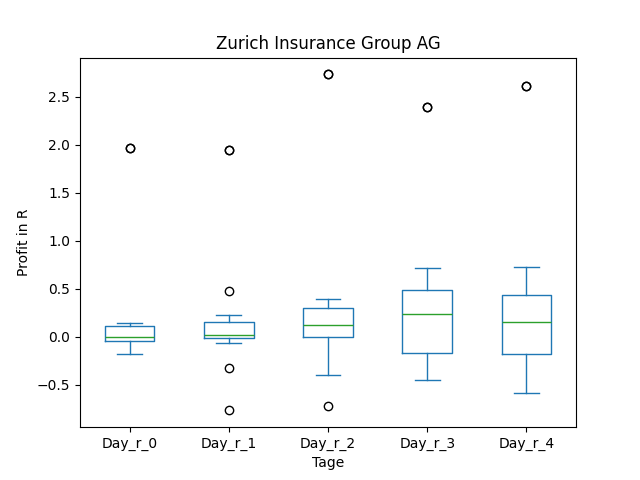
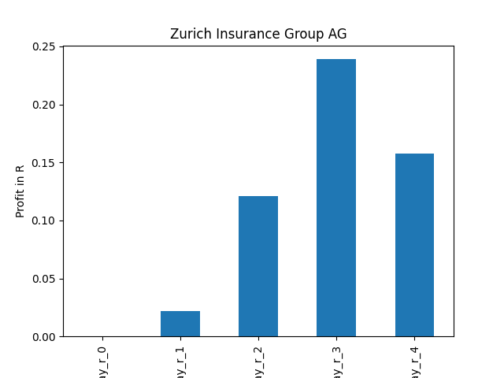
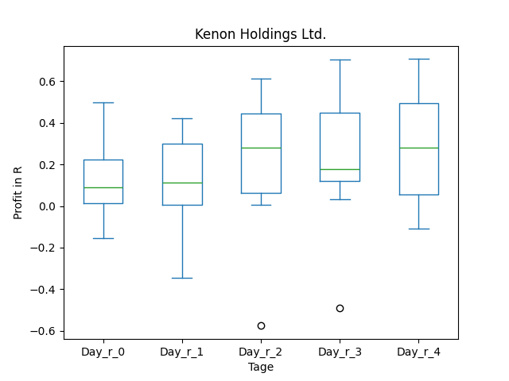
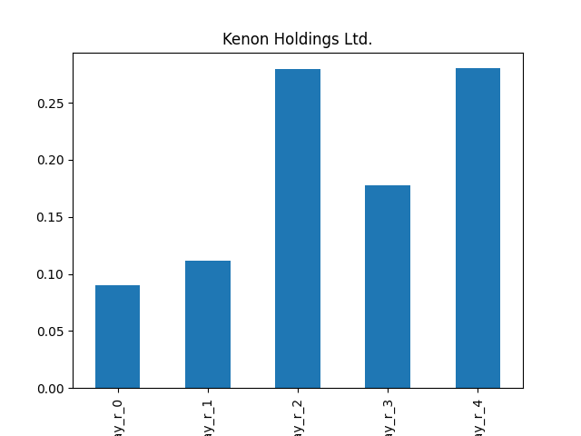
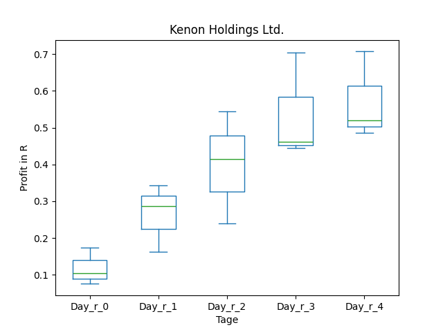
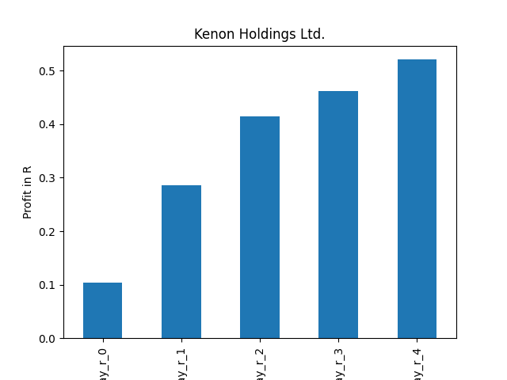
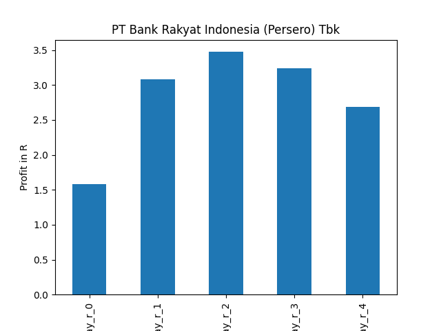

# dividend-shorter

bet on falling prices on payday **2025-04-14**.

## Signale

| Ticker   |   Divid Rate |   Close |   Volume |   last_close_volume |   Divid % | 5_Days_pos   | above_SMA_50   |
|:---------|-------------:|--------:|---------:|--------------------:|----------:|:-------------|:---------------|
| ZURVY    |         1.59 |   35    |    96100 |             3363500 |      4.54 | True         | True           |
| SIGCY    |         0.5  |   19.07 |    50000 |              953500 |      2.64 | True         | False          |
| LTM      |         0.97 |   29.23 |   559000 |            16339570 |      3.32 | True         | False          |
| KEN      |         4.8  |   34.85 |   140200 |             4885970 |     13.77 | True         | True           |
| BKRKY    |         0.63 |   11.49 |   211100 |             2425539 |      5.47 | True         | False          |

## ZURVY

### Erwartung in R
|      |   Day_r_0 |   Day_r_1 |   Day_r_2 |   Day_r_3 |   Day_r_4 |   Treffer |
|:-----|----------:|----------:|----------:|----------:|----------:|----------:|
| ohne |         0 |         0 |       0.1 |       0.2 |       0.1 |        17 |
| mit  |         0 |         0 |       0.1 |       0.2 |       0.2 |        15 |

### Ohne Filter

### Mit Filter

## SIGCY

### Erwartung in R
|      |   Day_r_0 |   Day_r_1 |   Day_r_2 |   Day_r_3 |   Day_r_4 |   Treffer |
|:-----|----------:|----------:|----------:|----------:|----------:|----------:|
| ohne |       nan |       nan |       nan |       nan |       nan |         0 |
| mit  |       nan |       nan |       nan |       nan |       nan |         0 |

### Ohne Filter

### Mit Filter

## LTM

### Erwartung in R
|      |   Day_r_0 |   Day_r_1 |   Day_r_2 |   Day_r_3 |   Day_r_4 |   Treffer |
|:-----|----------:|----------:|----------:|----------:|----------:|----------:|
| ohne |       nan |       nan |       nan |       nan |       nan |         0 |
| mit  |       nan |       nan |       nan |       nan |       nan |         0 |

### Ohne Filter

### Mit Filter

## KEN

### Erwartung in R
|      |   Day_r_0 |   Day_r_1 |   Day_r_2 |   Day_r_3 |   Day_r_4 |   Treffer |
|:-----|----------:|----------:|----------:|----------:|----------:|----------:|
| ohne |       0.1 |       0.1 |       0.3 |       0.2 |       0.3 |         8 |
| mit  |       0.1 |       0.3 |       0.4 |       0.5 |       0.5 |         3 |

### Ohne Filter

### Mit Filter

## BKRKY

### Erwartung in R
|      |   Day_r_0 |   Day_r_1 |   Day_r_2 |   Day_r_3 |   Day_r_4 |   Treffer |
|:-----|----------:|----------:|----------:|----------:|----------:|----------:|
| ohne |      -0.2 |       0   |       0   |      -0.2 |      -0.1 |        16 |
| mit  |       1.6 |       3.1 |       3.5 |       3.2 |       2.7 |         1 |

### Ohne Filter

### Mit Filter

