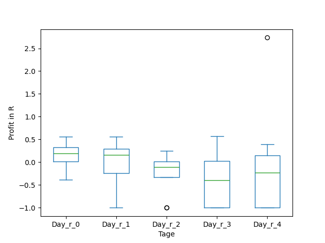
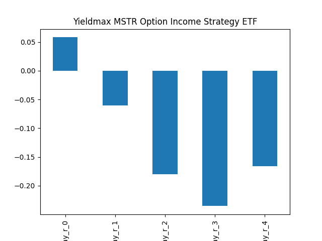
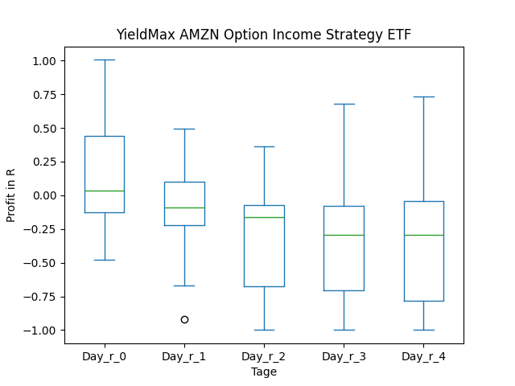
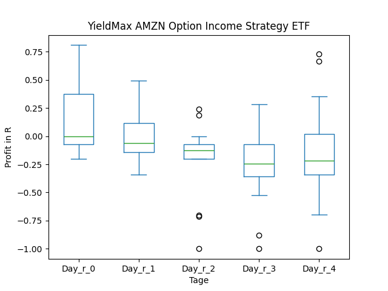
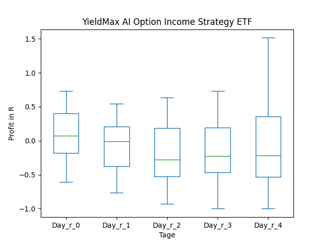

# dividend-shorter

bet on falling prices on payday **2025-02-13**.

## Signale

| Ticker   |   Divid Rate |   Close |          Volume |   last_close_volume |   Divid % | 5_Days_pos   | above_SMA_50   |
|:---------|-------------:|--------:|----------------:|--------------------:|----------:|:-------------|:---------------|
| SQY      |         0.58 |   16.85 | 133200          |             2244420 |      3.47 | False        | False          |
| SMCY     |         2.09 |   28.14 | 796300          |            22407882 |      7.43 | True         | True           |
| MSTY     |         2.02 |   26.86 |      7.8961e+06 |           212089246 |      7.53 | True         | False          |
| DISO     |         0.46 |   16.36 |  13500          |              220860 |      2.8  | False        | False          |
| AMZY     |         0.55 |   19.4  | 313500          |             6081900 |      2.82 | False        | False          |
| AIYY     |         0.37 |    7.64 | 766200          |             5853768 |      4.86 | False        | False          |

## SQY

### Erwartung in R
|      |   Day_r_0 |   Day_r_1 |   Day_r_2 |   Day_r_3 |   Day_r_4 |   Treffer |
|:-----|----------:|----------:|----------:|----------:|----------:|----------:|
| ohne |      -0.1 |      -0.2 |      -0.1 |      -0.2 |      -0.2 |        15 |
| mit  |      -0   |      -0.2 |      -0.2 |      -0.1 |      -0.1 |         6 |

### Ohne Filter

### Mit Filter

## SMCY

### Erwartung in R
|      |   Day_r_0 |   Day_r_1 |   Day_r_2 |   Day_r_3 |   Day_r_4 |   Treffer |
|:-----|----------:|----------:|----------:|----------:|----------:|----------:|
| ohne |       0.1 |        -0 |      -0.2 |      -0.5 |      -0.4 |         4 |
| mit  |       0.1 |        -0 |      -0.2 |      -0.5 |      -0.4 |         4 |

### Ohne Filter

### Mit Filter

## MSTY

### Erwartung in R
|      |   Day_r_0 |   Day_r_1 |   Day_r_2 |   Day_r_3 |   Day_r_4 |   Treffer |
|:-----|----------:|----------:|----------:|----------:|----------:|----------:|
| ohne |       0.2 |         0 |       0.1 |      -0.1 |       0.2 |        10 |
| mit  |       0.2 |         0 |       0.1 |      -0.1 |       0.2 |        10 |

### Ohne Filter

### Mit Filter

## DISO

### Erwartung in R
|      |   Day_r_0 |   Day_r_1 |   Day_r_2 |   Day_r_3 |   Day_r_4 |   Treffer |
|:-----|----------:|----------:|----------:|----------:|----------:|----------:|
| ohne |       0.3 |       0.1 |       0.2 |       0.2 |      -0   |        16 |
| mit  |      -0.3 |       3   |       2.9 |       2.7 |       2.9 |         1 |

### Ohne Filter

### Mit Filter

## AMZY

### Erwartung in R
|      |   Day_r_0 |   Day_r_1 |   Day_r_2 |   Day_r_3 |   Day_r_4 |   Treffer |
|:-----|----------:|----------:|----------:|----------:|----------:|----------:|
| ohne |         0 |      -0.1 |      -0.2 |      -0.3 |      -0.3 |        17 |
| mit  |         0 |      -0   |      -0.1 |      -0.2 |      -0.2 |         9 |

### Ohne Filter

### Mit Filter

## AIYY

### Erwartung in R
|      |   Day_r_0 |   Day_r_1 |   Day_r_2 |   Day_r_3 |   Day_r_4 |   Treffer |
|:-----|----------:|----------:|----------:|----------:|----------:|----------:|
| ohne |       0.1 |      -0   |      -0.3 |      -0.2 |      -0.2 |        13 |
| mit  |       0.1 |       0.1 |      -0.3 |      -0.2 |      -0.2 |         8 |

### Ohne Filter

### Mit Filter

