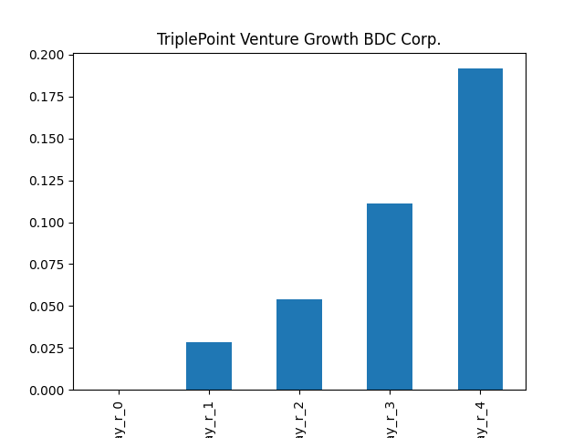
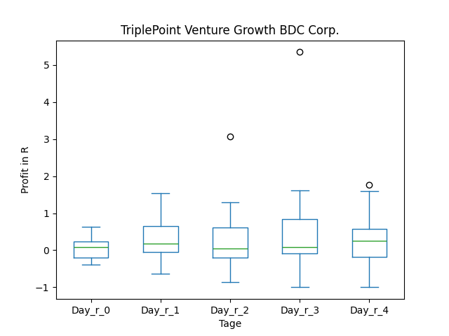
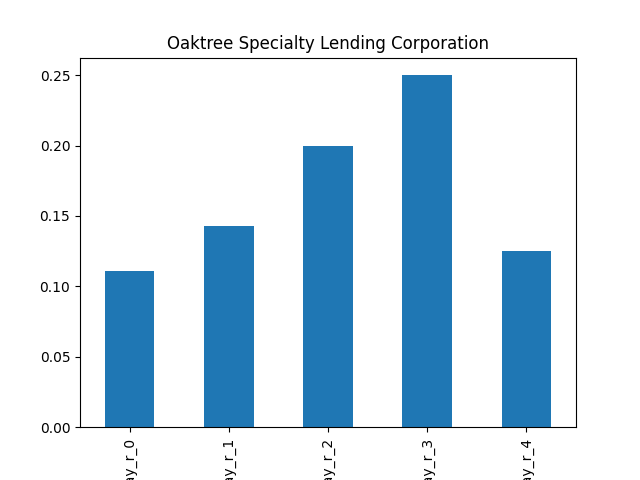
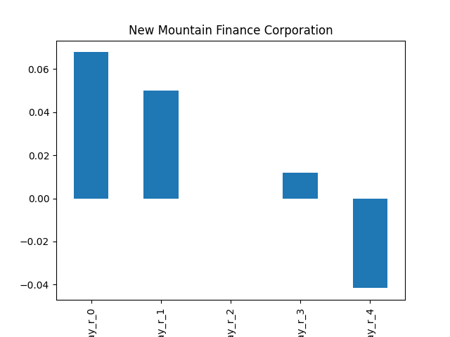
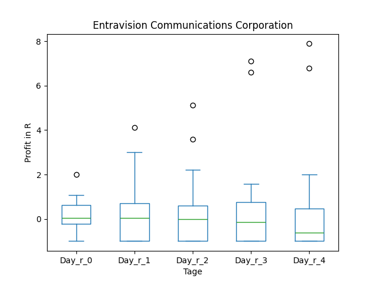
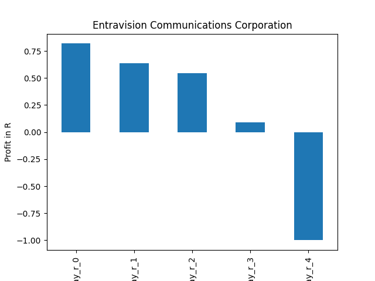

# dividend-shorter

bet on falling prices on payday **2025-03-17**.

## Signale

| Ticker   |   Divid Rate |   Close |          Volume |   last_close_volume |   Divid % | 5_Days_pos   | above_SMA_50   |
|:---------|-------------:|--------:|----------------:|--------------------:|----------:|:-------------|:---------------|
| TPVG     |         0.3  |    7.38 | 599800          |             4426524 |      4.07 | False        | False          |
| TCPC     |         0.25 |    8.08 | 927600          |             7495008 |      3.09 | False        | False          |
| SACH     |         0.05 |    1.28 | 671400          |              859392 |      3.91 | True         | True           |
| OCSL     |         0.4  |   15.75 |      1.0759e+06 |            16945425 |      2.54 | False        | True           |
| NMFC     |         0.32 |   11.16 | 832500          |             9290700 |      2.87 | False        | False          |
| MCN      |         0.18 |    6.28 |  38600          |              242408 |      2.87 | False        | False          |
| KMDA     |         0.2  |    7.18 |  72400          |              519832 |      2.79 | True         | True           |
| GHLD     |         0.5  |   13.16 |   8900          |              117124 |      3.8  | False        | True           |
| GGT      |         0.22 |    4.9  | 261900          |             1283310 |      4.49 | True         | True           |
| GECC     |         0.37 |   10.88 |  66100          |              719168 |      3.4  | True         | True           |
| GAB      |         0.15 |    5.49 | 528000          |             2898720 |      2.73 | True         | False          |
| EVC      |         0.05 |    1.97 | 320800          |              631976 |      2.54 | True         | False          |
| BCSF     |         0.42 |   16.67 | 612000          |            10202040 |      2.52 | False        | False          |

## TPVG

### Erwartung in R
|      |   Day_r_0 |   Day_r_1 |   Day_r_2 |   Day_r_3 |   Day_r_4 |   Treffer |
|:-----|----------:|----------:|----------:|----------:|----------:|----------:|
| ohne |       0   |       0   |       0.1 |       0.1 |       0.2 |        47 |
| mit  |       0.1 |       0.2 |       0.1 |       0.1 |       0.2 |        17 |

### Ohne Filter

### Mit Filter

## TCPC

### Erwartung in R
|      |   Day_r_0 |   Day_r_1 |   Day_r_2 |   Day_r_3 |   Day_r_4 |   Treffer |
|:-----|----------:|----------:|----------:|----------:|----------:|----------:|
| ohne |      -0.1 |       0   |       0   |      -0   |       0   |        60 |
| mit  |      -0.1 |       0.1 |       0.3 |       0.2 |       0.4 |         9 |

### Ohne Filter

### Mit Filter

## SACH

### Erwartung in R
|      |   Day_r_0 |   Day_r_1 |   Day_r_2 |   Day_r_3 |   Day_r_4 |   Treffer |
|:-----|----------:|----------:|----------:|----------:|----------:|----------:|
| ohne |       0.3 |       0.5 |       0.8 |       0.9 |       0.8 |        30 |
| mit  |       0.8 |       1.1 |       1.3 |       1.3 |       1.1 |         7 |

### Ohne Filter

### Mit Filter

## OCSL

### Erwartung in R
|      |   Day_r_0 |   Day_r_1 |   Day_r_2 |   Day_r_3 |   Day_r_4 |   Treffer |
|:-----|----------:|----------:|----------:|----------:|----------:|----------:|
| ohne |       0.1 |       0.1 |       0.2 |       0.2 |       0.1 |        95 |
| mit  |       0   |       0.1 |       0.1 |       0.1 |       0.2 |         5 |

### Ohne Filter

### Mit Filter

## NMFC

### Erwartung in R
|      |   Day_r_0 |   Day_r_1 |   Day_r_2 |   Day_r_3 |   Day_r_4 |   Treffer |
|:-----|----------:|----------:|----------:|----------:|----------:|----------:|
| ohne |       0.1 |         0 |         0 |       0   |      -0   |        67 |
| mit  |       0.3 |         0 |         2 |       2.2 |       3.1 |         3 |

### Ohne Filter

### Mit Filter

## MCN

### Erwartung in R
|      |   Day_r_0 |   Day_r_1 |   Day_r_2 |   Day_r_3 |   Day_r_4 |   Treffer |
|:-----|----------:|----------:|----------:|----------:|----------:|----------:|
| ohne |       0.1 |       0.2 |       0.2 |       0.2 |       0.3 |        66 |
| mit  |       0   |       0.9 |       1   |       1.4 |       2.1 |         1 |

### Ohne Filter

### Mit Filter

## KMDA

### Erwartung in R
|      |   Day_r_0 |   Day_r_1 |   Day_r_2 |   Day_r_3 |   Day_r_4 |   Treffer |
|:-----|----------:|----------:|----------:|----------:|----------:|----------:|
| ohne |       nan |       nan |       nan |       nan |       nan |         0 |
| mit  |       nan |       nan |       nan |       nan |       nan |         0 |

### Ohne Filter

### Mit Filter

## GHLD

### Erwartung in R
|      |   Day_r_0 |   Day_r_1 |   Day_r_2 |   Day_r_3 |   Day_r_4 |   Treffer |
|:-----|----------:|----------:|----------:|----------:|----------:|----------:|
| ohne |      -0.2 |        -0 |         0 |      -0.1 |        -0 |         3 |
| mit  |     nan   |       nan |       nan |     nan   |       nan |         0 |

### Ohne Filter

### Mit Filter

## GGT

### Erwartung in R
|      |   Day_r_0 |   Day_r_1 |   Day_r_2 |   Day_r_3 |   Day_r_4 |   Treffer |
|:-----|----------:|----------:|----------:|----------:|----------:|----------:|
| ohne |       0.1 |       0.3 |       0.4 |       0.5 |       0.2 |        61 |
| mit  |       0.9 |       1.5 |       0.8 |       0.5 |       0.5 |         3 |

### Ohne Filter

### Mit Filter

## GECC

### Erwartung in R
|      |   Day_r_0 |   Day_r_1 |   Day_r_2 |   Day_r_3 |   Day_r_4 |   Treffer |
|:-----|----------:|----------:|----------:|----------:|----------:|----------:|
| ohne |       0.2 |       0.4 |       0.7 |       0.6 |       0.6 |        68 |
| mit  |     nan   |     nan   |     nan   |     nan   |     nan   |         0 |

### Ohne Filter

### Mit Filter

## GAB

### Erwartung in R
|      |   Day_r_0 |   Day_r_1 |   Day_r_2 |   Day_r_3 |   Day_r_4 |   Treffer |
|:-----|----------:|----------:|----------:|----------:|----------:|----------:|
| ohne |       0.3 |       0.3 |       0.4 |       0.4 |       0.2 |        66 |
| mit  |       0.4 |       0.4 |       0.7 |       0.8 |       0.4 |        15 |

### Ohne Filter

### Mit Filter

## EVC

### Erwartung in R
|      |   Day_r_0 |   Day_r_1 |   Day_r_2 |   Day_r_3 |   Day_r_4 |   Treffer |
|:-----|----------:|----------:|----------:|----------:|----------:|----------:|
| ohne |       0   |       0.1 |       0   |      -0.2 |      -0.6 |        48 |
| mit  |       0.8 |       0.6 |       0.5 |       0.1 |      -1   |         1 |

### Ohne Filter

### Mit Filter

## BCSF

### Erwartung in R
|      |   Day_r_0 |   Day_r_1 |   Day_r_2 |   Day_r_3 |   Day_r_4 |   Treffer |
|:-----|----------:|----------:|----------:|----------:|----------:|----------:|
| ohne |         0 |       0.1 |       0   |       0   |      -0.2 |        29 |
| mit  |         0 |       0.1 |      -0.1 |      -0.1 |       0.1 |         6 |

### Ohne Filter

### Mit Filter

