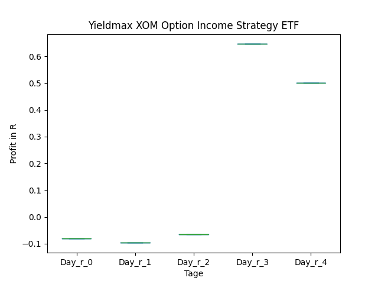
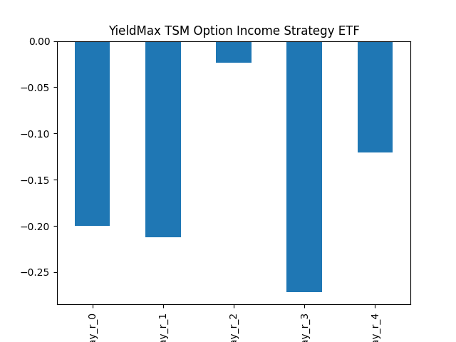
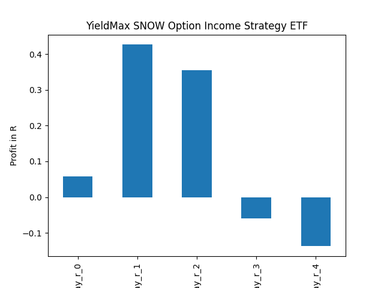
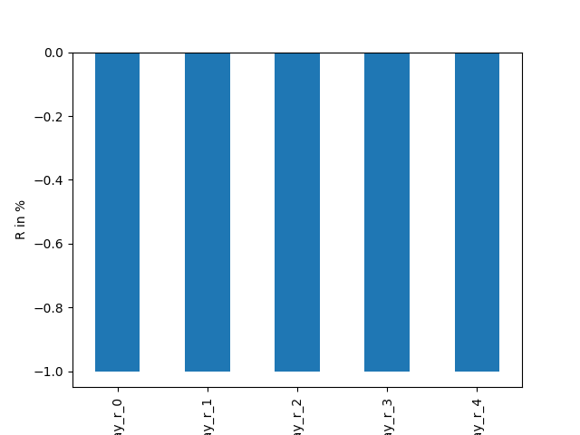
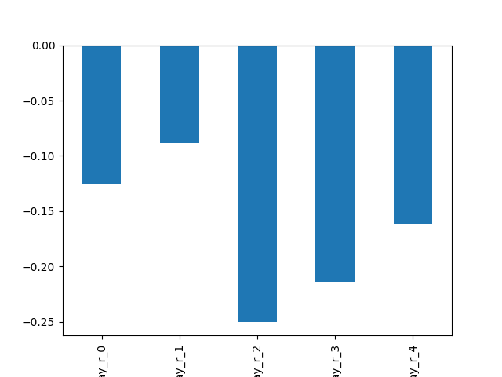
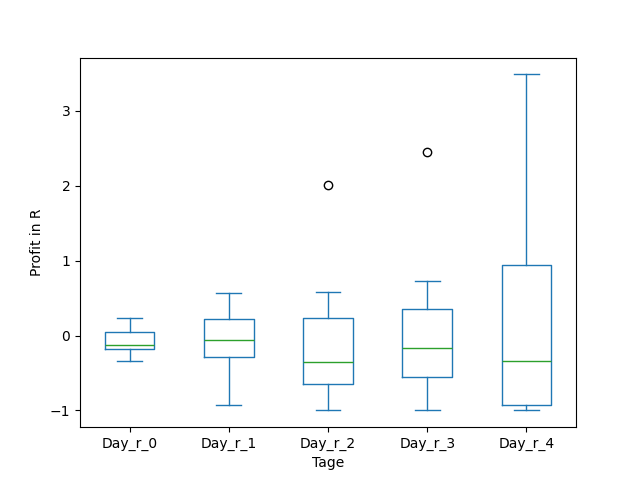

# dividend-shorter

bet on falling prices on payday

## Signale

| Ticker   |   Divid Rate |   Close |          Volume |   last_close_volume |   Divid % | 5_Days_pos   | above_SMA_50   |
|:---------|-------------:|--------:|----------------:|--------------------:|----------:|:-------------|:---------------|
| YBIT     |         1.26 |   15.12 |      1.0558e+06 |            15963696 |      8.36 | False        | True           |
| XOMO     |         0.51 |   16.55 |  84100          |             1391855 |      3.08 | False        | False          |
| VDMCY    |         0.16 |    5.8  |  18900          |              109620 |      2.82 | True         | False          |
| TSMY     |         0.54 |   19.06 | 139100          |             2651246 |      2.82 | False        | False          |
| TSLY     |         1.22 |   15.22 |      4.495e+06  |            68413900 |      8.02 | False        | True           |
| SNOY     |         1.71 |   22.12 | 424700          |             9394364 |      7.72 | True         | True           |
| SID      |         0.1  |    2    |      1.7232e+06 |             3446400 |      4.76 | True         | False          |
| QVCD     |         0.4  |   13.05 |  14300          |              186615 |      3.05 | False        | False          |
| QVCC     |         0.39 |   12.96 |  18200          |              235872 |      3.01 | False        | False          |
| PTALF    |         0.02 |    0.45 | 401400          |              180630 |      3.33 | True         | False          |
| OARK     |         0.47 |   11    | 156300          |             1719300 |      4.27 | True         | True           |
| IIIN     |         1    |   30.31 | 108900          |             3300759 |      3.3  | True         | True           |
| CRSH     |         0.38 |    8.33 | 275100          |             2291583 |      4.51 | True         | False          |

## YBIT

### Erwartung in R
|      |   Day_r_0 |   Day_r_1 |   Day_r_2 |   Day_r_3 |   Day_r_4 |   Treffer |
|:-----|----------:|----------:|----------:|----------:|----------:|----------:|
| ohne |       0.3 |       0.1 |         0 |       0.1 |         0 |         6 |
| mit  |       0.3 |       0.1 |         0 |       0.1 |         0 |         6 |

### Ohne Filter

### Mit Filter

## XOMO

### Erwartung in R
|      |   Day_r_0 |   Day_r_1 |   Day_r_2 |   Day_r_3 |   Day_r_4 |   Treffer |
|:-----|----------:|----------:|----------:|----------:|----------:|----------:|
| ohne |       0.1 |      -0.1 |       0.1 |      -0.1 |      -0.1 |        14 |
| mit  |     nan   |     nan   |     nan   |     nan   |     nan   |         0 |

### Ohne Filter

### Mit Filter

## VDMCY

### Erwartung in R
|      |   Day_r_0 |   Day_r_1 |   Day_r_2 |   Day_r_3 |   Day_r_4 |   Treffer |
|:-----|----------:|----------:|----------:|----------:|----------:|----------:|
| ohne |         0 |        -0 |       0.2 |       0.2 |      -0.1 |        25 |
| mit  |       nan |       nan |     nan   |     nan   |     nan   |         0 |

### Ohne Filter

### Mit Filter

## TSMY

### Erwartung in R
|      |   Day_r_0 |   Day_r_1 |   Day_r_2 |   Day_r_3 |   Day_r_4 |   Treffer |
|:-----|----------:|----------:|----------:|----------:|----------:|----------:|
| ohne |      -0.2 |      -0.2 |      -0.5 |      -0.6 |      -0.6 |         2 |
| mit  |       0.1 |      -0   |      -0   |      -0.3 |      -0.1 |         1 |

### Ohne Filter

### Mit Filter

## TSLY

### Erwartung in R
|      |   Day_r_0 |   Day_r_1 |   Day_r_2 |   Day_r_3 |   Day_r_4 |   Treffer |
|:-----|----------:|----------:|----------:|----------:|----------:|----------:|
| ohne |       0   |      -0   |       0   |       0.1 |      -0.1 |        23 |
| mit  |       0.2 |       0.3 |       0.2 |       0.2 |      -0   |        10 |

### Ohne Filter

### Mit Filter

## SNOY

### Erwartung in R
|      |   Day_r_0 |   Day_r_1 |   Day_r_2 |   Day_r_3 |   Day_r_4 |   Treffer |
|:-----|----------:|----------:|----------:|----------:|----------:|----------:|
| ohne |       0.4 |       0.2 |       0.1 |      -0.1 |      -0.5 |         5 |
| mit  |     nan   |     nan   |     nan   |     nan   |     nan   |         0 |

### Ohne Filter

### Mit Filter

## SID

### Erwartung in R
|      |   Day_r_0 |   Day_r_1 |   Day_r_2 |   Day_r_3 |   Day_r_4 |   Treffer |
|:-----|----------:|----------:|----------:|----------:|----------:|----------:|
| ohne |       0   |       0   |       0.1 |         0 |       0.1 |        45 |
| mit  |       0.1 |       0.1 |       0.1 |         0 |       0.3 |        27 |

### Ohne Filter

### Mit Filter

## QVCD

### Erwartung in R
|      |   Day_r_0 |   Day_r_1 |   Day_r_2 |   Day_r_3 |   Day_r_4 |   Treffer |
|:-----|----------:|----------:|----------:|----------:|----------:|----------:|
| ohne |      -0.1 |      -0.1 |      -0.4 |      -0.5 |      -0.4 |        24 |
| mit  |     nan   |     nan   |     nan   |     nan   |     nan   |         0 |

### Ohne Filter

### Mit Filter

## QVCC

### Erwartung in R
|      |   Day_r_0 |   Day_r_1 |   Day_r_2 |   Day_r_3 |   Day_r_4 |   Treffer |
|:-----|----------:|----------:|----------:|----------:|----------:|----------:|
| ohne |      -0.2 |      -0.3 |      -0.3 |      -0.2 |      -0.2 |        19 |
| mit  |      -1   |      -1   |      -1   |      -1   |      -1   |         1 |

### Ohne Filter

### Mit Filter

## PTALF

### Erwartung in R
|      |   Day_r_0 |   Day_r_1 |   Day_r_2 |   Day_r_3 |   Day_r_4 |   Treffer |
|:-----|----------:|----------:|----------:|----------:|----------:|----------:|
| ohne |       0.2 |         0 |        -1 |        -1 |        -1 |         7 |
| mit  |     nan   |       nan |       nan |       nan |       nan |         0 |

### Ohne Filter

### Mit Filter

## OARK

### Erwartung in R
|      |   Day_r_0 |   Day_r_1 |   Day_r_2 |   Day_r_3 |   Day_r_4 |   Treffer |
|:-----|----------:|----------:|----------:|----------:|----------:|----------:|
| ohne |       0.1 |      -0.1 |      -0.1 |      -0.3 |      -0.4 |        23 |
| mit  |       0.1 |       0.4 |       0.4 |       0.2 |      -0.3 |         9 |

### Ohne Filter

### Mit Filter

## IIIN

### Erwartung in R
|      |   Day_r_0 |   Day_r_1 |   Day_r_2 |   Day_r_3 |   Day_r_4 |   Treffer |
|:-----|----------:|----------:|----------:|----------:|----------:|----------:|
| ohne |       0   |      -0.3 |      -0.1 |      -0.4 |      -0.6 |        87 |
| mit  |       0.5 |      -0   |       0.1 |       0.3 |       0.3 |         8 |

### Ohne Filter

### Mit Filter

## CRSH

### Erwartung in R
|      |   Day_r_0 |   Day_r_1 |   Day_r_2 |   Day_r_3 |   Day_r_4 |   Treffer |
|:-----|----------:|----------:|----------:|----------:|----------:|----------:|
| ohne |      -0.2 |      -0.1 |      -0.2 |      -0.2 |      -0.1 |         6 |
| mit  |      -0.1 |      -0   |      -0.2 |      -0.1 |      -0.3 |         3 |

### Ohne Filter

### Mit Filter

