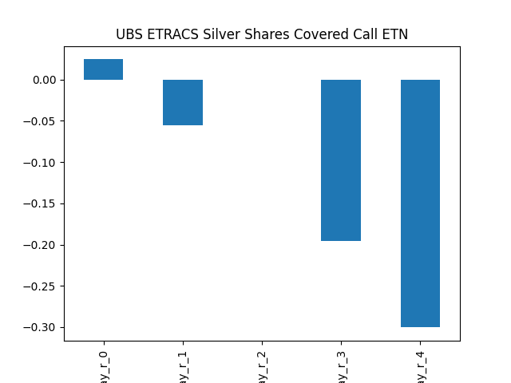

# dividend-shorter

bet on falling prices on payday **2026-01-21**.

## Signale

| Ticker   |   Divid Rate |   Close |   Volume |   last_close_volume |   Divid % | 5_Days_pos   | above_SMA_50   |
|:---------|-------------:|--------:|---------:|--------------------:|----------:|:-------------|:---------------|
| SLVO     |         5.79 |  107.41 |   246900 |            26519529 |      5.39 | True         | True           |

## SLVO

### Erwartung in R
|      |   Day_r_0 |   Day_r_1 |   Day_r_2 |   Day_r_3 |   Day_r_4 |   Treffer |
|:-----|----------:|----------:|----------:|----------:|----------:|----------:|
| ohne |       0   |       0   |       0   |      -0.2 |      -0.3 |       151 |
| mit  |       0.2 |       0.4 |      -0.1 |      -0.1 |      -0.5 |         1 |

### Ohne Filter

### Mit Filter

