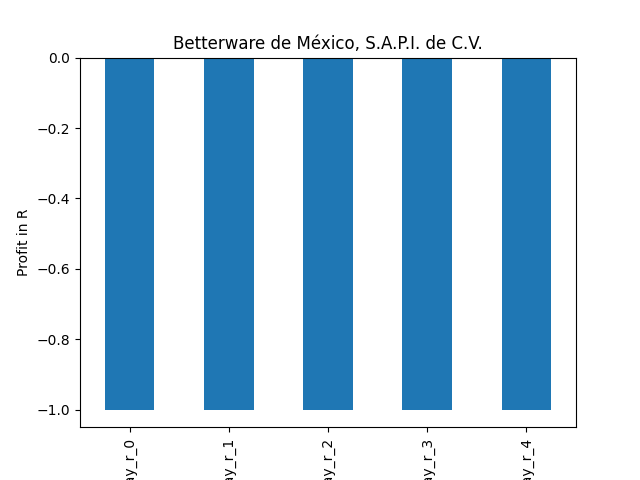

# dividend-shorter

bet on falling prices on payday **2025-03-18**.

## Signale

| Ticker   |   Divid Rate |   Close |   Volume |   last_close_volume |   Divid % | 5_Days_pos   | above_SMA_50   |
|:---------|-------------:|--------:|---------:|--------------------:|----------:|:-------------|:---------------|
| UNTC     |         1.25 |   29.13 |    31200 |              908856 |      4.29 | True         | True           |
| KRP      |         0.4  |   14.28 |   855400 |            12215112 |      2.8  | True         | False          |
| BWMX     |         0.32 |   12.13 |    52200 |              633186 |      2.65 | True         | True           |

## UNTC

### Erwartung in R
|      |   Day_r_0 |   Day_r_1 |   Day_r_2 |   Day_r_3 |   Day_r_4 |   Treffer |
|:-----|----------:|----------:|----------:|----------:|----------:|----------:|
| ohne |       0.3 |       0.3 |       0.5 |       0.5 |       0.4 |         3 |
| mit  |       0.1 |       0.5 |       0.4 |       0.1 |       0.4 |         1 |

### Ohne Filter

### Mit Filter

## KRP

### Erwartung in R
|      |   Day_r_0 |   Day_r_1 |   Day_r_2 |   Day_r_3 |   Day_r_4 |   Treffer |
|:-----|----------:|----------:|----------:|----------:|----------:|----------:|
| ohne |       0   |       0.1 |       0.2 |       0   |      -0.2 |        31 |
| mit  |      -0.1 |      -0.2 |      -0   |      -0.4 |      -0.4 |         6 |

### Ohne Filter

### Mit Filter

## BWMX

### Erwartung in R
|      |   Day_r_0 |   Day_r_1 |   Day_r_2 |   Day_r_3 |   Day_r_4 |   Treffer |
|:-----|----------:|----------:|----------:|----------:|----------:|----------:|
| ohne |         0 |      -0.5 |      -0.4 |      -0.2 |      -0.2 |        19 |
| mit  |        -1 |      -1   |      -1   |      -1   |      -1   |         1 |

### Ohne Filter

### Mit Filter

