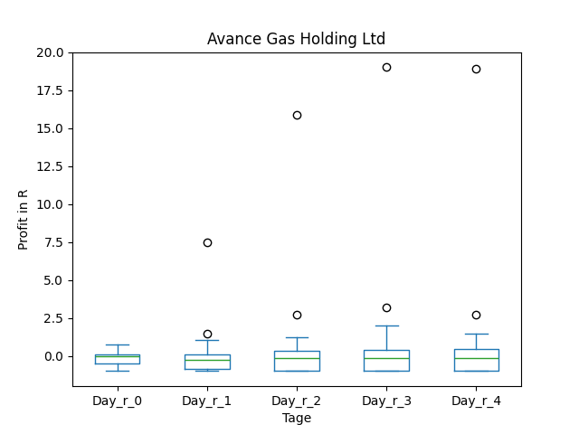

# dividend-shorter

bet on falling prices on payday **2025-02-18**.

## Signale

| Ticker   |   Divid Rate |   Close |   Volume |   last_close_volume |   Divid % | 5_Days_pos   | above_SMA_50   |
|:---------|-------------:|--------:|---------:|--------------------:|----------:|:-------------|:---------------|
| NHTC     |         0.2  |    5.27 |    88400 |              465868 |      3.8  | True         | True           |
| CVHSY    |         0.26 |    6.26 |    34500 |              215970 |      4.2  | True         | False          |
| AVACF    |         2    |    7.64 |    88300 |              674612 |     26.18 | True         | True           |
| AB       |         1.05 |   37.08 |   764300 |            28340244 |      2.83 | True         | False          |

## NHTC

### Erwartung in R
|      |   Day_r_0 |   Day_r_1 |   Day_r_2 |   Day_r_3 |   Day_r_4 |   Treffer |
|:-----|----------:|----------:|----------:|----------:|----------:|----------:|
| ohne |      -0   |       0.1 |       0   |       0.1 |       0.1 |        51 |
| mit  |      -0.1 |      -0.2 |      -0.1 |      -0.2 |      -0.2 |         1 |

### Ohne Filter

### Mit Filter

## CVHSY

### Erwartung in R
|      |   Day_r_0 |   Day_r_1 |   Day_r_2 |   Day_r_3 |   Day_r_4 |   Treffer |
|:-----|----------:|----------:|----------:|----------:|----------:|----------:|
| ohne |        -1 |        -1 |        -1 |        -1 |        -1 |         5 |
| mit  |       nan |       nan |       nan |       nan |       nan |         0 |

### Ohne Filter

### Mit Filter

## AVACF

### Erwartung in R
|      |   Day_r_0 |   Day_r_1 |   Day_r_2 |   Day_r_3 |   Day_r_4 |   Treffer |
|:-----|----------:|----------:|----------:|----------:|----------:|----------:|
| ohne |        -0 |      -0.3 |      -0.2 |      -0.1 |      -0.3 |        20 |
| mit  |       nan |     nan   |     nan   |     nan   |     nan   |         0 |

### Ohne Filter

### Mit Filter

## AB

### Erwartung in R
|      |   Day_r_0 |   Day_r_1 |   Day_r_2 |   Day_r_3 |   Day_r_4 |   Treffer |
|:-----|----------:|----------:|----------:|----------:|----------:|----------:|
| ohne |       0   |       0.1 |       0.2 |       0.4 |       0.2 |        65 |
| mit  |      -0.2 |       0.1 |       0.6 |       0.6 |       0.2 |         4 |

### Ohne Filter

### Mit Filter

