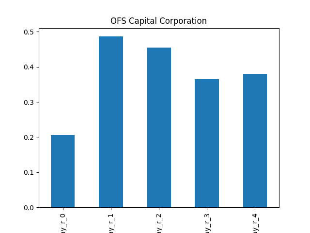

# dividend-shorter

bet on falling prices on payday **2025-09-19**.

## Signale

| Ticker   |   Divid Rate |   Close |   Volume |   last_close_volume |   Divid % | 5_Days_pos   | above_SMA_50   |
|:---------|-------------:|--------:|---------:|--------------------:|----------:|:-------------|:---------------|
| WHF      |         0.38 |    8.81 |   425500 |             3748655 |      4.37 | True         | True           |
| OFS      |         0.34 |    8.67 |   202600 |             1756542 |      3.92 | False        | True           |
| NTIP     |         0.05 |    1.67 |   176100 |              294087 |      2.99 | True         | True           |
| GNTY     |         2.3  |   52.33 |    51600 |             2700228 |      4.4  | True         | True           |

## WHF

### Erwartung in R
|      |   Day_r_0 |   Day_r_1 |   Day_r_2 |   Day_r_3 |   Day_r_4 |   Treffer |
|:-----|----------:|----------:|----------:|----------:|----------:|----------:|
| ohne |       0.1 |       0.3 |       0.4 |       0.5 |       0.4 |        57 |
| mit  |       0.1 |       0.4 |       0.6 |       0.6 |       0.6 |        10 |

### Ohne Filter

### Mit Filter

## OFS

### Erwartung in R
|      |   Day_r_0 |   Day_r_1 |   Day_r_2 |   Day_r_3 |   Day_r_4 |   Treffer |
|:-----|----------:|----------:|----------:|----------:|----------:|----------:|
| ohne |       0.2 |       0.5 |       0.5 |       0.4 |       0.4 |        51 |
| mit  |       0.6 |       1.1 |       1.3 |       1.6 |       1.6 |         7 |

### Ohne Filter

### Mit Filter

## NTIP

### Erwartung in R
|      |   Day_r_0 |   Day_r_1 |   Day_r_2 |   Day_r_3 |   Day_r_4 |   Treffer |
|:-----|----------:|----------:|----------:|----------:|----------:|----------:|
| ohne |         0 |       0.1 |       0.3 |         0 |       0.3 |        18 |
| mit  |       nan |     nan   |     nan   |       nan |     nan   |         0 |

### Ohne Filter

### Mit Filter

## GNTY

### Erwartung in R
|      |   Day_r_0 |   Day_r_1 |   Day_r_2 |   Day_r_3 |   Day_r_4 |   Treffer |
|:-----|----------:|----------:|----------:|----------:|----------:|----------:|
| ohne |       0.1 |       0.4 |      -0.2 |      -0.3 |      -0.6 |        33 |
| mit  |     nan   |     nan   |     nan   |     nan   |     nan   |         0 |

### Ohne Filter

### Mit Filter

