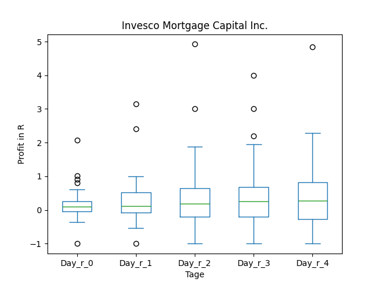
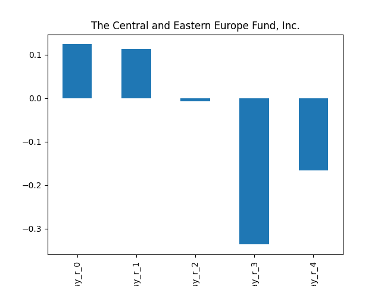
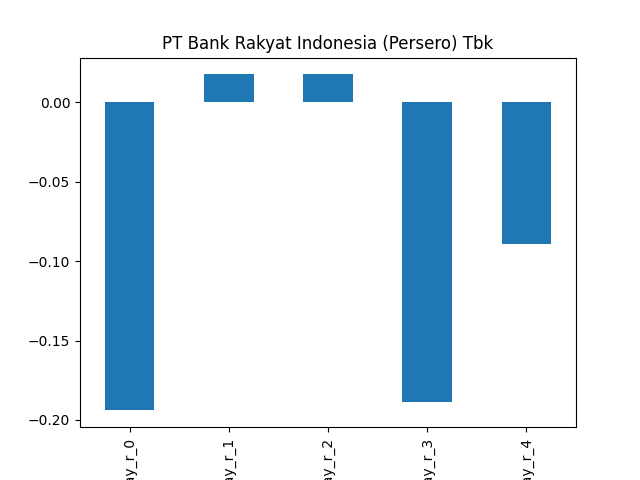
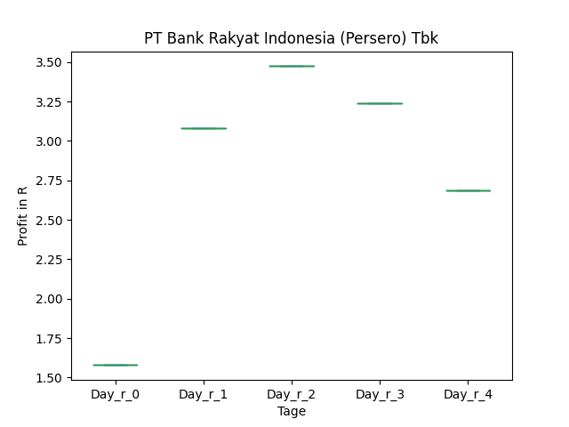

# dividend-shorter

bet on falling prices on payday **2024-12-30**.

## Signale

| Ticker   |   Divid Rate |   Close |         Volume |   last_close_volume |   Divid % | 5_Days_pos   | above_SMA_50   |
|:---------|-------------:|--------:|---------------:|--------------------:|----------:|:-------------|:---------------|
| YETH     |         2.58 |   53.08 |  45100         |             2393908 |      4.85 | False        | True           |
| YBTC     |         1.63 |   51.99 |  80800         |             4200792 |      3.14 | False        | True           |
| IVR      |         0.4  |    8.23 |      2.819e+06 |            23200370 |      4.86 | False        | False          |
| CIB      |         0.8  |   32.05 | 162800         |             5217740 |      2.51 | False        | False          |
| CEE      |         0.35 |   11.59 |  20400         |              236436 |      3.05 | False        | True           |
| BNCC     |         4    |   35.45 |   3700         |              131165 |     11.28 | True         | True           |
| BKRKY    |         0.42 |   12.79 | 103600         |             1325044 |      3.28 | True         | False          |

## YETH

### Erwartung in R
|      |   Day_r_0 |   Day_r_1 |   Day_r_2 |   Day_r_3 |   Day_r_4 |   Treffer |
|:-----|----------:|----------:|----------:|----------:|----------:|----------:|
| ohne |        -0 |       0.6 |       0.6 |       1.1 |       1.1 |         3 |
| mit  |       nan |     nan   |     nan   |     nan   |     nan   |         0 |

### Ohne Filter

### Mit Filter

## YBTC

### Erwartung in R
|      |   Day_r_0 |   Day_r_1 |   Day_r_2 |   Day_r_3 |   Day_r_4 |   Treffer |
|:-----|----------:|----------:|----------:|----------:|----------:|----------:|
| ohne |       0.1 |       0.2 |       0   |       0.1 |       0.5 |        11 |
| mit  |       0.1 |       0.2 |       0.5 |       0.5 |       1.1 |         7 |

### Ohne Filter

### Mit Filter

## IVR

### Erwartung in R
|      |   Day_r_0 |   Day_r_1 |   Day_r_2 |   Day_r_3 |   Day_r_4 |   Treffer |
|:-----|----------:|----------:|----------:|----------:|----------:|----------:|
| ohne |       0.1 |       0.1 |       0.2 |       0.3 |       0.3 |        61 |
| mit  |       0.2 |       0.4 |       0.1 |       0.3 |       0.4 |        10 |

### Ohne Filter

### Mit Filter

## CIB

### Erwartung in R
|      |   Day_r_0 |   Day_r_1 |   Day_r_2 |   Day_r_3 |   Day_r_4 |   Treffer |
|:-----|----------:|----------:|----------:|----------:|----------:|----------:|
| ohne |      -0.1 |      -0.5 |      -0.4 |      -1   |      -1   |        87 |
| mit  |      -0.3 |      -0.7 |      -0.2 |       0.2 |       1.1 |         3 |

### Ohne Filter

### Mit Filter

## CEE

### Erwartung in R
|      |   Day_r_0 |   Day_r_1 |   Day_r_2 |   Day_r_3 |   Day_r_4 |   Treffer |
|:-----|----------:|----------:|----------:|----------:|----------:|----------:|
| ohne |       0.1 |       0.1 |        -0 |      -0.3 |      -0.2 |        19 |
| mit  |       0.1 |       0.1 |        -0 |       0.2 |       0.2 |         3 |

### Ohne Filter

### Mit Filter

## BNCC

### Erwartung in R
|      |   Day_r_0 |   Day_r_1 |   Day_r_2 |   Day_r_3 |   Day_r_4 |   Treffer |
|:-----|----------:|----------:|----------:|----------:|----------:|----------:|
| ohne |       0.1 |       0.1 |       0.3 |       0.3 |       0.3 |         4 |
| mit  |     nan   |     nan   |     nan   |     nan   |     nan   |         0 |

### Ohne Filter

### Mit Filter

## BKRKY

### Erwartung in R
|      |   Day_r_0 |   Day_r_1 |   Day_r_2 |   Day_r_3 |   Day_r_4 |   Treffer |
|:-----|----------:|----------:|----------:|----------:|----------:|----------:|
| ohne |      -0.2 |      -0   |       0   |      -0.1 |      -0.1 |        15 |
| mit  |       1.6 |       3.1 |       3.5 |       3.2 |       2.7 |         1 |

### Ohne Filter

### Mit Filter

