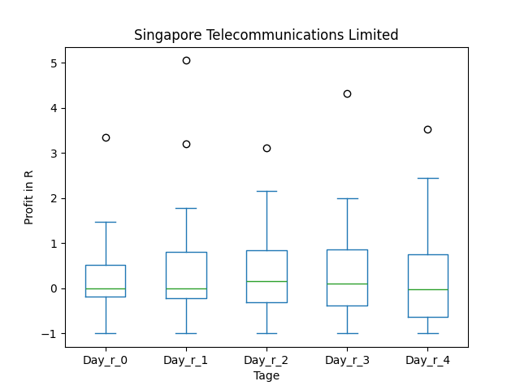
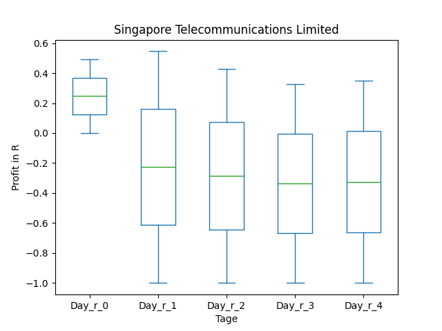
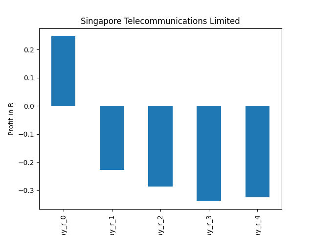
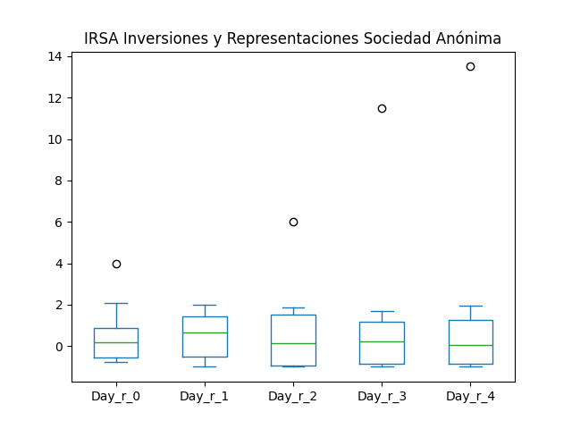
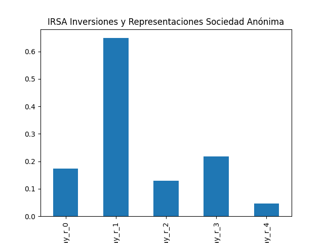

# dividend-shorter

bet on falling prices on payday

## Signale

| Ticker   |   Divid Rate |   Close |   Volume |   last_close_volume |   Divid % | 5_Days_pos   | above_SMA_50   |
|:---------|-------------:|--------:|---------:|--------------------:|----------:|:-------------|:---------------|
| SGAPY    |         0.66 |   23.3  |    24500 |              570850 |      2.85 | False        | False          |
| ISNPY    |         1.08 |   23.57 |   137800 |             3247946 |      4.59 | False        | False          |
| IRS      |         1.02 |   15.79 |   345200 |             5450708 |      6.45 | True         | True           |
| BEBE     |         2    |    3.52 |    42900 |              151008 |     56.82 | True         | True           |

## SGAPY

### Erwartung in R
|      |   Day_r_0 |   Day_r_1 |   Day_r_2 |   Day_r_3 |   Day_r_4 |   Treffer |
|:-----|----------:|----------:|----------:|----------:|----------:|----------:|
| ohne |       0   |      -0   |       0.2 |       0.1 |       0.1 |        34 |
| mit  |       0.2 |      -0.2 |      -0.3 |      -0.3 |      -0.3 |         2 |

### Ohne Filter

### Mit Filter

## ISNPY

### Erwartung in R
|      |   Day_r_0 |   Day_r_1 |   Day_r_2 |   Day_r_3 |   Day_r_4 |   Treffer |
|:-----|----------:|----------:|----------:|----------:|----------:|----------:|
| ohne |         0 |        -0 |       0.1 |      -0   |       0.1 |        18 |
| mit  |         0 |        -0 |       0.2 |       0.2 |       0.2 |        14 |

### Ohne Filter

### Mit Filter

## IRS

### Erwartung in R
|      |   Day_r_0 |   Day_r_1 |   Day_r_2 |   Day_r_3 |   Day_r_4 |   Treffer |
|:-----|----------:|----------:|----------:|----------:|----------:|----------:|
| ohne |       0.2 |       0.6 |       0.1 |       0.2 |       0   |        14 |
| mit  |       0.7 |       1   |       0.2 |       0.3 |       0.5 |         2 |

### Ohne Filter

### Mit Filter

## BEBE

### Erwartung in R
|      |   Day_r_0 |   Day_r_1 |   Day_r_2 |   Day_r_3 |   Day_r_4 |   Treffer |
|:-----|----------:|----------:|----------:|----------:|----------:|----------:|
| ohne |         0 |      -0.2 |         0 |      -0.2 |      -0.5 |        65 |
| mit  |       nan |     nan   |       nan |     nan   |     nan   |         0 |

### Ohne Filter

### Mit Filter

