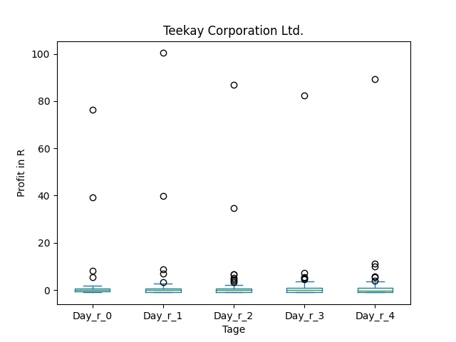
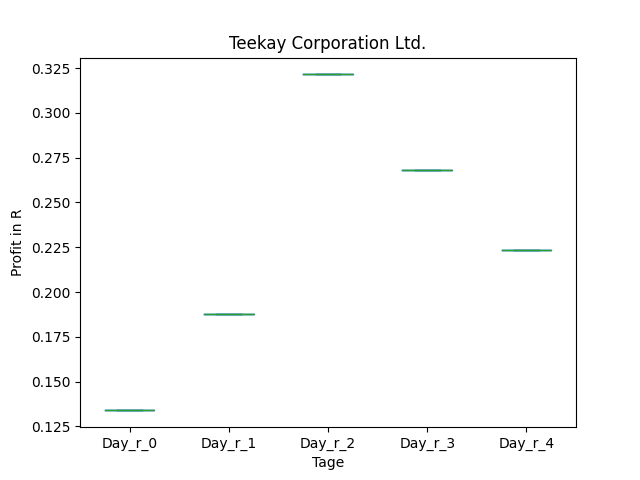
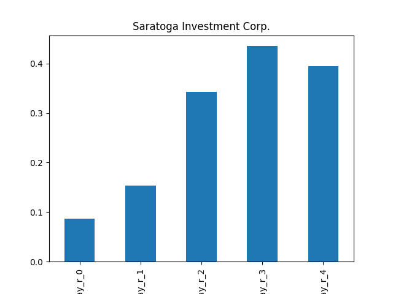
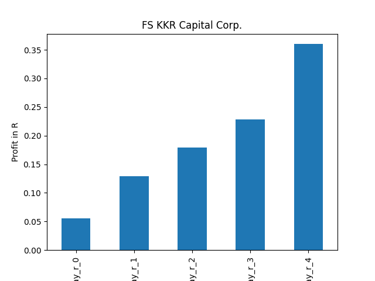

# dividend-shorter

bet on falling prices on payday **2024-12-04**.

## Signale

| Ticker   |   Divid Rate |   Close |          Volume |   last_close_volume |   Divid % | 5_Days_pos   | above_SMA_50   |
|:---------|-------------:|--------:|----------------:|--------------------:|----------:|:-------------|:---------------|
| TK       |         1    |    7.66 |      1.4956e+06 |            11456296 |     13.05 | True         | False          |
| SAR      |         0.74 |   25.37 | 279600          |             7093452 |      2.92 | False        | True           |
| FSK      |         0.64 |   21.98 |      2.6107e+06 |            57383186 |      2.91 | True         | True           |
| BBDC     |         0.26 |   10.22 | 796900          |             8144318 |      2.54 | True         | True           |

## TK

### Erwartung in R
|      |   Day_r_0 |   Day_r_1 |   Day_r_2 |   Day_r_3 |   Day_r_4 |   Treffer |
|:-----|----------:|----------:|----------:|----------:|----------:|----------:|
| ohne |        -0 |      -0.1 |         0 |      -0.1 |      -0.2 |        61 |
| mit  |       nan |     nan   |       nan |     nan   |     nan   |         0 |

### Ohne Filter

### Mit Filter

## SAR

### Erwartung in R
|      |   Day_r_0 |   Day_r_1 |   Day_r_2 |   Day_r_3 |   Day_r_4 |   Treffer |
|:-----|----------:|----------:|----------:|----------:|----------:|----------:|
| ohne |       0.1 |       0.1 |       0.3 |       0.4 |       0.4 |        55 |
| mit  |       0.1 |       0.4 |       0.7 |       0.5 |       0.6 |         3 |

### Ohne Filter

### Mit Filter

## FSK

### Erwartung in R
|      |   Day_r_0 |   Day_r_1 |   Day_r_2 |   Day_r_3 |   Day_r_4 |   Treffer |
|:-----|----------:|----------:|----------:|----------:|----------:|----------:|
| ohne |       0.1 |       0.2 |       0.2 |       0.2 |       0.3 |        63 |
| mit  |       0.1 |       0.1 |       0.3 |       0.2 |       0.4 |        17 |

### Ohne Filter

### Mit Filter

## BBDC

### Erwartung in R
|      |   Day_r_0 |   Day_r_1 |   Day_r_2 |   Day_r_3 |   Day_r_4 |   Treffer |
|:-----|----------:|----------:|----------:|----------:|----------:|----------:|
| ohne |       0.2 |       0.3 |       0.4 |       0.4 |       0.5 |        62 |
| mit  |       0.1 |       0.4 |       0.3 |       0.4 |       0.1 |         7 |

### Ohne Filter

### Mit Filter

