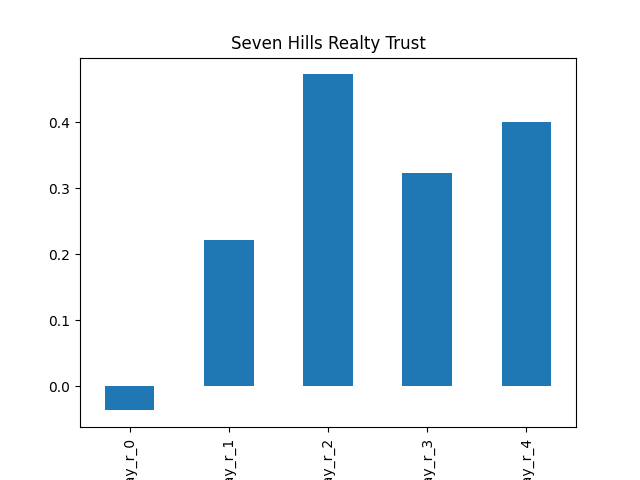
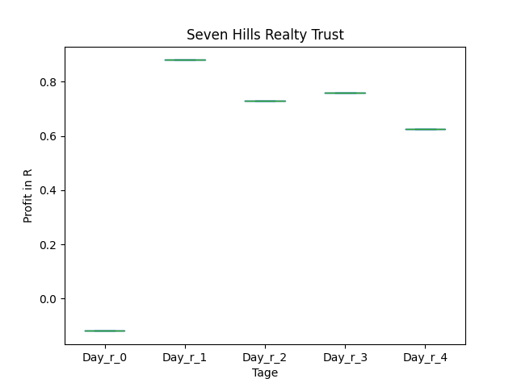
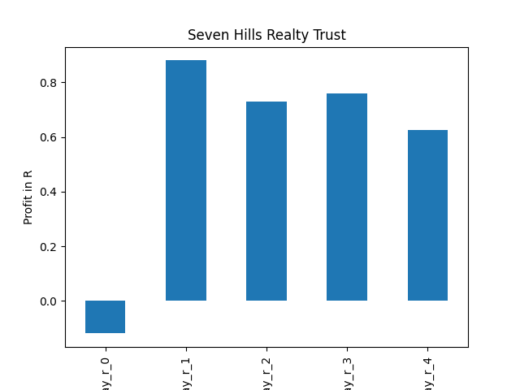
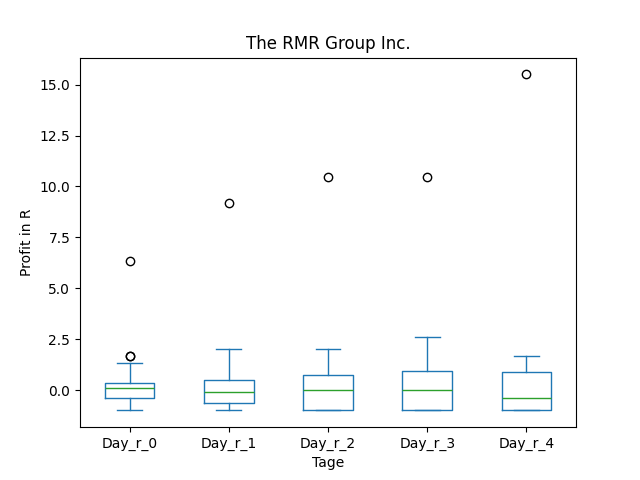
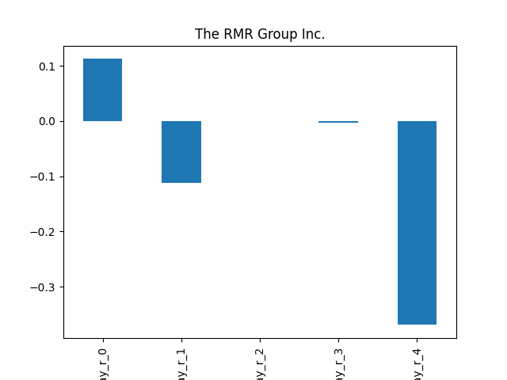
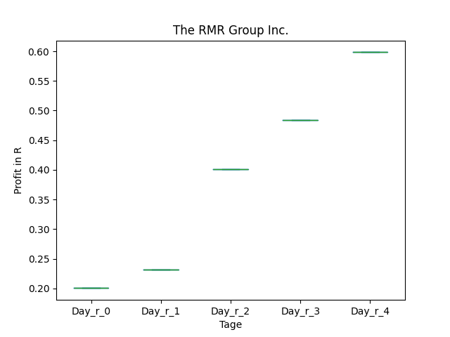
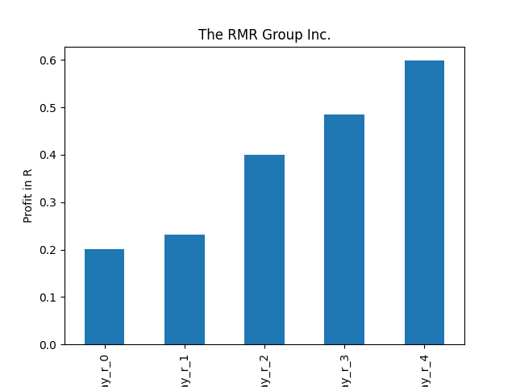

# dividend-shorter

bet on falling prices on payday **2025-04-22**.

## Signale

| Ticker   |   Divid Rate |   Close |   Volume |   last_close_volume |   Divid % | 5_Days_pos   | above_SMA_50   |
|:---------|-------------:|--------:|---------:|--------------------:|----------:|:-------------|:---------------|
| SLVO     |         2.08 |   79.25 |   101600 |             8051800 |      2.63 | True         | True           |
| SEVN     |         0.35 |   12.08 |    84400 |             1019552 |      2.9  | True         | False          |
| RMR      |         0.45 |   14.96 |   208500 |             3119160 |      3.01 | False        | False          |
| OPI      |         0.01 |    0.34 |   950500 |              323170 |      2.94 | True         | False          |
| MOV      |         0.35 |   13.47 |   437000 |             5886390 |      2.6  | False        | False          |
| FNLPF    |         0.42 |   13.27 |    11600 |              153932 |      3.15 | False        | True           |

## SLVO

### Erwartung in R
|      |   Day_r_0 |   Day_r_1 |   Day_r_2 |   Day_r_3 |   Day_r_4 |   Treffer |
|:-----|----------:|----------:|----------:|----------:|----------:|----------:|
| ohne |         0 |      -0.1 |         0 |      -0.2 |      -0.3 |       142 |
| mit  |       nan |     nan   |       nan |     nan   |     nan   |         0 |

### Ohne Filter

### Mit Filter

## SEVN

### Erwartung in R
|      |   Day_r_0 |   Day_r_1 |   Day_r_2 |   Day_r_3 |   Day_r_4 |   Treffer |
|:-----|----------:|----------:|----------:|----------:|----------:|----------:|
| ohne |      -0   |       0.2 |       0.5 |       0.3 |       0.4 |        13 |
| mit  |      -0.1 |       0.9 |       0.7 |       0.8 |       0.6 |         1 |

### Ohne Filter

### Mit Filter

## RMR

### Erwartung in R
|      |   Day_r_0 |   Day_r_1 |   Day_r_2 |   Day_r_3 |   Day_r_4 |   Treffer |
|:-----|----------:|----------:|----------:|----------:|----------:|----------:|
| ohne |       0.1 |      -0.1 |       0   |      -0   |      -0.4 |        38 |
| mit  |       0.2 |       0.2 |       0.4 |       0.5 |       0.6 |         1 |

### Ohne Filter

### Mit Filter

## OPI

### Erwartung in R
|      |   Day_r_0 |   Day_r_1 |   Day_r_2 |   Day_r_3 |   Day_r_4 |   Treffer |
|:-----|----------:|----------:|----------:|----------:|----------:|----------:|
| ohne |       0.2 |       0.1 |       0.1 |      -0.1 |       0   |        37 |
| mit  |       0.3 |       0   |       0.2 |       0.1 |       0.2 |         5 |

### Ohne Filter

### Mit Filter

## MOV

### Erwartung in R
|      |   Day_r_0 |   Day_r_1 |   Day_r_2 |   Day_r_3 |   Day_r_4 |   Treffer |
|:-----|----------:|----------:|----------:|----------:|----------:|----------:|
| ohne |       0   |       0   |       0.1 |      -0.3 |      -0.9 |        77 |
| mit  |       0.5 |       0.9 |       1.2 |       0.5 |       0.3 |         1 |

### Ohne Filter

### Mit Filter

## FNLPF

### Erwartung in R
|      |   Day_r_0 |   Day_r_1 |   Day_r_2 |   Day_r_3 |   Day_r_4 |   Treffer |
|:-----|----------:|----------:|----------:|----------:|----------:|----------:|
| ohne |      -0.2 |      -0.4 |      -0.1 |      -0.5 |      -0.6 |        18 |
| mit  |     nan   |     nan   |     nan   |     nan   |     nan   |         0 |

### Ohne Filter

### Mit Filter

