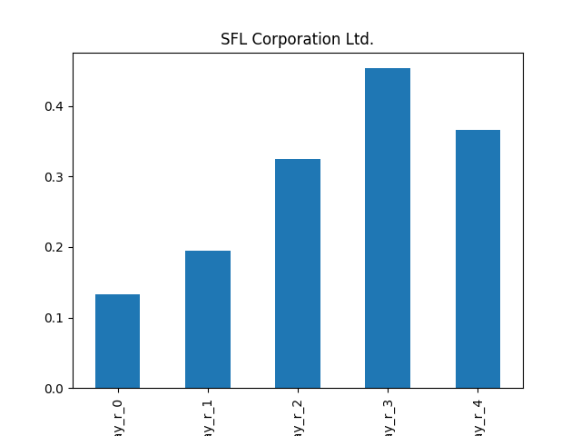
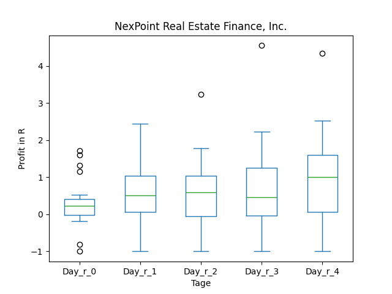
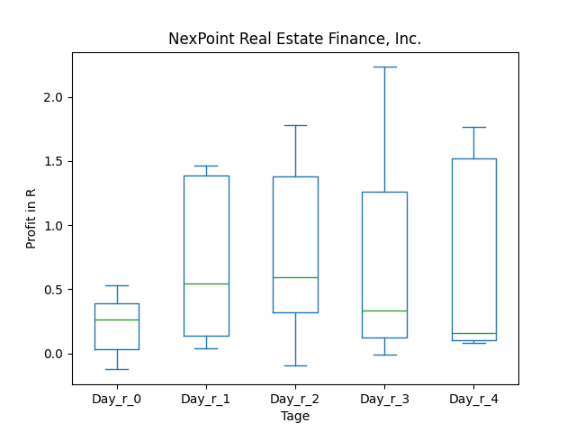
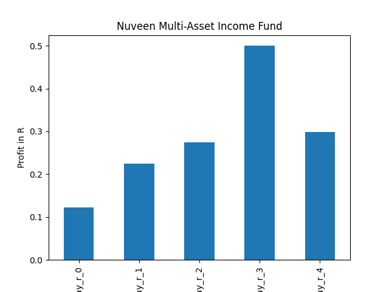
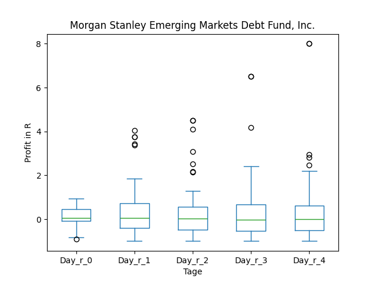
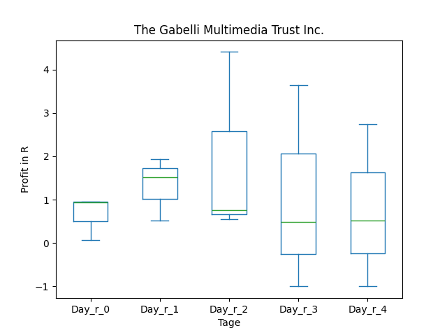
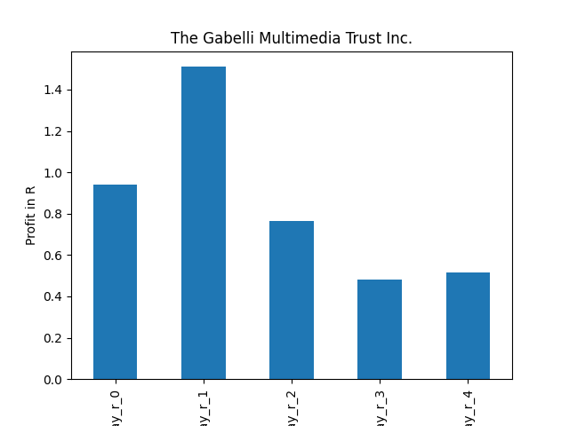
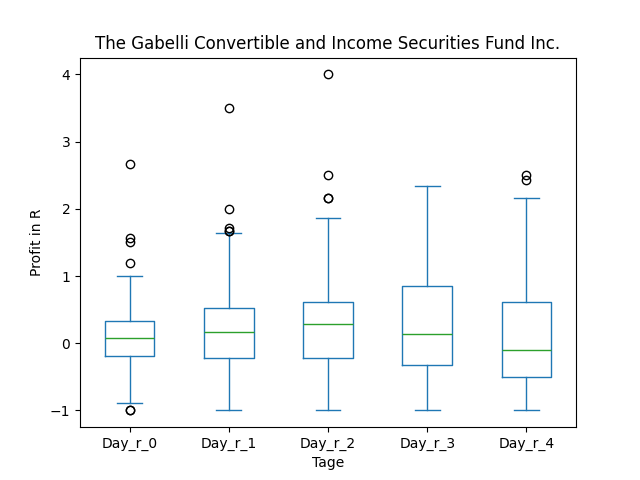
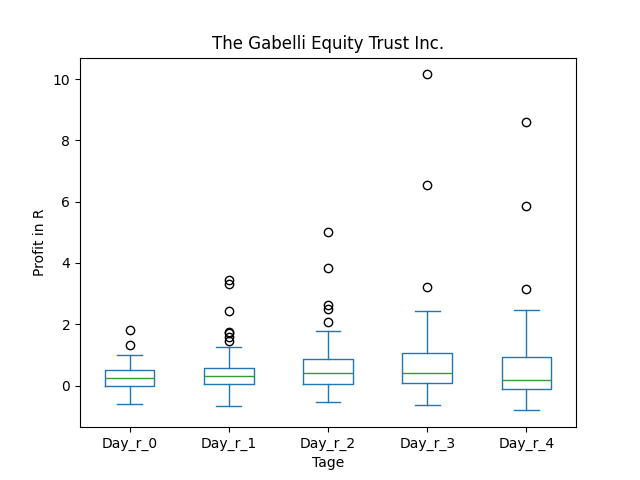
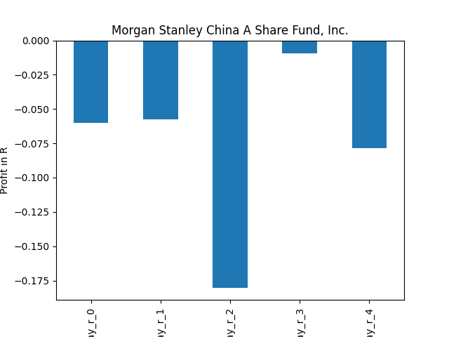

# dividend-shorter

bet on falling prices on payday **2024-12-13**.

## Signale

| Ticker   |   Divid Rate |   Close |           Volume |   last_close_volume |   Divid % | 5_Days_pos   | above_SMA_50   |
|:---------|-------------:|--------:|-----------------:|--------------------:|----------:|:-------------|:---------------|
| TY       |         2.24 |   34.08 |  35500           |             1209840 |      6.56 | False        | True           |
| TPVG     |         0.3  |    8.05 | 553900           |             4458895 |      3.73 | False        | True           |
| SFL      |         0.27 |   10.25 |      1.1132e+06  |            11410300 |      2.63 | False        | False          |
| PBR      |         0.53 |   14.26 |      1.74132e+07 |           248312232 |      3.74 | True         | True           |
| NREF     |         0.5  |   17.47 |  49000           |              856030 |      2.86 | True         | True           |
| NMAI     |         0.42 |   12.78 | 224200           |             2865276 |      3.27 | False        | True           |
| MSD      |         0.26 |    7.84 |  94900           |              744016 |      3.38 | False        | True           |
| INSW     |         1.08 |   35.93 | 628400           |            22578412 |      3.01 | False        | False          |
| IIF      |         2.7  |   29.26 |  51600           |             1509816 |      9.22 | False        | True           |
| GGT      |         0.22 |    5.05 | 208600           |             1053430 |      4.36 | False        | True           |
| GCV      |         0.12 |    4.03 |  42100           |              169663 |      2.98 | False        | True           |
| GAB      |         0.15 |    5.76 | 816900           |             4705344 |      2.6  | False        | True           |
| FUND     |         0.22 |    8.02 |  21400           |              171628 |      2.69 | False        | True           |
| EDD      |         0.16 |    4.7  | 363700           |             1709390 |      3.4  | False        | False          |
| DDS      |        25    |  453.48 | 140600           |            63759288 |      5.51 | True         | True           |
| CSWC     |         0.58 |   22.55 |      1.3314e+06  |            30023070 |      2.57 | False        | False          |
| CAF      |         0.33 |   12.93 |  16900           |              218517 |      2.53 | True         | False          |
| ASBFY    |         0.9  |   28.02 |  13600           |              381072 |      3.22 | False        | False          |

## TY

### Erwartung in R
|      |   Day_r_0 |   Day_r_1 |   Day_r_2 |   Day_r_3 |   Day_r_4 |   Treffer |
|:-----|----------:|----------:|----------:|----------:|----------:|----------:|
| ohne |      -0   |      -0   |      -0.1 |       0.1 |      -0   |        96 |
| mit  |       0.1 |      -0.1 |       0.4 |       0.5 |       0.3 |         7 |

### Ohne Filter

### Mit Filter

## TPVG

### Erwartung in R
|      |   Day_r_0 |   Day_r_1 |   Day_r_2 |   Day_r_3 |   Day_r_4 |   Treffer |
|:-----|----------:|----------:|----------:|----------:|----------:|----------:|
| ohne |       0   |       0   |         0 |       0.1 |       0.2 |        46 |
| mit  |       0.1 |       0.1 |         0 |       0.1 |       0.2 |        16 |

### Ohne Filter

### Mit Filter

## SFL

### Erwartung in R
|      |   Day_r_0 |   Day_r_1 |   Day_r_2 |   Day_r_3 |   Day_r_4 |   Treffer |
|:-----|----------:|----------:|----------:|----------:|----------:|----------:|
| ohne |       0.1 |       0.2 |       0.3 |       0.4 |       0.4 |        89 |
| mit  |       0.4 |       0.6 |       0.8 |       0.7 |       0.6 |        15 |

### Ohne Filter

### Mit Filter

## PBR

### Erwartung in R
|      |   Day_r_0 |   Day_r_1 |   Day_r_2 |   Day_r_3 |   Day_r_4 |   Treffer |
|:-----|----------:|----------:|----------:|----------:|----------:|----------:|
| ohne |         0 |       0   |      -0.3 |      -0.4 |      -0.6 |        73 |
| mit  |         0 |      -0.2 |      -0.7 |      -0.9 |      -1   |        21 |

### Ohne Filter

### Mit Filter

## NREF

### Erwartung in R
|      |   Day_r_0 |   Day_r_1 |   Day_r_2 |   Day_r_3 |   Day_r_4 |   Treffer |
|:-----|----------:|----------:|----------:|----------:|----------:|----------:|
| ohne |       0.3 |       0.5 |       0.6 |       0.3 |       1   |        23 |
| mit  |       0.1 |       0.3 |       0.5 |       0.2 |       0.1 |         4 |

### Ohne Filter

### Mit Filter

## NMAI

### Erwartung in R
|      |   Day_r_0 |   Day_r_1 |   Day_r_2 |   Day_r_3 |   Day_r_4 |   Treffer |
|:-----|----------:|----------:|----------:|----------:|----------:|----------:|
| ohne |       0.2 |       0.2 |       0.3 |       0.3 |       0.3 |        13 |
| mit  |       0.1 |       0.2 |       0.2 |       0.4 |       0.1 |         2 |

### Ohne Filter

### Mit Filter

## MSD

### Erwartung in R
|      |   Day_r_0 |   Day_r_1 |   Day_r_2 |   Day_r_3 |   Day_r_4 |   Treffer |
|:-----|----------:|----------:|----------:|----------:|----------:|----------:|
| ohne |       0.1 |       0.1 |       0   |      -0   |      -0   |        72 |
| mit  |      -0   |      -0.1 |       0.2 |       0.4 |       0.4 |         2 |

### Ohne Filter

### Mit Filter

## INSW

### Erwartung in R
|      |   Day_r_0 |   Day_r_1 |   Day_r_2 |   Day_r_3 |   Day_r_4 |   Treffer |
|:-----|----------:|----------:|----------:|----------:|----------:|----------:|
| ohne |        -0 |      -0.1 |       0.1 |      -0.1 |      -0.8 |        28 |
| mit  |        -0 |      -0.2 |       0   |       0.1 |      -0.5 |         5 |

### Ohne Filter

### Mit Filter

## IIF

### Erwartung in R
|      |   Day_r_0 |   Day_r_1 |   Day_r_2 |   Day_r_3 |   Day_r_4 |   Treffer |
|:-----|----------:|----------:|----------:|----------:|----------:|----------:|
| ohne |       0.1 |         0 |       0.1 |         0 |       0.2 |        23 |
| mit  |       0.1 |         0 |       0   |        -0 |       0.2 |         8 |

### Ohne Filter

### Mit Filter

## GGT

### Erwartung in R
|      |   Day_r_0 |   Day_r_1 |   Day_r_2 |   Day_r_3 |   Day_r_4 |   Treffer |
|:-----|----------:|----------:|----------:|----------:|----------:|----------:|
| ohne |       0.1 |       0.3 |       0.4 |       0.5 |       0.2 |        60 |
| mit  |       0.9 |       1.7 |       2.6 |       1.3 |       0.9 |         2 |

### Ohne Filter

### Mit Filter

## GCV

### Erwartung in R
|      |   Day_r_0 |   Day_r_1 |   Day_r_2 |   Day_r_3 |   Day_r_4 |   Treffer |
|:-----|----------:|----------:|----------:|----------:|----------:|----------:|
| ohne |       0.1 |       0.2 |       0.3 |       0.1 |      -0.1 |        66 |
| mit  |     nan   |     nan   |     nan   |     nan   |     nan   |         0 |

### Ohne Filter

### Mit Filter

## GAB

### Erwartung in R
|      |   Day_r_0 |   Day_r_1 |   Day_r_2 |   Day_r_3 |   Day_r_4 |   Treffer |
|:-----|----------:|----------:|----------:|----------:|----------:|----------:|
| ohne |       0.3 |       0.3 |       0.4 |       0.4 |       0.2 |        65 |
| mit  |       0.4 |       0.4 |       0.7 |       0.8 |       0.4 |        15 |

### Ohne Filter

### Mit Filter

## FUND

### Erwartung in R
|      |   Day_r_0 |   Day_r_1 |   Day_r_2 |   Day_r_3 |   Day_r_4 |   Treffer |
|:-----|----------:|----------:|----------:|----------:|----------:|----------:|
| ohne |       0.1 |       0.3 |       0.4 |       0.2 |         0 |        58 |
| mit  |       0.5 |       0.4 |       0.1 |       0.3 |         0 |         1 |

### Ohne Filter

### Mit Filter

## EDD

### Erwartung in R
|      |   Day_r_0 |   Day_r_1 |   Day_r_2 |   Day_r_3 |   Day_r_4 |   Treffer |
|:-----|----------:|----------:|----------:|----------:|----------:|----------:|
| ohne |       0.1 |       0.1 |       0.1 |         0 |      -0.1 |        66 |
| mit  |       0.1 |       0.2 |       0.2 |         0 |      -0.1 |         7 |

### Ohne Filter

### Mit Filter

## DDS

### Erwartung in R
|      |   Day_r_0 |   Day_r_1 |   Day_r_2 |   Day_r_3 |   Day_r_4 |   Treffer |
|:-----|----------:|----------:|----------:|----------:|----------:|----------:|
| ohne |      -0.3 |      -0.2 |      -0.2 |      -0.9 |      -1   |        88 |
| mit  |      -0   |       0   |       0.1 |       0.1 |       0.1 |         4 |

### Ohne Filter

### Mit Filter

## CSWC

### Erwartung in R
|      |   Day_r_0 |   Day_r_1 |   Day_r_2 |   Day_r_3 |   Day_r_4 |   Treffer |
|:-----|----------:|----------:|----------:|----------:|----------:|----------:|
| ohne |       0.1 |       0.1 |       0.2 |       0.1 |       0.1 |        88 |
| mit  |      -0.1 |       0.6 |       0.1 |       0.4 |      -0   |         7 |

### Ohne Filter

### Mit Filter

## CAF

### Erwartung in R
|      |   Day_r_0 |   Day_r_1 |   Day_r_2 |   Day_r_3 |   Day_r_4 |   Treffer |
|:-----|----------:|----------:|----------:|----------:|----------:|----------:|
| ohne |      -0.1 |       0   |      -0.2 |        -0 |      -0.1 |        41 |
| mit  |      -0.1 |      -0.1 |      -0.2 |        -0 |      -0.1 |        13 |

### Ohne Filter

### Mit Filter

## ASBFY

### Erwartung in R
|      |   Day_r_0 |   Day_r_1 |   Day_r_2 |   Day_r_3 |   Day_r_4 |   Treffer |
|:-----|----------:|----------:|----------:|----------:|----------:|----------:|
| ohne |         0 |       0.1 |      -0.3 |      -0.4 |      -0.3 |        23 |
| mit  |       nan |     nan   |     nan   |     nan   |     nan   |         0 |

### Ohne Filter

### Mit Filter

