# dividend-shorter

bet on falling prices on payday **2024-12-31**.

## Signale

| Ticker   |   Divid Rate |   Close |          Volume |   last_close_volume |   Divid % | 5_Days_pos   | above_SMA_50   |
|:---------|-------------:|--------:|----------------:|--------------------:|----------:|:-------------|:---------------|
| XRX      |         0.25 |    8.91 |      2.1203e+06 |            18891873 |      2.81 | False        | False          |
| VIASP    |         0.72 |   23.59 |   8100          |              191079 |      3.05 | True         | True           |
| TSI      |         0.14 |    4.96 |  51100          |              253456 |      2.92 | False        | False          |
| TRIN     |         0.51 |   14.81 | 990700          |            14672267 |      3.44 | True         | True           |
| SUNS     |         0.42 |   14.54 |  39400          |              572876 |      2.89 | True         | True           |
| REFI     |         0.47 |   16.01 | 312700          |             5006327 |      2.94 | True         | True           |
| RC       |         0.25 |    6.87 |      3.1898e+06 |            21913926 |      3.64 | False        | False          |
| PK       |         0.4  |   14.71 |      4.7227e+06 |            69470917 |      2.72 | False        | False          |
| ONL      |         0.1  |    3.73 | 408800          |             1524824 |      2.68 | False        | False          |
| OBDE     |         0.52 |   15.29 | 520900          |             7964561 |      3.4  | True         | True           |
| NLY      |         0.65 |   18.71 |      8.6187e+06 |           161255877 |      3.47 | False        | False          |
| NCDL     |         0.45 |   16.91 | 317200          |             5363852 |      2.66 | True         | False          |
| MITT     |         0.19 |    6.84 | 417300          |             2854332 |      2.78 | False        | False          |
| MFA      |         0.35 |   10.22 |      1.4731e+06 |            15055082 |      3.42 | False        | False          |
| LFT      |         0.09 |    2.73 | 213700          |              583401 |      3.3  | False        | True           |
| LFT      |         0.08 |    2.73 | 213700          |              583401 |      2.93 | False        | True           |
| KTN      |         1.03 |   27.38 |   7300          |              199874 |      3.75 | True         | True           |
| IIPR     |         1.9  |   67.31 | 667600          |            44936156 |      2.82 | False        | False          |
| HOVNP    |         0.48 |   17.85 |  26700          |              476595 |      2.67 | True         | True           |
| GSBD     |         0.45 |   12.69 |      1.7513e+06 |            22223997 |      3.55 | False        | False          |
| GHI      |         0.37 |   10.74 | 252900          |             2716146 |      3.45 | True         | False          |
| FBRT     |         0.36 |   12.51 | 468000          |             5854680 |      2.84 | False        | False          |
| CUBA     |         0.23 |    2.57 | 153300          |              393981 |      9.05 | True         | True           |
| CIM      |         0.37 |   13.97 | 975300          |            13624941 |      2.65 | False        | False          |
| CHMI     |         0.15 |    2.76 | 763600          |             2107536 |      5.43 | True         | False          |
| BXMT     |         0.47 |   17.71 |      2.7605e+06 |            48888455 |      2.65 | False        | False          |
| BRSP     |         0.16 |    5.74 | 704600          |             4044404 |      2.79 | False        | False          |
| BGS      |         0.19 |    6.95 |      1.4743e+06 |            10246385 |      2.73 | False        | False          |
| ATHM     |         1.15 |   26.17 | 611400          |            16000338 |      4.39 | False        | False          |
| ARI      |         0.25 |    8.76 |      1.3082e+06 |            11459832 |      2.85 | False        | False          |
| ALVOF    |         0.09 |    3.58 |  32800          |              117424 |      2.51 | True         | True           |
| AFCG     |         0.33 |    8.57 | 407900          |             3495703 |      3.85 | False        | False          |
| ACRE     |         0.25 |    6.03 |      1.1787e+06 |             7107561 |      4.15 | False        | False          |

## XRX

### Erwartung in R
|      |   Day_r_0 |   Day_r_1 |   Day_r_2 |   Day_r_3 |   Day_r_4 |   Treffer |
|:-----|----------:|----------:|----------:|----------:|----------:|----------:|
| ohne |       0.1 |       0.4 |       0.4 |         0 |        -0 |        33 |
| mit  |     nan   |     nan   |     nan   |       nan |       nan |         0 |

### Ohne Filter

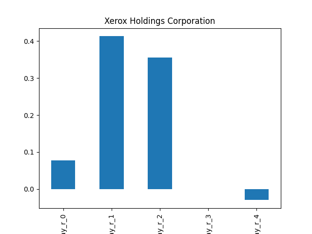

### Mit Filter

## VIASP

### Erwartung in R
|      |   Day_r_0 |   Day_r_1 |   Day_r_2 |   Day_r_3 |   Day_r_4 |   Treffer |
|:-----|----------:|----------:|----------:|----------:|----------:|----------:|
| ohne |       0.2 |       0.2 |       0.4 |       0.4 |       0.5 |        30 |
| mit  |       0.2 |       1.3 |       1.3 |       1.2 |       1.8 |         2 |

### Ohne Filter

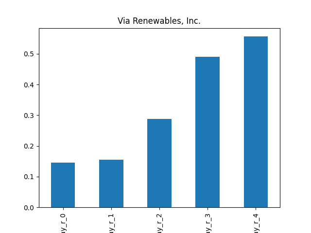

### Mit Filter

## TSI

### Erwartung in R
|      |   Day_r_0 |   Day_r_1 |   Day_r_2 |   Day_r_3 |   Day_r_4 |   Treffer |
|:-----|----------:|----------:|----------:|----------:|----------:|----------:|
| ohne |       0   |      -0.1 |      -0.1 |      -0.1 |      -0.1 |        76 |
| mit  |      -0.1 |      -0.1 |      -0.3 |      -0.1 |      -0.1 |         3 |

### Ohne Filter

### Mit Filter

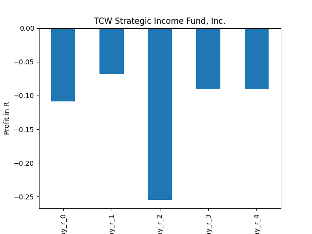

## TRIN

### Erwartung in R
|      |   Day_r_0 |   Day_r_1 |   Day_r_2 |   Day_r_3 |   Day_r_4 |   Treffer |
|:-----|----------:|----------:|----------:|----------:|----------:|----------:|
| ohne |         0 |      -0   |      -0.2 |      -0.3 |        -0 |        21 |
| mit  |        -0 |       0.1 |      -0   |      -0.2 |        -0 |        10 |

### Ohne Filter

### Mit Filter

## SUNS

### Erwartung in R
|      |   Day_r_0 |   Day_r_1 |   Day_r_2 |   Day_r_3 |   Day_r_4 |   Treffer |
|:-----|----------:|----------:|----------:|----------:|----------:|----------:|
| ohne |       0.8 |       1.6 |       2.7 |         5 |       0.7 |         1 |
| mit  |     nan   |     nan   |     nan   |       nan |     nan   |         0 |

### Ohne Filter

### Mit Filter

## REFI

### Erwartung in R
|      |   Day_r_0 |   Day_r_1 |   Day_r_2 |   Day_r_3 |   Day_r_4 |   Treffer |
|:-----|----------:|----------:|----------:|----------:|----------:|----------:|
| ohne |       0.2 |       0.3 |       0.3 |       0.3 |       0.2 |        13 |
| mit  |       0.2 |       0.3 |       0.3 |       0.4 |       0.4 |         5 |

### Ohne Filter

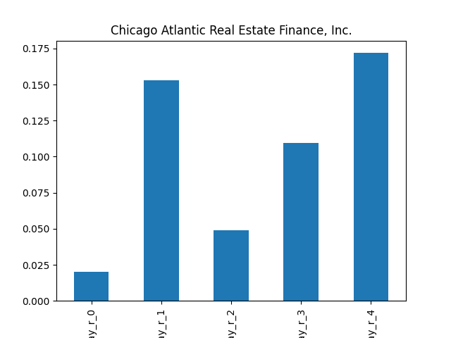

### Mit Filter
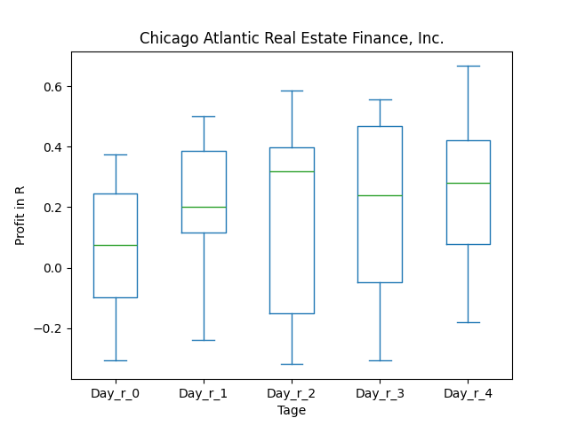

## RC

### Erwartung in R
|      |   Day_r_0 |   Day_r_1 |   Day_r_2 |   Day_r_3 |   Day_r_4 |   Treffer |
|:-----|----------:|----------:|----------:|----------:|----------:|----------:|
| ohne |        -0 |        -0 |      -0.1 |      -0   |      -0.1 |        50 |
| mit  |        -0 |        -0 |      -0.2 |      -0.2 |      -0.2 |        12 |

### Ohne Filter

### Mit Filter

## PK

### Erwartung in R
|      |   Day_r_0 |   Day_r_1 |   Day_r_2 |   Day_r_3 |   Day_r_4 |   Treffer |
|:-----|----------:|----------:|----------:|----------:|----------:|----------:|
| ohne |      -0.3 |      -0.2 |      -0.3 |      -0.4 |      -0.5 |        27 |
| mit  |       0   |       0.1 |       0   |       0   |      -0.1 |         5 |

### Ohne Filter

### Mit Filter

## ONL

### Erwartung in R
|      |   Day_r_0 |   Day_r_1 |   Day_r_2 |   Day_r_3 |   Day_r_4 |   Treffer |
|:-----|----------:|----------:|----------:|----------:|----------:|----------:|
| ohne |      -0.3 |      -0.3 |      -0.1 |      -0.3 |       0.1 |        11 |
| mit  |      -1   |      -1   |      -1   |      -1   |      -1   |         2 |

### Ohne Filter

### Mit Filter

## OBDE

### Erwartung in R
|      |   Day_r_0 |   Day_r_1 |   Day_r_2 |   Day_r_3 |   Day_r_4 |   Treffer |
|:-----|----------:|----------:|----------:|----------:|----------:|----------:|
| ohne |      -0.7 |      -0.8 |      -0.9 |        -1 |        -1 |         6 |
| mit  |     nan   |     nan   |     nan   |       nan |       nan |         0 |

### Ohne Filter

### Mit Filter

## NLY

### Erwartung in R
|      |   Day_r_0 |   Day_r_1 |   Day_r_2 |   Day_r_3 |   Day_r_4 |   Treffer |
|:-----|----------:|----------:|----------:|----------:|----------:|----------:|
| ohne |      -0   |       0.1 |       0.1 |       0   |      -0   |        87 |
| mit  |      -0.1 |       0   |       0.3 |       0.3 |       0.5 |         9 |

### Ohne Filter
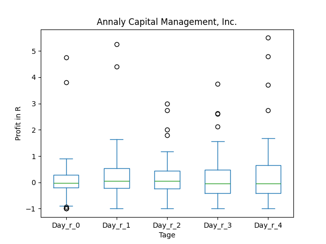

### Mit Filter

## NCDL

### Erwartung in R
|      |   Day_r_0 |   Day_r_1 |   Day_r_2 |   Day_r_3 |   Day_r_4 |   Treffer |
|:-----|----------:|----------:|----------:|----------:|----------:|----------:|
| ohne |       0.2 |       0.5 |       0.2 |      -0.2 |      -0.3 |         6 |
| mit  |     nan   |     nan   |     nan   |     nan   |     nan   |         0 |

### Ohne Filter

### Mit Filter

## MITT

### Erwartung in R
|      |   Day_r_0 |   Day_r_1 |   Day_r_2 |   Day_r_3 |   Day_r_4 |   Treffer |
|:-----|----------:|----------:|----------:|----------:|----------:|----------:|
| ohne |      -0.1 |      -0.2 |      -0.2 |      -0.1 |      -0   |        53 |
| mit  |      -0.2 |       0   |      -0.2 |      -0.2 |      -0.2 |         4 |

### Ohne Filter

### Mit Filter

## MFA

### Erwartung in R
|      |   Day_r_0 |   Day_r_1 |   Day_r_2 |   Day_r_3 |   Day_r_4 |   Treffer |
|:-----|----------:|----------:|----------:|----------:|----------:|----------:|
| ohne |       0.1 |       0.1 |      -0   |         0 |       0   |        86 |
| mit  |      -0.1 |       0.1 |      -0.2 |         0 |       0.2 |         9 |

### Ohne Filter

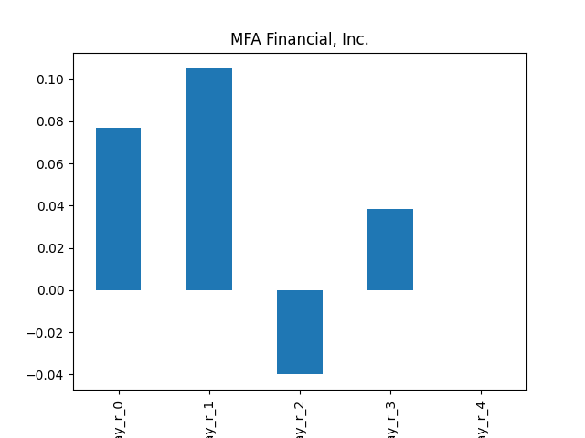

### Mit Filter
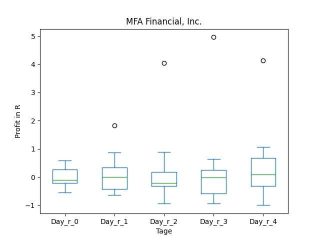

## LFT

### Erwartung in R
|      |   Day_r_0 |   Day_r_1 |   Day_r_2 |   Day_r_3 |   Day_r_4 |   Treffer |
|:-----|----------:|----------:|----------:|----------:|----------:|----------:|
| ohne |       0.2 |       0.4 |       0.3 |       0.4 |       0.3 |        90 |
| mit  |      -0.2 |      -0.2 |      -0.1 |      -0.1 |      -0.1 |         1 |

### Ohne Filter

### Mit Filter

## LFT

### Erwartung in R
|      |   Day_r_0 |   Day_r_1 |   Day_r_2 |   Day_r_3 |   Day_r_4 |   Treffer |
|:-----|----------:|----------:|----------:|----------:|----------:|----------:|
| ohne |       0.2 |       0.4 |       0.3 |       0.4 |       0.3 |        90 |
| mit  |      -0.2 |      -0.2 |      -0.1 |      -0.1 |      -0.1 |         1 |

### Ohne Filter

### Mit Filter

## KTN

### Erwartung in R
|      |   Day_r_0 |   Day_r_1 |   Day_r_2 |   Day_r_3 |   Day_r_4 |   Treffer |
|:-----|----------:|----------:|----------:|----------:|----------:|----------:|
| ohne |       0.1 |       0.1 |         0 |       0.1 |       0.2 |        32 |
| mit  |     nan   |     nan   |       nan |     nan   |     nan   |         0 |

### Ohne Filter

### Mit Filter

## IIPR

### Erwartung in R
|      |   Day_r_0 |   Day_r_1 |   Day_r_2 |   Day_r_3 |   Day_r_4 |   Treffer |
|:-----|----------:|----------:|----------:|----------:|----------:|----------:|
| ohne |      -0.1 |       0.2 |       0.3 |       0.6 |       0.2 |        30 |
| mit  |     nan   |     nan   |     nan   |     nan   |     nan   |         0 |

### Ohne Filter

### Mit Filter

## HOVNP

### Erwartung in R
|      |   Day_r_0 |   Day_r_1 |   Day_r_2 |   Day_r_3 |   Day_r_4 |   Treffer |
|:-----|----------:|----------:|----------:|----------:|----------:|----------:|
| ohne |      -0.1 |      -0.2 |      -0.2 |      -0.2 |      -0.2 |        20 |
| mit  |     nan   |     nan   |     nan   |     nan   |     nan   |         0 |

### Ohne Filter

### Mit Filter

## GSBD

### Erwartung in R
|      |   Day_r_0 |   Day_r_1 |   Day_r_2 |   Day_r_3 |   Day_r_4 |   Treffer |
|:-----|----------:|----------:|----------:|----------:|----------:|----------:|
| ohne |       0.2 |       0.2 |       0.1 |       0.1 |       0.2 |        42 |
| mit  |       0.4 |       0.5 |       0.3 |       0.3 |       0.4 |        11 |

### Ohne Filter

### Mit Filter

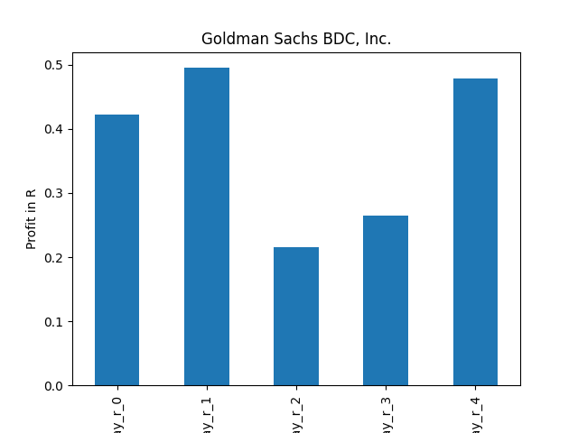

## GHI

### Erwartung in R
|      |   Day_r_0 |   Day_r_1 |   Day_r_2 |   Day_r_3 |   Day_r_4 |   Treffer |
|:-----|----------:|----------:|----------:|----------:|----------:|----------:|
| ohne |      -0.2 |        -0 |      -0.1 |      -0.1 |      -0.1 |        10 |
| mit  |     nan   |       nan |     nan   |     nan   |     nan   |         0 |

### Ohne Filter

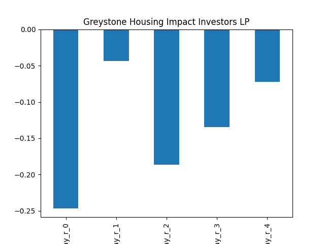

### Mit Filter

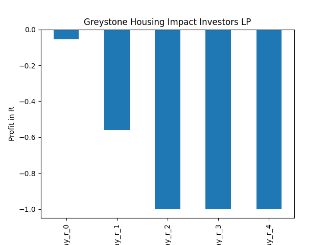

## FBRT

### Erwartung in R
|      |   Day_r_0 |   Day_r_1 |   Day_r_2 |   Day_r_3 |   Day_r_4 |   Treffer |
|:-----|----------:|----------:|----------:|----------:|----------:|----------:|
| ohne |       0.1 |       0.1 |      -0.2 |      -0   |       0.3 |        12 |
| mit  |       0.1 |       0   |      -0.3 |      -0.1 |      -0.1 |         3 |

### Ohne Filter
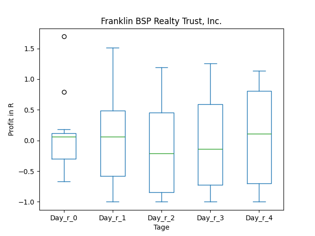

### Mit Filter
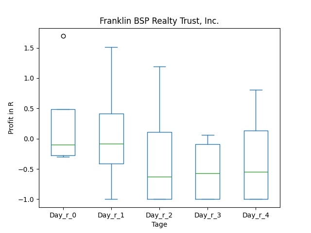

## CUBA

### Erwartung in R
|      |   Day_r_0 |   Day_r_1 |   Day_r_2 |   Day_r_3 |   Day_r_4 |   Treffer |
|:-----|----------:|----------:|----------:|----------:|----------:|----------:|
| ohne |       0.1 |       0.1 |       0.2 |       0.2 |       0.3 |        26 |
| mit  |       0.4 |       0.5 |       0.6 |       0.7 |       0.6 |         1 |

### Ohne Filter

### Mit Filter

## CIM

### Erwartung in R
|      |   Day_r_0 |   Day_r_1 |   Day_r_2 |   Day_r_3 |   Day_r_4 |   Treffer |
|:-----|----------:|----------:|----------:|----------:|----------:|----------:|
| ohne |       0.1 |       0.2 |       0.1 |         0 |       0.2 |        70 |
| mit  |     nan   |     nan   |     nan   |       nan |     nan   |         0 |

### Ohne Filter
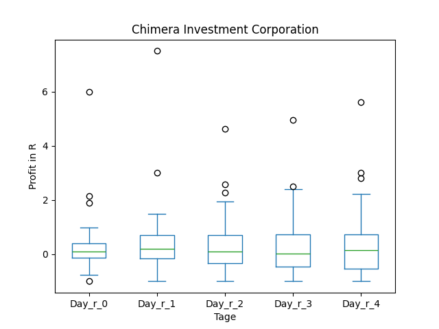

### Mit Filter

## CHMI

### Erwartung in R
|      |   Day_r_0 |   Day_r_1 |   Day_r_2 |   Day_r_3 |   Day_r_4 |   Treffer |
|:-----|----------:|----------:|----------:|----------:|----------:|----------:|
| ohne |       0.1 |       0   |       0   |       0   |       0   |        46 |
| mit  |       0.1 |       0.1 |       0.4 |       0.5 |       0.5 |        17 |

### Ohne Filter

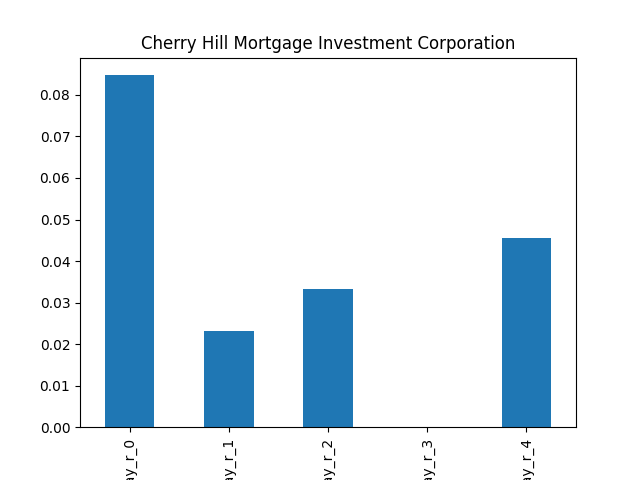

### Mit Filter

## BXMT

### Erwartung in R
|      |   Day_r_0 |   Day_r_1 |   Day_r_2 |   Day_r_3 |   Day_r_4 |   Treffer |
|:-----|----------:|----------:|----------:|----------:|----------:|----------:|
| ohne |       0.1 |       0.1 |       0.1 |      -0.1 |         0 |        66 |
| mit  |      -0.2 |      -0.3 |      -0.1 |       0   |         0 |         7 |

### Ohne Filter

### Mit Filter

## BRSP

### Erwartung in R
|      |   Day_r_0 |   Day_r_1 |   Day_r_2 |   Day_r_3 |   Day_r_4 |   Treffer |
|:-----|----------:|----------:|----------:|----------:|----------:|----------:|
| ohne |      -0.1 |      -0.2 |      -0.2 |      -0.5 |      -0.4 |        41 |
| mit  |      -0.1 |      -0.3 |       0.2 |      -0   |       0   |         8 |

### Ohne Filter

### Mit Filter
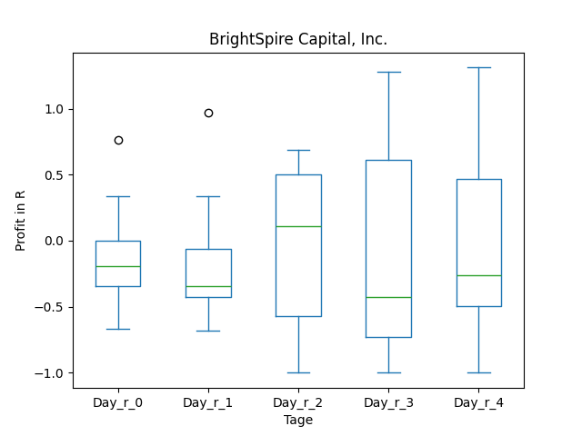

## BGS

### Erwartung in R
|      |   Day_r_0 |   Day_r_1 |   Day_r_2 |   Day_r_3 |   Day_r_4 |   Treffer |
|:-----|----------:|----------:|----------:|----------:|----------:|----------:|
| ohne |       0.3 |       0.4 |       0.3 |       0.3 |       0.5 |        69 |
| mit  |      -0.5 |      -1   |      -1   |      -1   |      -1   |         1 |

### Ohne Filter

### Mit Filter

## ATHM

### Erwartung in R
|      |   Day_r_0 |   Day_r_1 |   Day_r_2 |   Day_r_3 |   Day_r_4 |   Treffer |
|:-----|----------:|----------:|----------:|----------:|----------:|----------:|
| ohne |      -0.6 |        -1 |        -1 |        -1 |        -1 |         7 |
| mit  |      -0.6 |        -1 |        -1 |        -1 |        -1 |         1 |

### Ohne Filter

### Mit Filter

## ARI

### Erwartung in R
|      |   Day_r_0 |   Day_r_1 |   Day_r_2 |   Day_r_3 |   Day_r_4 |   Treffer |
|:-----|----------:|----------:|----------:|----------:|----------:|----------:|
| ohne |        -0 |       0   |       0   |      -0.1 |      -0.1 |        59 |
| mit  |        -0 |      -0.1 |      -0.2 |      -0   |       0   |        17 |

### Ohne Filter

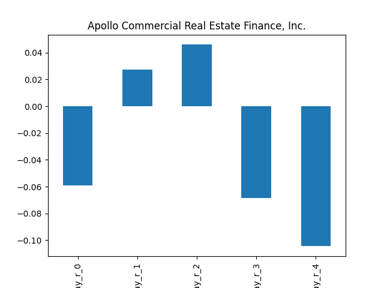

### Mit Filter
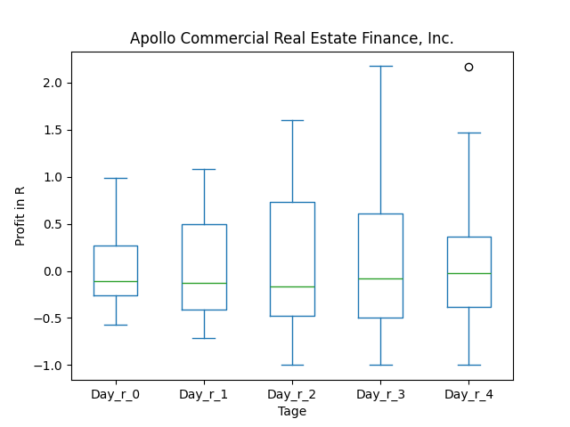

## ALVOF

### Erwartung in R
|      |   Day_r_0 |   Day_r_1 |   Day_r_2 |   Day_r_3 |   Day_r_4 |   Treffer |
|:-----|----------:|----------:|----------:|----------:|----------:|----------:|
| ohne |       0.5 |        -0 |        -1 |        -1 |        -1 |        13 |
| mit  |     nan   |       nan |       nan |       nan |       nan |         0 |

### Ohne Filter

### Mit Filter

## AFCG

### Erwartung in R
|      |   Day_r_0 |   Day_r_1 |   Day_r_2 |   Day_r_3 |   Day_r_4 |   Treffer |
|:-----|----------:|----------:|----------:|----------:|----------:|----------:|
| ohne |       0.4 |       0.5 |       0.5 |       0.6 |       0.8 |        15 |
| mit  |       0.4 |       0.4 |       0.5 |       0.6 |       0.8 |        13 |

### Ohne Filter

### Mit Filter

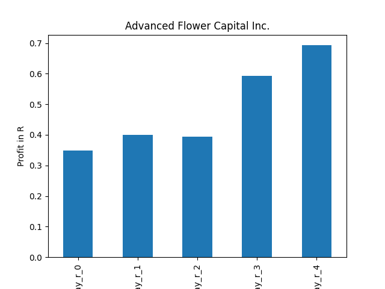

## ACRE

### Erwartung in R
|      |   Day_r_0 |   Day_r_1 |   Day_r_2 |   Day_r_3 |   Day_r_4 |   Treffer |
|:-----|----------:|----------:|----------:|----------:|----------:|----------:|
| ohne |      -0.1 |      -0.1 |      -0.2 |      -0.2 |      -0.2 |        60 |
| mit  |      -0.1 |      -0.1 |       0.1 |       0.1 |       0.3 |        12 |

### Ohne Filter

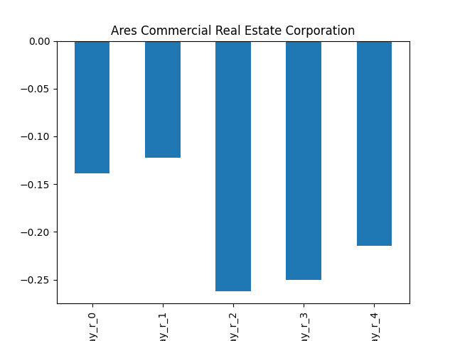

### Mit Filter
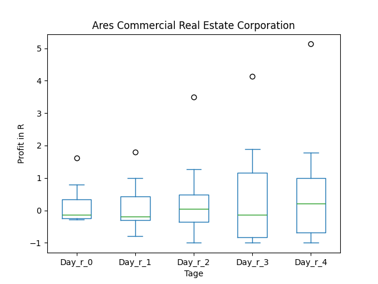

