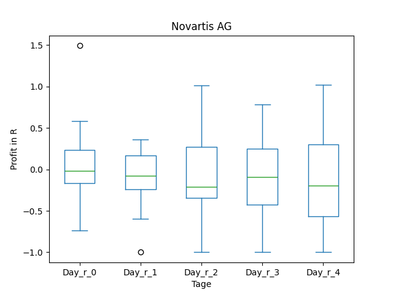
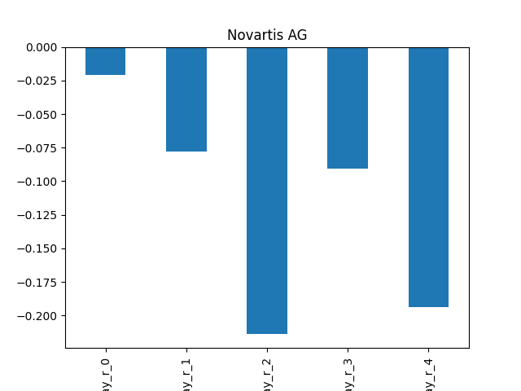
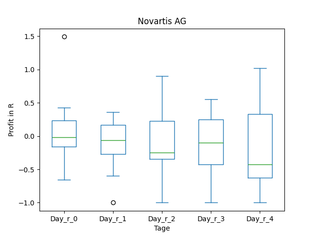
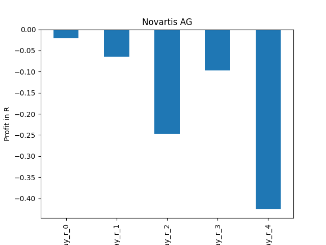

# dividend-shorter

bet on falling prices on payday **2025-03-12**.

## Signale

| Ticker   |   Divid Rate |   Close |         Volume |   last_close_volume |   Divid % | 5_Days_pos   | above_SMA_50   |
|:---------|-------------:|--------:|---------------:|--------------------:|----------:|:-------------|:---------------|
| SFL      |         0.27 |    8.52 |     2.6874e+06 |            22896648 |      3.17 | False        | False          |
| PHI      |         0.81 |   25.01 | 98700          |             2468487 |      3.25 | True         | True           |
| NVS      |         3.87 |  111.35 |     2.0212e+06 |           225060620 |      3.48 | False        | True           |
| GDEV     |         3.31 |   19.2  | 18500          |              355200 |     17.24 | True         | True           |

## SFL

### Erwartung in R
|      |   Day_r_0 |   Day_r_1 |   Day_r_2 |   Day_r_3 |   Day_r_4 |   Treffer |
|:-----|----------:|----------:|----------:|----------:|----------:|----------:|
| ohne |       0.1 |       0.2 |       0.3 |       0.5 |       0.4 |        90 |
| mit  |       0.4 |       0.6 |       0.8 |       0.7 |       0.6 |        15 |

### Ohne Filter

### Mit Filter

## PHI

### Erwartung in R
|      |   Day_r_0 |   Day_r_1 |   Day_r_2 |   Day_r_3 |   Day_r_4 |   Treffer |
|:-----|----------:|----------:|----------:|----------:|----------:|----------:|
| ohne |       0.1 |       0.1 |       0.3 |       0.2 |       0.2 |        49 |
| mit  |       0   |      -0   |       0.1 |       0.1 |      -0   |        18 |

### Ohne Filter

### Mit Filter

## NVS

### Erwartung in R
|      |   Day_r_0 |   Day_r_1 |   Day_r_2 |   Day_r_3 |   Day_r_4 |   Treffer |
|:-----|----------:|----------:|----------:|----------:|----------:|----------:|
| ohne |        -0 |      -0.1 |      -0.2 |      -0.1 |      -0.2 |        21 |
| mit  |        -0 |      -0.1 |      -0.2 |      -0.1 |      -0.4 |        17 |

### Ohne Filter

### Mit Filter

## GDEV

### Erwartung in R
|      |   Day_r_0 |   Day_r_1 |   Day_r_2 |   Day_r_3 |   Day_r_4 |   Treffer |
|:-----|----------:|----------:|----------:|----------:|----------:|----------:|
| ohne |       nan |       nan |       nan |       nan |       nan |         0 |
| mit  |       nan |       nan |       nan |       nan |       nan |         0 |

### Ohne Filter

### Mit Filter

