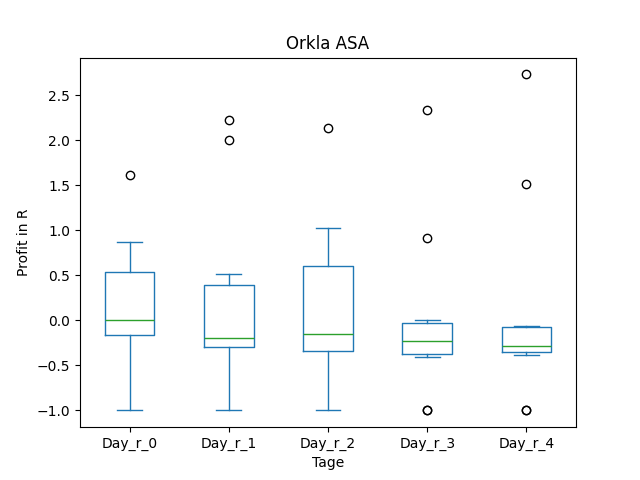
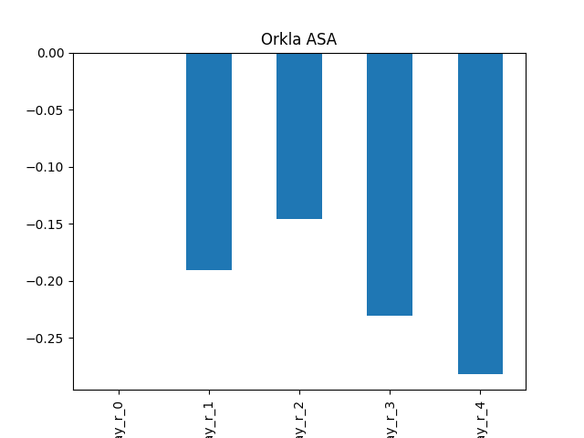
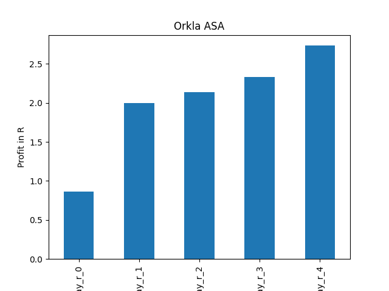
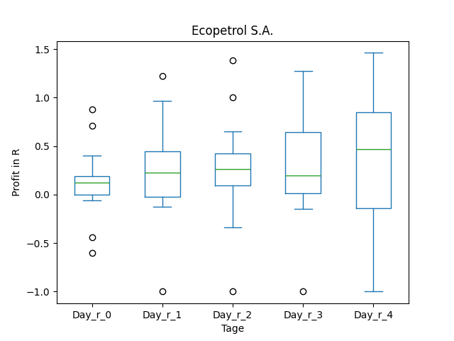
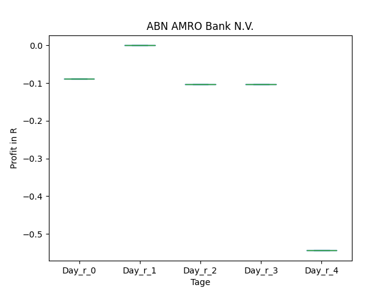

# dividend-shorter

bet on falling prices on payday **2025-04-28**.

## Signale

| Ticker   |   Divid Rate |   Close |          Volume |   last_close_volume |   Divid % | 5_Days_pos   | above_SMA_50   |
|:---------|-------------:|--------:|----------------:|--------------------:|----------:|:-------------|:---------------|
| PEO      |         0.52 |   20.58 |  46700          |              961086 |      2.53 | True         | False          |
| ORKLY    |         0.94 |   12.1  |  21400          |              258940 |      7.79 | True         | True           |
| ENGIY    |         1.61 |   21.64 | 129000          |             2791560 |      7.44 | True         | True           |
| EC       |         0.52 |    9.29 |      2.0259e+06 |            18820611 |      5.6  | True         | False          |
| AAVMY    |         0.78 |   21.23 |   7400          |              157102 |      3.67 | True         | True           |

## PEO

### Erwartung in R
|      |   Day_r_0 |   Day_r_1 |   Day_r_2 |   Day_r_3 |   Day_r_4 |   Treffer |
|:-----|----------:|----------:|----------:|----------:|----------:|----------:|
| ohne |        -0 |      -0.2 |      -0.2 |      -0.4 |      -0.4 |        96 |
| mit  |        -0 |      -0   |       0   |       0.1 |       0.2 |        13 |

### Ohne Filter

### Mit Filter

## ORKLY

### Erwartung in R
|      |   Day_r_0 |   Day_r_1 |   Day_r_2 |   Day_r_3 |   Day_r_4 |   Treffer |
|:-----|----------:|----------:|----------:|----------:|----------:|----------:|
| ohne |       0   |      -0.2 |      -0.1 |      -0.2 |      -0.3 |        14 |
| mit  |       0.9 |       2   |       2.1 |       2.3 |       2.7 |         1 |

### Ohne Filter

### Mit Filter

## ENGIY

### Erwartung in R
|      |   Day_r_0 |   Day_r_1 |   Day_r_2 |   Day_r_3 |   Day_r_4 |   Treffer |
|:-----|----------:|----------:|----------:|----------:|----------:|----------:|
| ohne |       0.1 |       0.2 |       0.2 |       0.3 |       0.1 |        20 |
| mit  |       0.2 |       0.2 |       0.2 |      -0.2 |      -0.1 |        13 |

### Ohne Filter

### Mit Filter

## EC

### Erwartung in R
|      |   Day_r_0 |   Day_r_1 |   Day_r_2 |   Day_r_3 |   Day_r_4 |   Treffer |
|:-----|----------:|----------:|----------:|----------:|----------:|----------:|
| ohne |       0.1 |       0.2 |       0.2 |       0.2 |       0.3 |        38 |
| mit  |       0.1 |       0.2 |       0.3 |       0.2 |       0.5 |        15 |

### Ohne Filter

### Mit Filter

## AAVMY

### Erwartung in R
|      |   Day_r_0 |   Day_r_1 |   Day_r_2 |   Day_r_3 |   Day_r_4 |   Treffer |
|:-----|----------:|----------:|----------:|----------:|----------:|----------:|
| ohne |       0   |         0 |       0.2 |      -0   |      -0.2 |         7 |
| mit  |      -0.1 |         0 |      -0.1 |      -0.1 |      -0.5 |         1 |

### Ohne Filter

### Mit Filter

