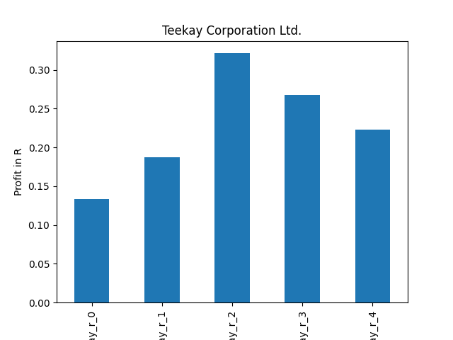
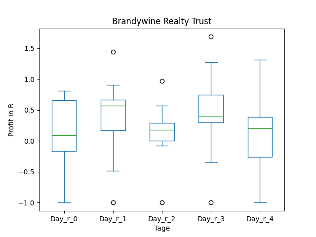

# dividend-shorter

bet on falling prices on payday **2025-07-02**.

## Signale

| Ticker   |   Divid Rate |   Close |           Volume |   last_close_volume |   Divid % | 5_Days_pos   | above_SMA_50   |
|:---------|-------------:|--------:|-----------------:|--------------------:|----------:|:-------------|:---------------|
| TK       |         1    |    8.28 |      1.0593e+06  |             8771004 |     12.08 | False        | True           |
| JKS      |         1.3  |   21.59 | 853200           |            18420588 |      6.02 | True         | True           |
| BVVBY    |         2.08 |   67.31 |   4700           |              316357 |      3.08 | True         | True           |
| BHKLY    |         3.66 |   88.99 |   2400           |              213576 |      4.11 | False        | True           |
| BDN      |         0.15 |    4.32 |      3.0296e+06  |            13087872 |      3.47 | True         | True           |
| ASX      |         0.36 |   10.26 |      1.47032e+07 |           150854832 |      3.5  | False        | True           |

## TK

### Erwartung in R
|      |   Day_r_0 |   Day_r_1 |   Day_r_2 |   Day_r_3 |   Day_r_4 |   Treffer |
|:-----|----------:|----------:|----------:|----------:|----------:|----------:|
| ohne |      -0   |      -0.1 |       0.1 |      -0.1 |      -0.1 |        62 |
| mit  |       0.1 |       0.2 |       0.3 |       0.3 |       0.2 |         1 |

### Ohne Filter

### Mit Filter

## JKS

### Erwartung in R
|      |   Day_r_0 |   Day_r_1 |   Day_r_2 |   Day_r_3 |   Day_r_4 |   Treffer |
|:-----|----------:|----------:|----------:|----------:|----------:|----------:|
| ohne |      -0.3 |        -0 |       0.5 |       1.3 |       0.7 |         2 |
| mit  |      -0.3 |        -0 |       0.5 |       1.3 |       0.7 |         2 |

### Ohne Filter

### Mit Filter

## BVVBY

### Erwartung in R
|      |   Day_r_0 |   Day_r_1 |   Day_r_2 |   Day_r_3 |   Day_r_4 |   Treffer |
|:-----|----------:|----------:|----------:|----------:|----------:|----------:|
| ohne |         0 |      -0.2 |      -0.4 |      -0.3 |       0.2 |         3 |
| mit  |       nan |     nan   |     nan   |     nan   |     nan   |         0 |

### Ohne Filter

### Mit Filter

## BHKLY

### Erwartung in R
|      |   Day_r_0 |   Day_r_1 |   Day_r_2 |   Day_r_3 |   Day_r_4 |   Treffer |
|:-----|----------:|----------:|----------:|----------:|----------:|----------:|
| ohne |      -0   |       0.2 |       0.1 |       0.4 |       0.5 |        30 |
| mit  |       6.5 |       4.5 |      -1   |      -1   |      -1   |         1 |

### Ohne Filter

### Mit Filter

## BDN

### Erwartung in R
|      |   Day_r_0 |   Day_r_1 |   Day_r_2 |   Day_r_3 |   Day_r_4 |   Treffer |
|:-----|----------:|----------:|----------:|----------:|----------:|----------:|
| ohne |       0.1 |       0.2 |       0   |      -0   |      -0.2 |        82 |
| mit  |       0.1 |       0.6 |       0.2 |       0.4 |       0.2 |        11 |

### Ohne Filter

### Mit Filter

## ASX

### Erwartung in R
|      |   Day_r_0 |   Day_r_1 |   Day_r_2 |   Day_r_3 |   Day_r_4 |   Treffer |
|:-----|----------:|----------:|----------:|----------:|----------:|----------:|
| ohne |       0.1 |       0.2 |       0.2 |       0.4 |       0.3 |         6 |
| mit  |       0.1 |       0.2 |       0.2 |       0.4 |       0.3 |         6 |

### Ohne Filter

### Mit Filter

