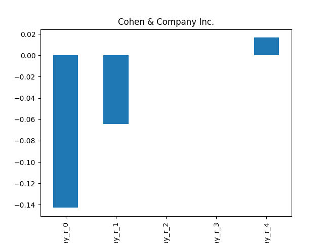
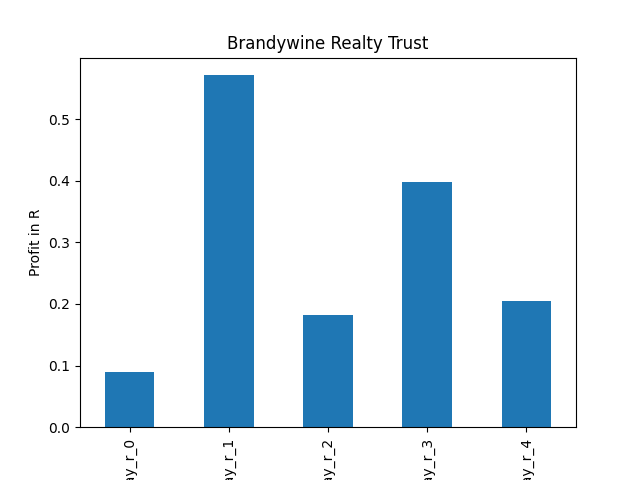

# dividend-shorter

bet on falling prices on payday **2026-01-07**.

## Signale

| Ticker   |   Divid Rate |   Close |          Volume |   last_close_volume |   Divid % | 5_Days_pos   | above_SMA_50   |
|:---------|-------------:|--------:|----------------:|--------------------:|----------:|:-------------|:---------------|
| OPRA     |         0.4  |   14.66 | 784600          |            11502236 |      2.73 | True         | True           |
| COHN     |         2    |   32.39 | 161700          |             5237463 |      6.17 | True         | True           |
| BDN      |         0.08 |    3.01 |      7.0196e+06 |            21128996 |      2.66 | True         | False          |

## OPRA

### Erwartung in R
|      |   Day_r_0 |   Day_r_1 |   Day_r_2 |   Day_r_3 |   Day_r_4 |   Treffer |
|:-----|----------:|----------:|----------:|----------:|----------:|----------:|
| ohne |       0.2 |       0.1 |       0.3 |       0.8 |       0.2 |         6 |
| mit  |       0.2 |       0.3 |       0.4 |       0.4 |       0.2 |         3 |

### Ohne Filter

### Mit Filter

## COHN

### Erwartung in R
|      |   Day_r_0 |   Day_r_1 |   Day_r_2 |   Day_r_3 |   Day_r_4 |   Treffer |
|:-----|----------:|----------:|----------:|----------:|----------:|----------:|
| ohne |      -0.1 |      -0.1 |         0 |         0 |       0.2 |        55 |
| mit  |      -0.1 |      -1   |        -1 |        -1 |      -1   |         1 |

### Ohne Filter

### Mit Filter

## BDN

### Erwartung in R
|      |   Day_r_0 |   Day_r_1 |   Day_r_2 |   Day_r_3 |   Day_r_4 |   Treffer |
|:-----|----------:|----------:|----------:|----------:|----------:|----------:|
| ohne |       0.2 |       0.2 |       0   |       0   |      -0.1 |        84 |
| mit  |       0.1 |       0.5 |       0.2 |       0.4 |       0.2 |        12 |

### Ohne Filter

### Mit Filter

