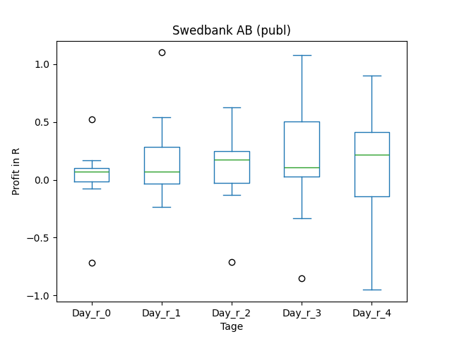
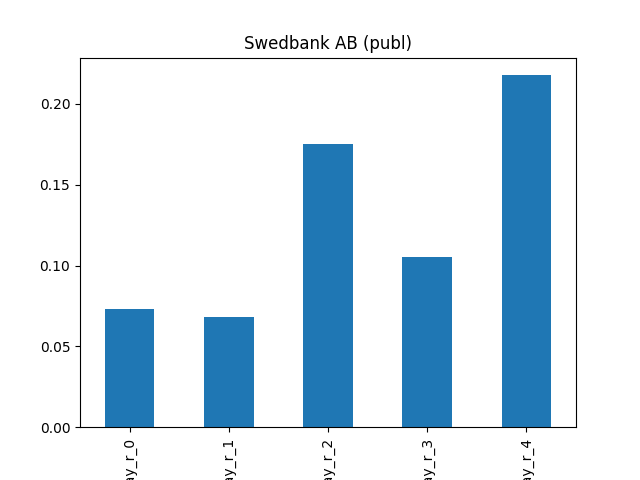
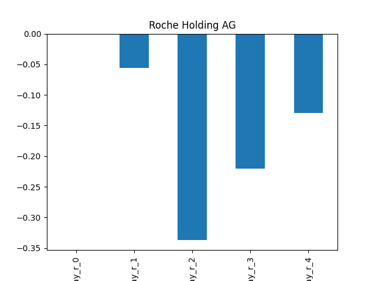
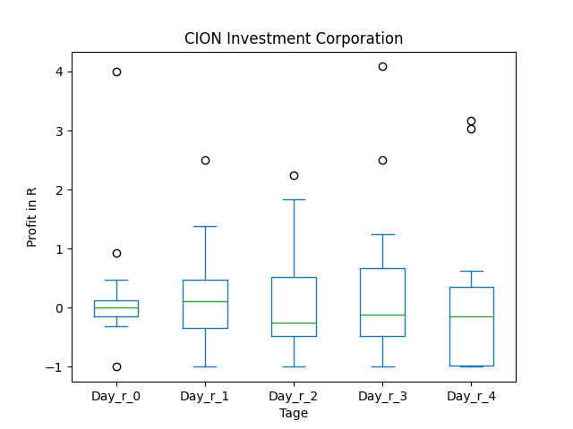
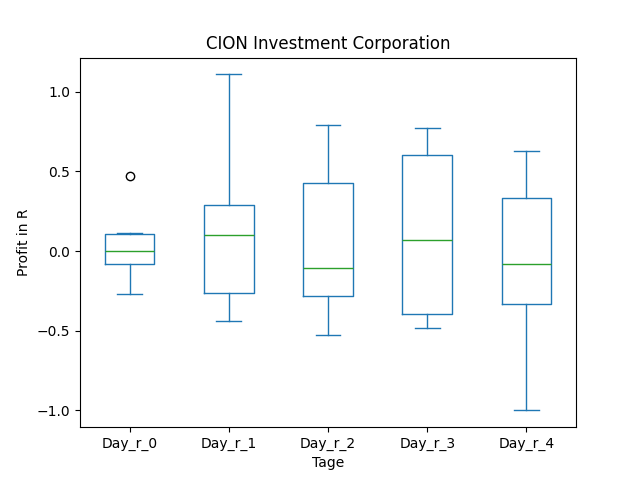

# dividend-shorter

bet on falling prices on payday **2025-03-28**.

## Signale

| Ticker   |   Divid Rate |   Close |          Volume |   last_close_volume |   Divid % | 5_Days_pos   | above_SMA_50   |
|:---------|-------------:|--------:|----------------:|--------------------:|----------:|:-------------|:---------------|
| TWODY    |         0.59 |   14.7  | 201400          |             2960580 |      4.01 | False        | True           |
| TRTX     |         0.24 |    8.36 | 909500          |             7603420 |      2.87 | False        | False          |
| SWDBY    |         1.98 |   25.57 |  34300          |              877051 |      7.73 | False        | True           |
| SVNLY    |         0.71 |    6.51 | 182400          |             1187424 |     10.94 | True         | True           |
| RHHBY    |         1.36 |   42.35 |      1.6812e+06 |            71198820 |      3.22 | False        | True           |
| LIEN     |         0.34 |   12    |  14300          |              171600 |      2.83 | True         | True           |
| CION     |         0.36 |   10.84 | 376600          |             4082344 |      3.32 | False        | False          |
| AIBGY    |         0.8  |   13.75 |  26800          |              368500 |      5.83 | False        | True           |

## TWODY

### Erwartung in R
|      |   Day_r_0 |   Day_r_1 |   Day_r_2 |   Day_r_3 |   Day_r_4 |   Treffer |
|:-----|----------:|----------:|----------:|----------:|----------:|----------:|
| ohne |       1.5 |       1.2 |       0.4 |      -0.6 |      -0.8 |         1 |
| mit  |       1.5 |       1.2 |       0.4 |      -0.6 |      -0.8 |         1 |

### Ohne Filter

### Mit Filter

## TRTX

### Erwartung in R
|      |   Day_r_0 |   Day_r_1 |   Day_r_2 |   Day_r_3 |   Day_r_4 |   Treffer |
|:-----|----------:|----------:|----------:|----------:|----------:|----------:|
| ohne |         0 |      -0.1 |      -0.2 |      -0.1 |      -0.2 |        33 |
| mit  |         0 |      -0.3 |      -0.2 |      -0.1 |      -0.2 |        11 |

### Ohne Filter

### Mit Filter

## SWDBY

### Erwartung in R
|      |   Day_r_0 |   Day_r_1 |   Day_r_2 |   Day_r_3 |   Day_r_4 |   Treffer |
|:-----|----------:|----------:|----------:|----------:|----------:|----------:|
| ohne |       0.1 |       0.1 |       0.2 |       0.1 |       0.2 |        14 |
| mit  |       0.1 |      -0.1 |      -0.1 |      -0.1 |      -0.2 |         3 |

### Ohne Filter

### Mit Filter

## SVNLY

### Erwartung in R
|      |   Day_r_0 |   Day_r_1 |   Day_r_2 |   Day_r_3 |   Day_r_4 |   Treffer |
|:-----|----------:|----------:|----------:|----------:|----------:|----------:|
| ohne |       0   |       0   |       0   |        -0 |        -0 |        13 |
| mit  |       0.1 |       0.1 |       0.2 |         0 |        -0 |         2 |

### Ohne Filter

### Mit Filter

## RHHBY

### Erwartung in R
|      |   Day_r_0 |   Day_r_1 |   Day_r_2 |   Day_r_3 |   Day_r_4 |   Treffer |
|:-----|----------:|----------:|----------:|----------:|----------:|----------:|
| ohne |         0 |      -0.1 |      -0.3 |      -0.2 |      -0.1 |        18 |
| mit  |         0 |       0   |      -0.2 |      -0.1 |      -0.1 |        17 |

### Ohne Filter

### Mit Filter

## LIEN

### Erwartung in R
|      |   Day_r_0 |   Day_r_1 |   Day_r_2 |   Day_r_3 |   Day_r_4 |   Treffer |
|:-----|----------:|----------:|----------:|----------:|----------:|----------:|
| ohne |       0.5 |       0.3 |       0.5 |       0.4 |       0.6 |         1 |
| mit  |     nan   |     nan   |     nan   |     nan   |     nan   |         0 |

### Ohne Filter

### Mit Filter

## CION

### Erwartung in R
|      |   Day_r_0 |   Day_r_1 |   Day_r_2 |   Day_r_3 |   Day_r_4 |   Treffer |
|:-----|----------:|----------:|----------:|----------:|----------:|----------:|
| ohne |         0 |       0.1 |      -0.3 |      -0.1 |      -0.2 |        20 |
| mit  |         0 |       0.1 |      -0.1 |       0.1 |      -0.1 |        10 |

### Ohne Filter

### Mit Filter

## AIBGY

### Erwartung in R
|      |   Day_r_0 |   Day_r_1 |   Day_r_2 |   Day_r_3 |   Day_r_4 |   Treffer |
|:-----|----------:|----------:|----------:|----------:|----------:|----------:|
| ohne |        -1 |        -1 |        -1 |        -1 |        -1 |         4 |
| mit  |       nan |       nan |       nan |       nan |       nan |         0 |

### Ohne Filter

### Mit Filter

