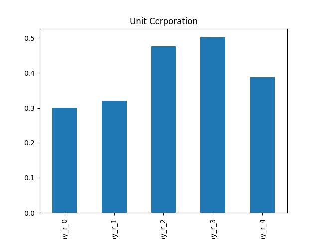
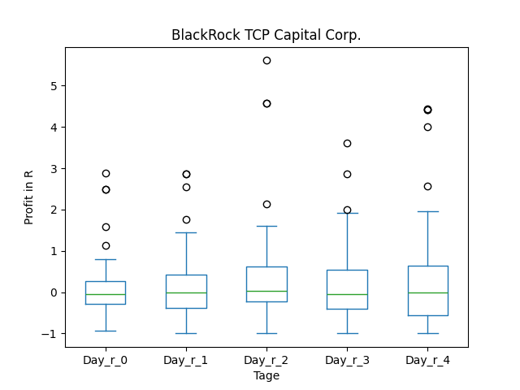

# dividend-shorter

bet on falling prices on payday **2024-12-17**.

## Signale

| Ticker   |   Divid Rate |   Close |   Volume |   last_close_volume |   Divid % | 5_Days_pos   | above_SMA_50   |
|:---------|-------------:|--------:|---------:|--------------------:|----------:|:-------------|:---------------|
| UNTC     |         2    |   34.27 |    44900 |             1538723 |      5.84 | True         | True           |
| UNTC     |         1.25 |   34.27 |    44900 |             1538723 |      3.65 | True         | True           |
| TCPC     |         0.34 |    9.21 |   982900 |             9052509 |      3.69 | False        | True           |
| PPSI     |         1.5  |    6.11 |   353400 |             2159274 |     24.55 | True         | True           |
| NMFC     |         0.32 |   11.73 |   970000 |            11378100 |      2.73 | False        | True           |
| MCN      |         0.18 |    6.98 |    55600 |              388088 |      2.58 | False        | False          |

## UNTC

### Erwartung in R
|      |   Day_r_0 |   Day_r_1 |   Day_r_2 |   Day_r_3 |   Day_r_4 |   Treffer |
|:-----|----------:|----------:|----------:|----------:|----------:|----------:|
| ohne |       0.1 |       0.5 |       0.4 |       0.1 |       0.4 |         1 |
| mit  |       0.1 |       0.5 |       0.4 |       0.1 |       0.4 |         1 |

### Ohne Filter

### Mit Filter

## UNTC

### Erwartung in R
|      |   Day_r_0 |   Day_r_1 |   Day_r_2 |   Day_r_3 |   Day_r_4 |   Treffer |
|:-----|----------:|----------:|----------:|----------:|----------:|----------:|
| ohne |       0.1 |       0.5 |       0.4 |       0.1 |       0.4 |         1 |
| mit  |       0.1 |       0.5 |       0.4 |       0.1 |       0.4 |         1 |

### Ohne Filter

### Mit Filter

## TCPC

### Erwartung in R
|      |   Day_r_0 |   Day_r_1 |   Day_r_2 |   Day_r_3 |   Day_r_4 |   Treffer |
|:-----|----------:|----------:|----------:|----------:|----------:|----------:|
| ohne |      -0.1 |      -0   |       0   |      -0.1 |      -0   |        58 |
| mit  |      -0.1 |       0.1 |       0.3 |       0.3 |       0.4 |         8 |

### Ohne Filter

### Mit Filter

## PPSI

### Erwartung in R
|      |   Day_r_0 |   Day_r_1 |   Day_r_2 |   Day_r_3 |   Day_r_4 |   Treffer |
|:-----|----------:|----------:|----------:|----------:|----------:|----------:|
| ohne |        -1 |        -1 |        -1 |        -1 |        -1 |         1 |
| mit  |       nan |       nan |       nan |       nan |       nan |         0 |

### Ohne Filter

### Mit Filter

## NMFC

### Erwartung in R
|      |   Day_r_0 |   Day_r_1 |   Day_r_2 |   Day_r_3 |   Day_r_4 |   Treffer |
|:-----|----------:|----------:|----------:|----------:|----------:|----------:|
| ohne |       0.1 |         0 |         0 |       0   |      -0.1 |        65 |
| mit  |       0.3 |         0 |         2 |       2.2 |       3.1 |         3 |

### Ohne Filter

### Mit Filter

## MCN

### Erwartung in R
|      |   Day_r_0 |   Day_r_1 |   Day_r_2 |   Day_r_3 |   Day_r_4 |   Treffer |
|:-----|----------:|----------:|----------:|----------:|----------:|----------:|
| ohne |       0.1 |       0.2 |       0.2 |       0.2 |       0.2 |        65 |
| mit  |       0   |       0.9 |       1   |       1.4 |       2.1 |         1 |

### Ohne Filter

### Mit Filter

