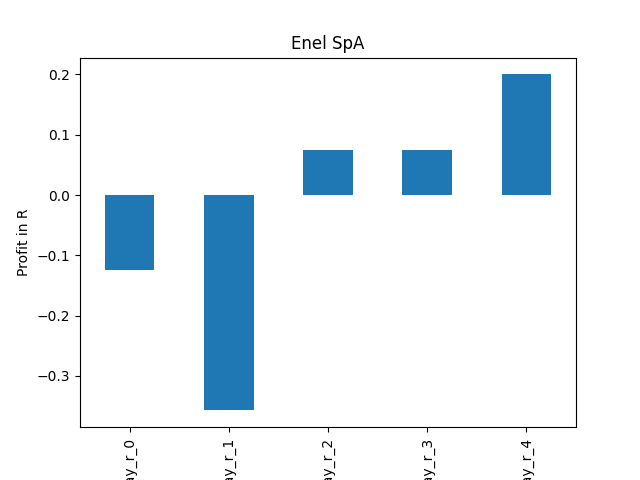

# dividend-shorter

bet on falling prices on payday **2025-01-21**.

## Signale

| Ticker   |   Divid Rate |   Close |   Volume |   last_close_volume |   Divid % | 5_Days_pos   | above_SMA_50   |
|:---------|-------------:|--------:|---------:|--------------------:|----------:|:-------------|:---------------|
| GSHD     |         5.91 |  110.35 |   257700 |            28437195 |      5.36 | True         | False          |
| ENLAY    |         0.23 |    7.41 |   237800 |             1762098 |      3.12 | True         | True           |
| BMRRY    |         0.74 |   15.94 |    45700 |              728458 |      4.63 | True         | False          |

## GSHD

### Erwartung in R
|      |   Day_r_0 |   Day_r_1 |   Day_r_2 |   Day_r_3 |   Day_r_4 |   Treffer |
|:-----|----------:|----------:|----------:|----------:|----------:|----------:|
| ohne |        -1 |        -1 |        -1 |        -1 |        -1 |         3 |
| mit  |       nan |       nan |       nan |       nan |       nan |         0 |

### Ohne Filter

### Mit Filter

## ENLAY

### Erwartung in R
|      |   Day_r_0 |   Day_r_1 |   Day_r_2 |   Day_r_3 |   Day_r_4 |   Treffer |
|:-----|----------:|----------:|----------:|----------:|----------:|----------:|
| ohne |      -0.1 |      -0.1 |      -0.1 |       0   |      -0.1 |        23 |
| mit  |      -0.1 |      -0.4 |       0.1 |       0.1 |       0.2 |         3 |

### Ohne Filter

### Mit Filter

## BMRRY

### Erwartung in R
|      |   Day_r_0 |   Day_r_1 |   Day_r_2 |   Day_r_3 |   Day_r_4 |   Treffer |
|:-----|----------:|----------:|----------:|----------:|----------:|----------:|
| ohne |      -0.3 |      -0   |      -0.1 |      -0.3 |      -0.4 |        25 |
| mit  |      -0.2 |      -0.3 |      -0.4 |      -0.4 |      -0.5 |         2 |

### Ohne Filter

### Mit Filter

