# dividend-shorter

bet on falling prices on payday **2025-09-30**.

## Signale

| Ticker   |   Divid Rate |   Close |          Volume |   last_close_volume |   Divid % | 5_Days_pos   | above_SMA_50   |
|:---------|-------------:|--------:|----------------:|--------------------:|----------:|:-------------|:---------------|
| YRD      |         0.22 |    5.99 |  94600          |              566654 |      3.67 | True         | True           |
| TRIN     |         0.51 |   15.86 |      1.3922e+06 |            22080292 |      3.22 | False        | True           |
| SUNS     |         0.3  |   10.99 |  75600          |              830844 |      2.73 | False        | True           |
| REFI     |         0.47 |   13.09 | 249300          |             3263337 |      3.59 | False        | False          |
| RC       |         0.12 |    4.04 |      2.4337e+06 |             9832148 |      3.09 | False        | False          |
| OBDC     |         0.37 |   13.21 |      4.0625e+06 |            53665625 |      2.8  | False        | False          |
| NLY      |         0.7  |   20.92 |      1.2277e+07 |           256834840 |      3.35 | False        | False          |
| NLCP     |         0.43 |   13.65 | 222200          |             3033030 |      3.15 | False        | False          |
| NCDL     |         0.45 |   14.3  | 535600          |             7659080 |      3.15 | False        | False          |
| NBY      |         0.8  |    2.36 |      1.2486e+06 |             2946696 |     33.9  | True         | True           |
| MSIF     |         0.35 |   13.43 | 156300          |             2099109 |      2.61 | False        | False          |
| MSDL     |         0.5  |   16.68 |      1.2822e+06 |            21387096 |      3    | False        | False          |
| MITT     |         0.21 |    7.57 | 197900          |             1498103 |      2.77 | False        | False          |
| MFA      |         0.36 |    9.54 |      2.1864e+06 |            20858256 |      3.77 | False        | False          |
| KREF     |         0.25 |    9.17 | 871800          |             7994406 |      2.73 | False        | False          |
| KBDC     |         0.4  |   13.61 | 595500          |             8104755 |      2.94 | False        | False          |
| IIPR     |         1.9  |   54.99 | 663000          |            36458370 |      3.46 | False        | True           |
| GSBD     |         0.32 |   10.75 |      1.1677e+06 |            12552775 |      2.98 | False        | False          |
| GHI      |         0.3  |   10.74 |  75500          |              810870 |      2.79 | True         | False          |
| FBRT     |         0.36 |   11.22 | 800900          |             8986098 |      3.16 | True         | True           |
| CIM      |         0.37 |   13.5  | 916800          |            12376800 |      2.74 | False        | False          |
| CHMI     |         0.1  |    2.52 | 660800          |             1665216 |      3.97 | True         | False          |
| CGBD     |         0.4  |   12.96 | 684300          |             8868528 |      3.09 | False        | False          |
| CCAP     |         0.42 |   14.88 | 465500          |             6926640 |      2.82 | False        | False          |
| BXSL     |         0.77 |   26.82 |      2.6953e+06 |            72287946 |      2.87 | False        | False          |
| BXMT     |         0.47 |   18.75 |      1.9145e+06 |            35896875 |      2.51 | False        | False          |
| BRSP     |         0.16 |    5.57 | 601700          |             3351469 |      2.87 | False        | True           |
| BGS      |         0.19 |    4.52 |      2.936e+06  |            13270720 |      4.2  | True         | True           |
| AFCG     |         0.15 |    4.11 | 409200          |             1681812 |      3.65 | True         | False          |
| ACRE     |         0.15 |    4.75 | 641900          |             3049025 |      3.16 | False        | True           |

## YRD

### Erwartung in R
|      |   Day_r_0 |   Day_r_1 |   Day_r_2 |   Day_r_3 |   Day_r_4 |   Treffer |
|:-----|----------:|----------:|----------:|----------:|----------:|----------:|
| ohne |       0.6 |       1.5 |       4.8 |       3.8 |       3.3 |         4 |
| mit  |       0.6 |       3.7 |       4.8 |       2.8 |       2.6 |         2 |

### Ohne Filter

### Mit Filter

## TRIN

### Erwartung in R
|      |   Day_r_0 |   Day_r_1 |   Day_r_2 |   Day_r_3 |   Day_r_4 |   Treffer |
|:-----|----------:|----------:|----------:|----------:|----------:|----------:|
| ohne |        -0 |      -0.1 |      -0.2 |      -0.3 |      -0.1 |        24 |
| mit  |        -0 |      -0   |      -0.2 |      -0.3 |      -0   |        13 |

### Ohne Filter
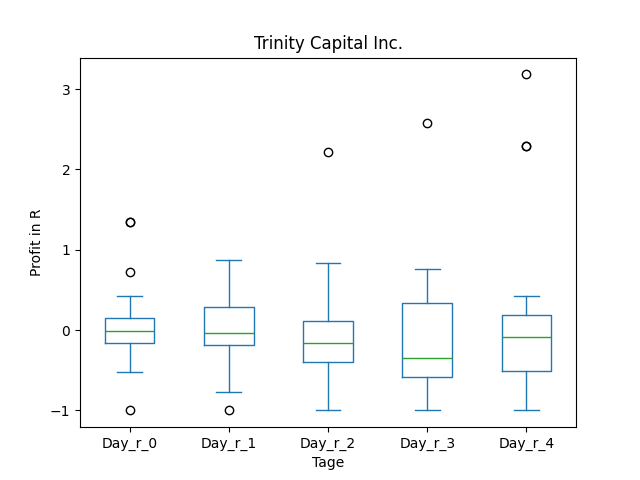
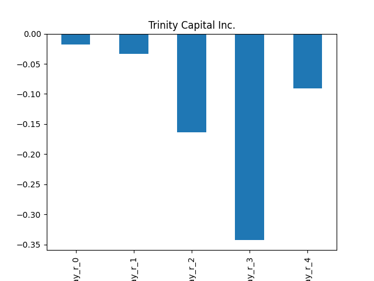

### Mit Filter

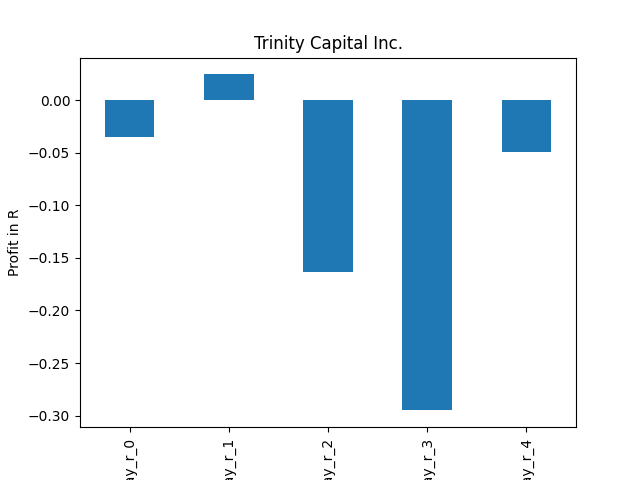

## SUNS

### Erwartung in R
|      |   Day_r_0 |   Day_r_1 |   Day_r_2 |   Day_r_3 |   Day_r_4 |   Treffer |
|:-----|----------:|----------:|----------:|----------:|----------:|----------:|
| ohne |       0.6 |       0.7 |       0.1 |       0.7 |       0.7 |         4 |
| mit  |     nan   |     nan   |     nan   |     nan   |     nan   |         0 |

### Ohne Filter

### Mit Filter

## REFI

### Erwartung in R
|      |   Day_r_0 |   Day_r_1 |   Day_r_2 |   Day_r_3 |   Day_r_4 |   Treffer |
|:-----|----------:|----------:|----------:|----------:|----------:|----------:|
| ohne |       0.1 |       0.1 |       0   |       0.1 |       0.2 |        17 |
| mit  |       0.2 |       0.1 |       0.2 |       0.2 |       0.3 |         8 |

### Ohne Filter

### Mit Filter

## RC

### Erwartung in R
|      |   Day_r_0 |   Day_r_1 |   Day_r_2 |   Day_r_3 |   Day_r_4 |   Treffer |
|:-----|----------:|----------:|----------:|----------:|----------:|----------:|
| ohne |        -0 |      -0.1 |      -0.1 |      -0.1 |      -0.1 |        53 |
| mit  |        -0 |      -0.1 |      -0.3 |      -0.4 |      -0.3 |        14 |

### Ohne Filter

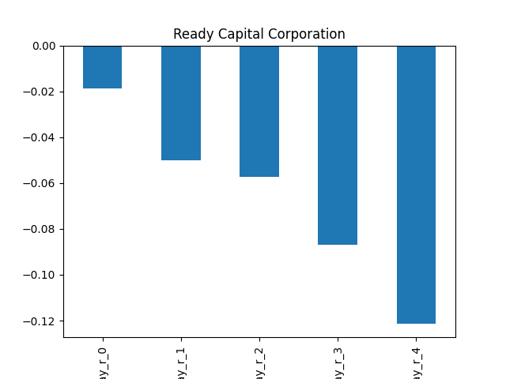

### Mit Filter

## OBDC

### Erwartung in R
|      |   Day_r_0 |   Day_r_1 |   Day_r_2 |   Day_r_3 |   Day_r_4 |   Treffer |
|:-----|----------:|----------:|----------:|----------:|----------:|----------:|
| ohne |      -0.1 |        -0 |      -0.2 |      -0.1 |      -0.2 |        42 |
| mit  |      -0.1 |         0 |      -0.6 |      -1   |      -0.8 |         1 |

### Ohne Filter

### Mit Filter

## NLY

### Erwartung in R
|      |   Day_r_0 |   Day_r_1 |   Day_r_2 |   Day_r_3 |   Day_r_4 |   Treffer |
|:-----|----------:|----------:|----------:|----------:|----------:|----------:|
| ohne |      -0   |       0   |       0.1 |        -0 |      -0   |        90 |
| mit  |      -0.1 |      -0.1 |       0.1 |        -0 |       0.3 |        12 |

### Ohne Filter

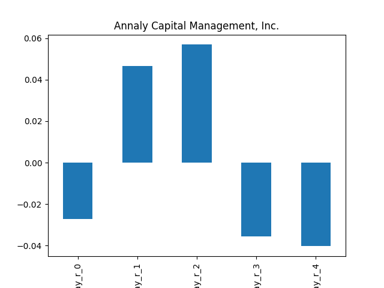

### Mit Filter

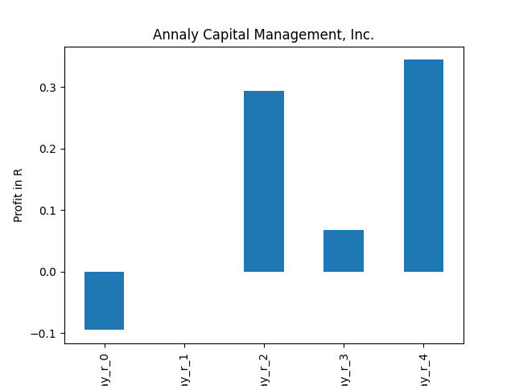

## NLCP

### Erwartung in R
|      |   Day_r_0 |   Day_r_1 |   Day_r_2 |   Day_r_3 |   Day_r_4 |   Treffer |
|:-----|----------:|----------:|----------:|----------:|----------:|----------:|
| ohne |        -0 |      -0.2 |      -0.1 |         0 |      -0.1 |        15 |
| mit  |       nan |     nan   |     nan   |       nan |     nan   |         0 |

### Ohne Filter

### Mit Filter

## NCDL

### Erwartung in R
|      |   Day_r_0 |   Day_r_1 |   Day_r_2 |   Day_r_3 |   Day_r_4 |   Treffer |
|:-----|----------:|----------:|----------:|----------:|----------:|----------:|
| ohne |      -0.1 |      -0.3 |      -0.4 |      -0.3 |      -0.3 |        10 |
| mit  |     nan   |     nan   |     nan   |     nan   |     nan   |         0 |

### Ohne Filter

### Mit Filter

## NBY

### Erwartung in R
|      |   Day_r_0 |   Day_r_1 |   Day_r_2 |   Day_r_3 |   Day_r_4 |   Treffer |
|:-----|----------:|----------:|----------:|----------:|----------:|----------:|
| ohne |       nan |       nan |       nan |       nan |       nan |         0 |
| mit  |       nan |       nan |       nan |       nan |       nan |         0 |

### Ohne Filter

### Mit Filter

## MSIF

### Erwartung in R
|      |   Day_r_0 |   Day_r_1 |   Day_r_2 |   Day_r_3 |   Day_r_4 |   Treffer |
|:-----|----------:|----------:|----------:|----------:|----------:|----------:|
| ohne |      -0.4 |         0 |      -0.3 |      -0.4 |       0.4 |         4 |
| mit  |     nan   |       nan |     nan   |     nan   |     nan   |         0 |

### Ohne Filter

### Mit Filter

## MSDL

### Erwartung in R
|      |   Day_r_0 |   Day_r_1 |   Day_r_2 |   Day_r_3 |   Day_r_4 |   Treffer |
|:-----|----------:|----------:|----------:|----------:|----------:|----------:|
| ohne |       0.8 |       0.3 |       0.3 |       0.2 |         0 |         8 |
| mit  |     nan   |     nan   |     nan   |     nan   |       nan |         0 |

### Ohne Filter

### Mit Filter

## MITT

### Erwartung in R
|      |   Day_r_0 |   Day_r_1 |   Day_r_2 |   Day_r_3 |   Day_r_4 |   Treffer |
|:-----|----------:|----------:|----------:|----------:|----------:|----------:|
| ohne |      -0.1 |      -0.1 |      -0.2 |      -0.1 |        -0 |        56 |
| mit  |      -0.2 |      -0.1 |      -0.5 |      -0.2 |        -0 |         5 |

### Ohne Filter

### Mit Filter

## MFA

### Erwartung in R
|      |   Day_r_0 |   Day_r_1 |   Day_r_2 |   Day_r_3 |   Day_r_4 |   Treffer |
|:-----|----------:|----------:|----------:|----------:|----------:|----------:|
| ohne |       0.1 |       0.1 |      -0   |         0 |       0   |        89 |
| mit  |      -0.1 |      -0.2 |      -0.2 |        -0 |       0.1 |        12 |

### Ohne Filter

### Mit Filter

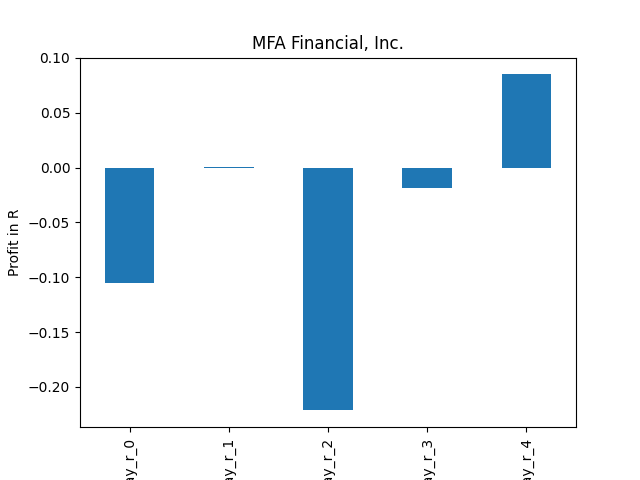

## KREF

### Erwartung in R
|      |   Day_r_0 |   Day_r_1 |   Day_r_2 |   Day_r_3 |   Day_r_4 |   Treffer |
|:-----|----------:|----------:|----------:|----------:|----------:|----------:|
| ohne |        -0 |       0   |      -0.1 |      -0.2 |      -0.1 |        33 |
| mit  |         0 |      -0.1 |      -0.5 |      -0.1 |       0.4 |         7 |

### Ohne Filter

### Mit Filter

## KBDC

### Erwartung in R
|      |   Day_r_0 |   Day_r_1 |   Day_r_2 |   Day_r_3 |   Day_r_4 |   Treffer |
|:-----|----------:|----------:|----------:|----------:|----------:|----------:|
| ohne |       0.2 |       0.2 |      -0.2 |      -0.5 |      -0.3 |         8 |
| mit  |     nan   |     nan   |     nan   |     nan   |     nan   |         0 |

### Ohne Filter

### Mit Filter

## IIPR

### Erwartung in R
|      |   Day_r_0 |   Day_r_1 |   Day_r_2 |   Day_r_3 |   Day_r_4 |   Treffer |
|:-----|----------:|----------:|----------:|----------:|----------:|----------:|
| ohne |      -0.1 |       0.1 |       0.1 |       0.5 |       0.2 |        33 |
| mit  |      -0   |      -0.4 |      -0.5 |      -0.4 |       0   |         3 |

### Ohne Filter

### Mit Filter
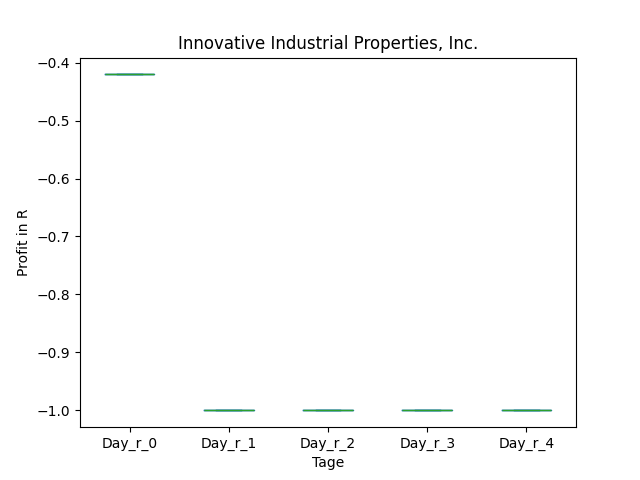

## GSBD

### Erwartung in R
|      |   Day_r_0 |   Day_r_1 |   Day_r_2 |   Day_r_3 |   Day_r_4 |   Treffer |
|:-----|----------:|----------:|----------:|----------:|----------:|----------:|
| ohne |       0.1 |       0.2 |       0.1 |       0.1 |       0.2 |        49 |
| mit  |       0.4 |       0.5 |       0.2 |       0.3 |       0.5 |        12 |

### Ohne Filter

### Mit Filter

## GHI

### Erwartung in R
|      |   Day_r_0 |   Day_r_1 |   Day_r_2 |   Day_r_3 |   Day_r_4 |   Treffer |
|:-----|----------:|----------:|----------:|----------:|----------:|----------:|
| ohne |      -0.1 |       0   |      -0.1 |         0 |      -0.1 |        13 |
| mit  |      -0.1 |      -0.6 |      -1   |        -1 |      -1   |         1 |

### Ohne Filter
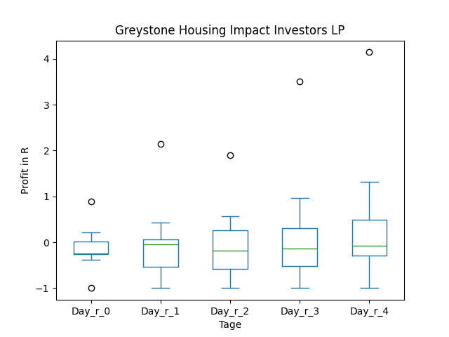

### Mit Filter
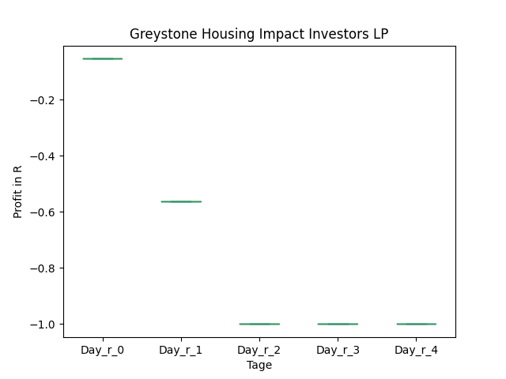

## FBRT

### Erwartung in R
|      |   Day_r_0 |   Day_r_1 |   Day_r_2 |   Day_r_3 |   Day_r_4 |   Treffer |
|:-----|----------:|----------:|----------:|----------:|----------:|----------:|
| ohne |         0 |       0   |      -0.2 |      -0.1 |       0.1 |        15 |
| mit  |         0 |      -0.2 |      -0.6 |      -0.5 |      -0.1 |         5 |

### Ohne Filter

### Mit Filter

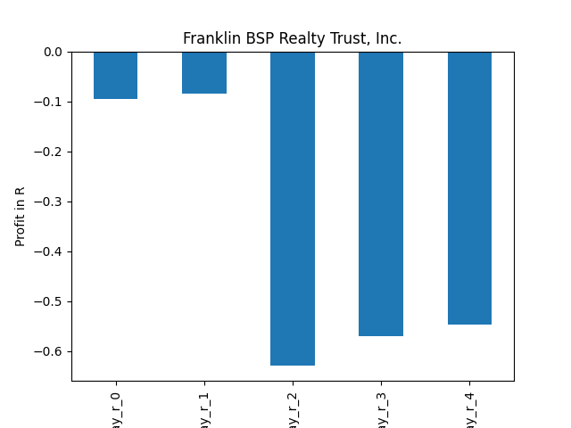

## CIM

### Erwartung in R
|      |   Day_r_0 |   Day_r_1 |   Day_r_2 |   Day_r_3 |   Day_r_4 |   Treffer |
|:-----|----------:|----------:|----------:|----------:|----------:|----------:|
| ohne |       0   |       0.2 |       0.1 |       0   |       0.2 |        73 |
| mit  |      -0.3 |      -0.2 |      -0.2 |       0.2 |       1.4 |         1 |

### Ohne Filter

### Mit Filter
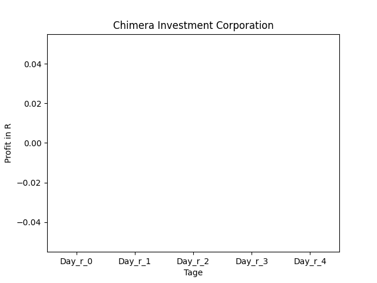

## CHMI

### Erwartung in R
|      |   Day_r_0 |   Day_r_1 |   Day_r_2 |   Day_r_3 |   Day_r_4 |   Treffer |
|:-----|----------:|----------:|----------:|----------:|----------:|----------:|
| ohne |       0.1 |       0.1 |       0   |       0   |       0.1 |        49 |
| mit  |       0.1 |       0.2 |       0.4 |       0.5 |       0.5 |        19 |

### Ohne Filter

### Mit Filter

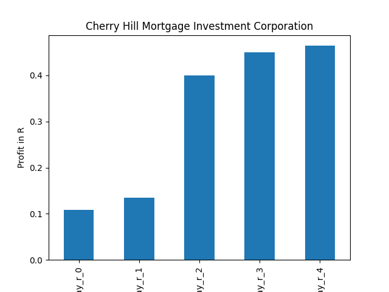

## CGBD

### Erwartung in R
|      |   Day_r_0 |   Day_r_1 |   Day_r_2 |   Day_r_3 |   Day_r_4 |   Treffer |
|:-----|----------:|----------:|----------:|----------:|----------:|----------:|
| ohne |      -0   |       0.1 |      -0   |      -0.2 |      -0.3 |        56 |
| mit  |      -0.1 |       0.1 |       0.2 |      -0   |      -0.1 |         6 |

### Ohne Filter

### Mit Filter

## CCAP

### Erwartung in R
|      |   Day_r_0 |   Day_r_1 |   Day_r_2 |   Day_r_3 |   Day_r_4 |   Treffer |
|:-----|----------:|----------:|----------:|----------:|----------:|----------:|
| ohne |       0   |       0   |       0.1 |      -0.1 |       0.1 |        35 |
| mit  |      -0.1 |      -0.1 |      -0.4 |      -0.5 |      -0.1 |         5 |

### Ohne Filter

### Mit Filter

## BXSL

### Erwartung in R
|      |   Day_r_0 |   Day_r_1 |   Day_r_2 |   Day_r_3 |   Day_r_4 |   Treffer |
|:-----|----------:|----------:|----------:|----------:|----------:|----------:|
| ohne |      -0.1 |      -0.1 |      -0.1 |      -0   |      -0.2 |        19 |
| mit  |      -0.3 |      -0.1 |       0.5 |       0.8 |       0.9 |         1 |

### Ohne Filter

### Mit Filter

## BXMT

### Erwartung in R
|      |   Day_r_0 |   Day_r_1 |   Day_r_2 |   Day_r_3 |   Day_r_4 |   Treffer |
|:-----|----------:|----------:|----------:|----------:|----------:|----------:|
| ohne |       0   |      -0   |       0.1 |      -0.1 |         0 |        69 |
| mit  |      -0.2 |      -0.3 |      -0.1 |       0   |         0 |         7 |

### Ohne Filter

### Mit Filter

## BRSP

### Erwartung in R
|      |   Day_r_0 |   Day_r_1 |   Day_r_2 |   Day_r_3 |   Day_r_4 |   Treffer |
|:-----|----------:|----------:|----------:|----------:|----------:|----------:|
| ohne |      -0.1 |      -0.2 |      -0.2 |      -0.5 |      -0.4 |        44 |
| mit  |      -0.2 |      -0.3 |      -0.2 |      -0.4 |       0   |        11 |

### Ohne Filter

### Mit Filter

## BGS

### Erwartung in R
|      |   Day_r_0 |   Day_r_1 |   Day_r_2 |   Day_r_3 |   Day_r_4 |   Treffer |
|:-----|----------:|----------:|----------:|----------:|----------:|----------:|
| ohne |       0.3 |       0.3 |       0.3 |       0.3 |       0.4 |        72 |
| mit  |      -0.5 |      -1   |      -1   |      -1   |      -1   |         3 |

### Ohne Filter

### Mit Filter
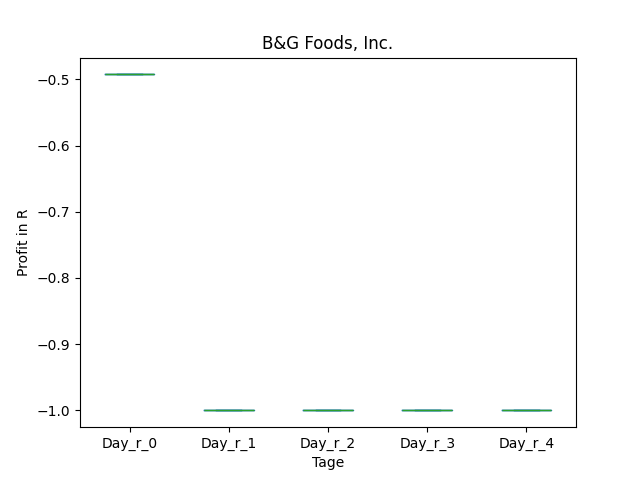

## AFCG

### Erwartung in R
|      |   Day_r_0 |   Day_r_1 |   Day_r_2 |   Day_r_3 |   Day_r_4 |   Treffer |
|:-----|----------:|----------:|----------:|----------:|----------:|----------:|
| ohne |       0.4 |       0.4 |       0.3 |       0.6 |       0.7 |        18 |
| mit  |       0.4 |       0.4 |       0.3 |       0.6 |       0.7 |        16 |

### Ohne Filter

### Mit Filter

## ACRE

### Erwartung in R
|      |   Day_r_0 |   Day_r_1 |   Day_r_2 |   Day_r_3 |   Day_r_4 |   Treffer |
|:-----|----------:|----------:|----------:|----------:|----------:|----------:|
| ohne |      -0.1 |      -0.1 |      -0.3 |      -0.2 |      -0.1 |        63 |
| mit  |      -0.1 |      -0.1 |       0   |      -0.1 |       0.3 |        15 |

### Ohne Filter

### Mit Filter

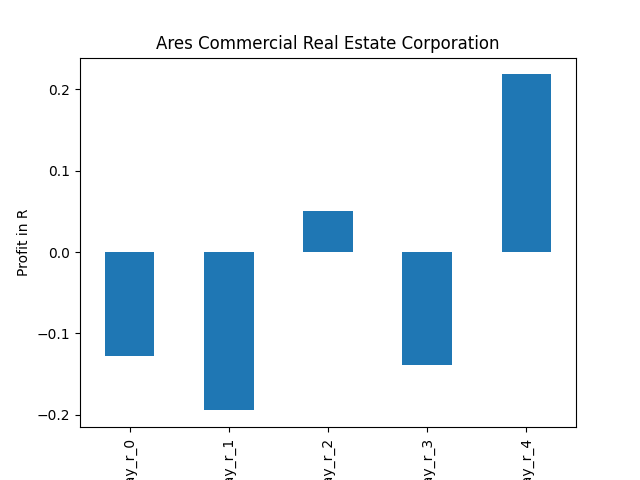

