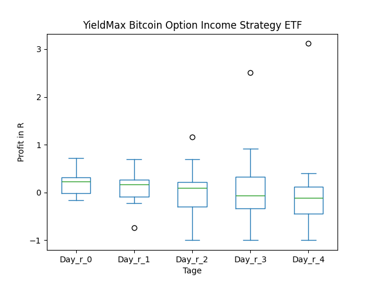
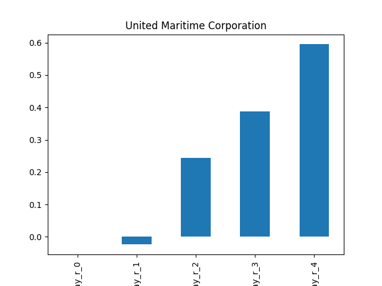
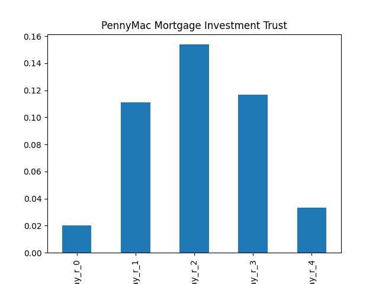
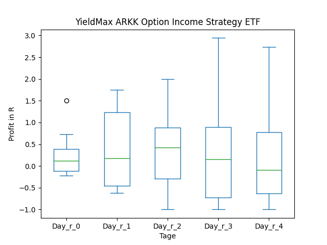
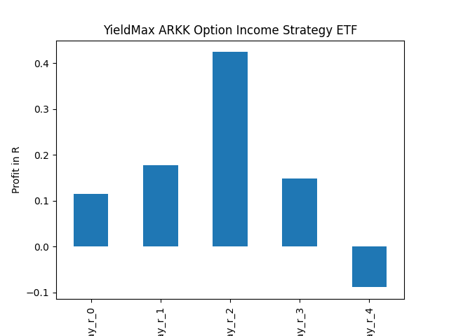
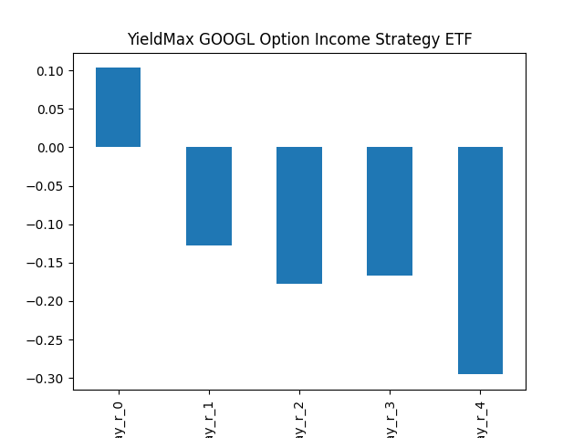
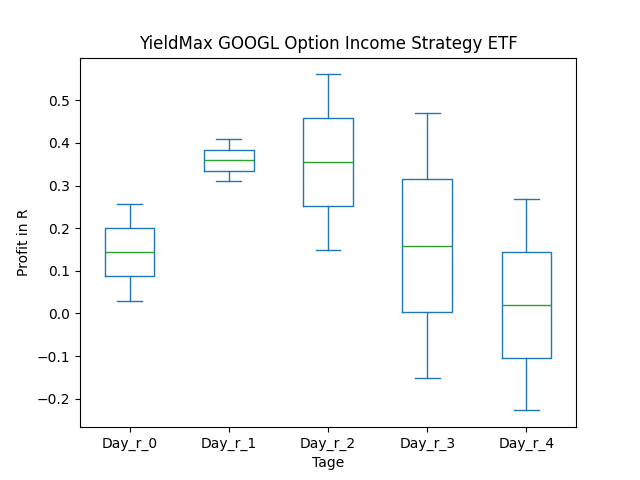

# dividend-shorter

bet on falling prices on payday **2024-12-27**.

## Signale

| Ticker   |   Divid Rate |   Close |          Volume |   last_close_volume |   Divid % | 5_Days_pos   | above_SMA_50   |
|:---------|-------------:|--------:|----------------:|--------------------:|----------:|:-------------|:---------------|
| YBIT     |         0.71 |   13.21 | 525500          |             6941855 |      5.37 | False        | False          |
| USEA     |         0.08 |    1.86 | 262500          |              488250 |      4.03 | True         | False          |
| TWN      |         7.4  |   46.72 |  56500          |             2639680 |     15.84 | True         | True           |
| TSMY     |         0.81 |   20.31 |  59900          |             1216569 |      3.97 | True         | True           |
| TSLY     |         1.29 |   17.05 |      6.1736e+06 |           105259880 |      7.54 | True         | True           |
| TRTX     |         0.24 |    8.72 | 603100          |             5259032 |      2.75 | True         | False          |
| SNOY     |         0.57 |   19.17 | 174800          |             3350916 |      2.96 | False        | True           |
| SHIP     |         0.26 |    7.11 | 361900          |             2573109 |      3.66 | True         | False          |
| PSBD     |         0.42 |   16    |  18200          |              291200 |      2.62 | True         | True           |
| PMT      |         0.4  |   13    | 906800          |            11788400 |      3.08 | True         | False          |
| OARK     |         0.33 |   11.11 | 139500          |             1549845 |      2.96 | True         | True           |
| GOOY     |         0.63 |   15.82 | 142300          |             2251186 |      4    | True         | True           |
| CRSH     |         0.37 |    6.08 | 194700          |             1183776 |      6.1  | False        | False          |

## YBIT

### Erwartung in R
|      |   Day_r_0 |   Day_r_1 |   Day_r_2 |   Day_r_3 |   Day_r_4 |   Treffer |
|:-----|----------:|----------:|----------:|----------:|----------:|----------:|
| ohne |       0.2 |       0.1 |        -0 |       0.1 |      -0.1 |         7 |
| mit  |       0.2 |       0.1 |        -0 |       0.1 |      -0.1 |         7 |

### Ohne Filter

### Mit Filter

## USEA

### Erwartung in R
|      |   Day_r_0 |   Day_r_1 |   Day_r_2 |   Day_r_3 |   Day_r_4 |   Treffer |
|:-----|----------:|----------:|----------:|----------:|----------:|----------:|
| ohne |         0 |        -0 |       0.2 |       0.4 |       0.6 |         8 |
| mit  |       nan |       nan |     nan   |     nan   |     nan   |         0 |

### Ohne Filter

### Mit Filter

## TWN

### Erwartung in R
|      |   Day_r_0 |   Day_r_1 |   Day_r_2 |   Day_r_3 |   Day_r_4 |   Treffer |
|:-----|----------:|----------:|----------:|----------:|----------:|----------:|
| ohne |       0.1 |       0.1 |      -0.2 |      -0.4 |      -0.2 |        13 |
| mit  |     nan   |     nan   |     nan   |     nan   |     nan   |         0 |

### Ohne Filter

### Mit Filter

## TSMY

### Erwartung in R
|      |   Day_r_0 |   Day_r_1 |   Day_r_2 |   Day_r_3 |   Day_r_4 |   Treffer |
|:-----|----------:|----------:|----------:|----------:|----------:|----------:|
| ohne |      -0.4 |      -0.4 |      -1   |      -1   |      -1   |         3 |
| mit  |      -0.2 |      -0.5 |      -0.5 |      -0.6 |      -0.6 |         2 |

### Ohne Filter

### Mit Filter

## TSLY

### Erwartung in R
|      |   Day_r_0 |   Day_r_1 |   Day_r_2 |   Day_r_3 |   Day_r_4 |   Treffer |
|:-----|----------:|----------:|----------:|----------:|----------:|----------:|
| ohne |       0   |      -0.1 |      -0   |       0.1 |      -0.1 |        24 |
| mit  |       0.1 |       0.2 |       0.1 |       0.2 |      -0.1 |        11 |

### Ohne Filter

### Mit Filter

## TRTX

### Erwartung in R
|      |   Day_r_0 |   Day_r_1 |   Day_r_2 |   Day_r_3 |   Day_r_4 |   Treffer |
|:-----|----------:|----------:|----------:|----------:|----------:|----------:|
| ohne |         0 |      -0.1 |      -0.1 |      -0.1 |      -0.2 |        32 |
| mit  |         0 |      -0.3 |      -0.2 |      -0.1 |      -0.2 |        11 |

### Ohne Filter

### Mit Filter

## SNOY

### Erwartung in R
|      |   Day_r_0 |   Day_r_1 |   Day_r_2 |   Day_r_3 |   Day_r_4 |   Treffer |
|:-----|----------:|----------:|----------:|----------:|----------:|----------:|
| ohne |       0.3 |       0.2 |         0 |      -0.3 |      -0.5 |         6 |
| mit  |       0   |       0.2 |         0 |      -0.5 |      -0.4 |         1 |

### Ohne Filter

### Mit Filter

## SHIP

### Erwartung in R
|      |   Day_r_0 |   Day_r_1 |   Day_r_2 |   Day_r_3 |   Day_r_4 |   Treffer |
|:-----|----------:|----------:|----------:|----------:|----------:|----------:|
| ohne |       0.1 |        -0 |         1 |         1 |       1.1 |        14 |
| mit  |     nan   |       nan |       nan |       nan |     nan   |         0 |

### Ohne Filter

### Mit Filter

## PSBD

### Erwartung in R
|      |   Day_r_0 |   Day_r_1 |   Day_r_2 |   Day_r_3 |   Day_r_4 |   Treffer |
|:-----|----------:|----------:|----------:|----------:|----------:|----------:|
| ohne |        -0 |      -0.3 |        -0 |       0.1 |        -0 |         6 |
| mit  |       nan |     nan   |       nan |     nan   |       nan |         0 |

### Ohne Filter

### Mit Filter

## PMT

### Erwartung in R
|      |   Day_r_0 |   Day_r_1 |   Day_r_2 |   Day_r_3 |   Day_r_4 |   Treffer |
|:-----|----------:|----------:|----------:|----------:|----------:|----------:|
| ohne |         0 |       0.1 |       0.2 |       0.1 |       0.1 |        58 |
| mit  |        -0 |       0   |       0.2 |       0.1 |      -0   |        24 |

### Ohne Filter

### Mit Filter

## OARK

### Erwartung in R
|      |   Day_r_0 |   Day_r_1 |   Day_r_2 |   Day_r_3 |   Day_r_4 |   Treffer |
|:-----|----------:|----------:|----------:|----------:|----------:|----------:|
| ohne |       0.1 |      -0.1 |      -0.2 |      -0.3 |      -0.4 |        24 |
| mit  |       0.1 |       0.2 |       0.1 |       0   |      -0.3 |        10 |

### Ohne Filter

### Mit Filter

## GOOY

### Erwartung in R
|      |   Day_r_0 |   Day_r_1 |   Day_r_2 |   Day_r_3 |   Day_r_4 |   Treffer |
|:-----|----------:|----------:|----------:|----------:|----------:|----------:|
| ohne |       0.1 |      -0.1 |      -0.3 |      -0.2 |      -0.4 |        16 |
| mit  |       0   |       0.3 |       0.1 |      -0.2 |      -0.2 |         1 |

### Ohne Filter

### Mit Filter

## CRSH

### Erwartung in R
|      |   Day_r_0 |   Day_r_1 |   Day_r_2 |   Day_r_3 |   Day_r_4 |   Treffer |
|:-----|----------:|----------:|----------:|----------:|----------:|----------:|
| ohne |      -0.1 |        -0 |      -0.2 |      -0.2 |       0   |         7 |
| mit  |      -0.1 |         0 |      -0.1 |       0   |       0.2 |         4 |

### Ohne Filter

### Mit Filter

