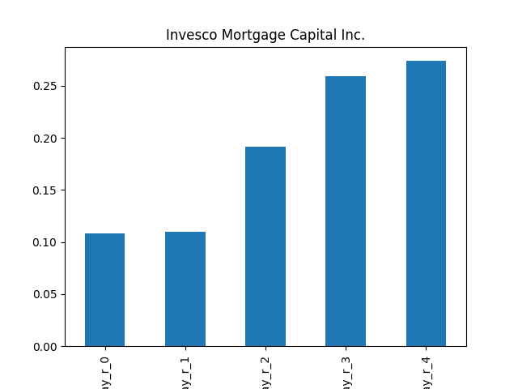

# dividend-shorter

bet on falling prices on payday **2025-04-07**.

## Signale

| Ticker   |   Divid Rate |   Close |    Volume |   last_close_volume |   Divid % | 5_Days_pos   | above_SMA_50   |
|:---------|-------------:|--------:|----------:|--------------------:|----------:|:-------------|:---------------|
| IVR      |         0.34 |    7.28 | 4.494e+06 |            32716320 |      4.67 | False        | False          |

## IVR

### Erwartung in R
|      |   Day_r_0 |   Day_r_1 |   Day_r_2 |   Day_r_3 |   Day_r_4 |   Treffer |
|:-----|----------:|----------:|----------:|----------:|----------:|----------:|
| ohne |       0.1 |       0.1 |       0.2 |       0.3 |       0.3 |        62 |
| mit  |       0.2 |       0.4 |       0   |       0.2 |       0.3 |        11 |

### Ohne Filter

### Mit Filter

