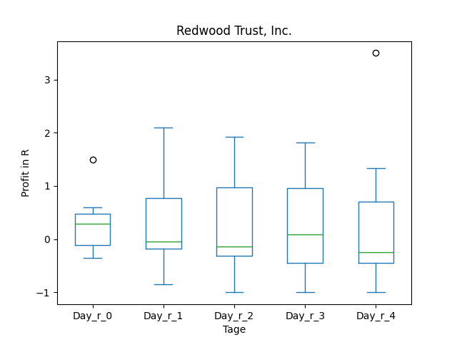
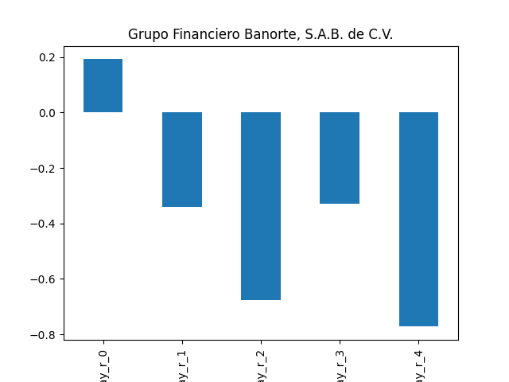

# dividend-shorter

bet on falling prices on payday **2024-12-23**.

## Signale

| Ticker   |   Divid Rate |   Close |          Volume |   last_close_volume |   Divid % | 5_Days_pos   | above_SMA_50   |
|:---------|-------------:|--------:|----------------:|--------------------:|----------:|:-------------|:---------------|
| RWT      |         0.18 |    6.77 |     7.3921e+06  |            50044517 |      2.66 | False        | False          |
| PIN      |         2.22 |   28.36 | 79800           |             2263128 |      7.83 | False        | False          |
| MNPP     |        55    | 1790    |   100           |              179000 |      3.07 | True         | True           |
| HNW      |         0.32 |   12.26 |  9600           |              117696 |      2.65 | False        | False          |
| GBOOY    |         0.88 |   35.1  | 75700           |             2657070 |      2.51 | True         | False          |
| FPI      |         1.15 |   12.32 |     1.1739e+06  |            14462448 |      9.33 | True         | True           |
| ABEV     |         0.07 |    2.06 |     2.77869e+07 |            57241014 |      3.47 | False        | False          |

## RWT

### Erwartung in R
|      |   Day_r_0 |   Day_r_1 |   Day_r_2 |   Day_r_3 |   Day_r_4 |   Treffer |
|:-----|----------:|----------:|----------:|----------:|----------:|----------:|
| ohne |       0.1 |         0 |      -0.2 |      -0.1 |      -0.3 |        89 |
| mit  |       0.3 |        -0 |      -0.1 |       0.1 |      -0.2 |        11 |

### Ohne Filter

### Mit Filter

## PIN

### Erwartung in R
|      |   Day_r_0 |   Day_r_1 |   Day_r_2 |   Day_r_3 |   Day_r_4 |   Treffer |
|:-----|----------:|----------:|----------:|----------:|----------:|----------:|
| ohne |       0   |      -0.1 |      -0.5 |      -0.7 |      -0.9 |        40 |
| mit  |      -0.1 |      -0.3 |      -0.5 |      -0.6 |      -0.6 |         1 |

### Ohne Filter

### Mit Filter

## MNPP

### Erwartung in R
|      |   Day_r_0 |   Day_r_1 |   Day_r_2 |   Day_r_3 |   Day_r_4 |   Treffer |
|:-----|----------:|----------:|----------:|----------:|----------:|----------:|
| ohne |        -1 |        -1 |        -1 |        -1 |        -1 |        23 |
| mit  |       nan |       nan |       nan |       nan |       nan |         0 |

### Ohne Filter

### Mit Filter

## HNW

### Erwartung in R
|      |   Day_r_0 |   Day_r_1 |   Day_r_2 |   Day_r_3 |   Day_r_4 |   Treffer |
|:-----|----------:|----------:|----------:|----------:|----------:|----------:|
| ohne |       0.1 |       0.2 |       0.2 |       0.3 |       0.2 |        44 |
| mit  |     nan   |     nan   |     nan   |     nan   |     nan   |         0 |

### Ohne Filter

### Mit Filter

## GBOOY

### Erwartung in R
|      |   Day_r_0 |   Day_r_1 |   Day_r_2 |   Day_r_3 |   Day_r_4 |   Treffer |
|:-----|----------:|----------:|----------:|----------:|----------:|----------:|
| ohne |       0.2 |      -0.3 |      -0.4 |      -0.3 |      -0.6 |        30 |
| mit  |      -0.7 |      -0.7 |      -0.8 |      -0.8 |      -0.8 |         1 |

### Ohne Filter

### Mit Filter

## FPI

### Erwartung in R
|      |   Day_r_0 |   Day_r_1 |   Day_r_2 |   Day_r_3 |   Day_r_4 |   Treffer |
|:-----|----------:|----------:|----------:|----------:|----------:|----------:|
| ohne |       0.2 |         0 |      -0.1 |      -0.6 |      -0.7 |        43 |
| mit  |     nan   |       nan |     nan   |     nan   |     nan   |         0 |

### Ohne Filter

### Mit Filter

## ABEV

### Erwartung in R
|      |   Day_r_0 |   Day_r_1 |   Day_r_2 |   Day_r_3 |   Day_r_4 |   Treffer |
|:-----|----------:|----------:|----------:|----------:|----------:|----------:|
| ohne |       0.1 |       0.1 |      -0.2 |      -0.4 |      -0.1 |        29 |
| mit  |      -0.1 |       0   |      -0.3 |      -0.4 |      -0.1 |         3 |

### Ohne Filter

### Mit Filter

