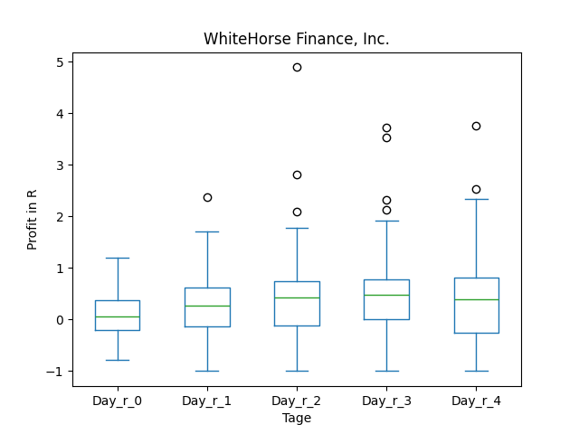
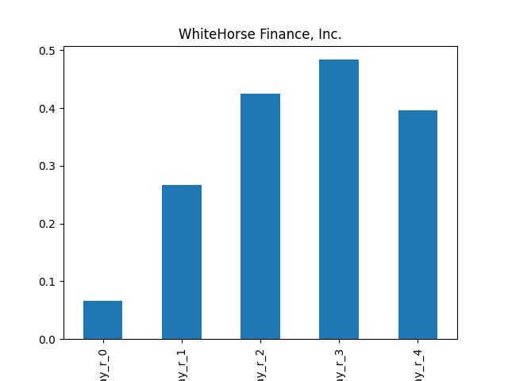
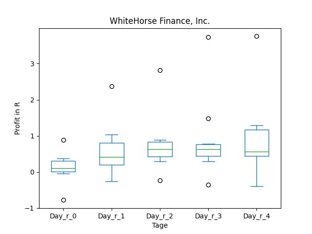
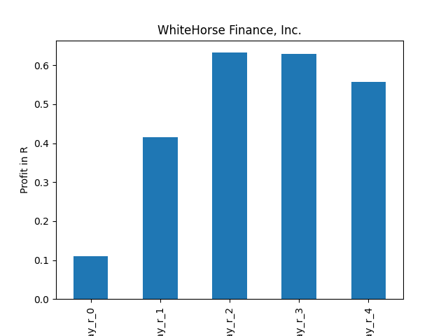
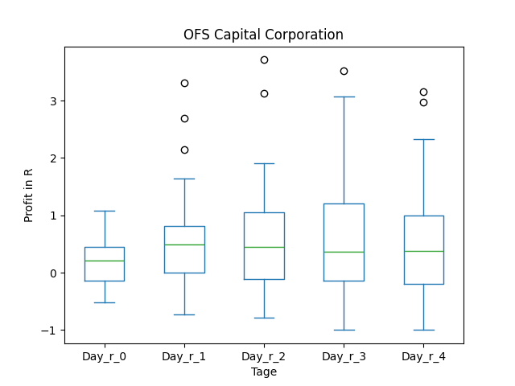

# dividend-shorter

bet on falling prices on payday **2024-12-20**.

## Signale

| Ticker   |   Divid Rate |   Close |          Volume |   last_close_volume |   Divid % | 5_Days_pos   | above_SMA_50   |
|:---------|-------------:|--------:|----------------:|--------------------:|----------:|:-------------|:---------------|
| WHF      |         0.38 |   10.44 |  92100          |              961524 |      3.69 | False        | False          |
| VNQI     |         2.04 |   40.75 | 582400          |            23732800 |      5.01 | False        | False          |
| SDXAY    |         0.57 |   16.46 |  41300          |              679798 |      3.46 | False        | False          |
| PCAR     |         3    |  107.51 |      3.1831e+06 |           342215081 |      2.79 | False        | False          |
| OFS      |         0.34 |    8.61 | 129800          |             1117578 |      3.95 | True         | True           |
| NYMT     |         0.2  |    5.88 |      1.1149e+06 |             6555612 |      3.4  | False        | False          |
| ICMB     |         0.12 |    3.2  |  83800          |              268160 |      3.75 | False        | True           |
| GMRE     |         0.21 |    7.95 | 876400          |             6967380 |      2.64 | False        | False          |
| DMA      |         0.32 |    8.67 |  33200          |              287844 |      3.74 | False        | False          |

## WHF

### Erwartung in R
|      |   Day_r_0 |   Day_r_1 |   Day_r_2 |   Day_r_3 |   Day_r_4 |   Treffer |
|:-----|----------:|----------:|----------:|----------:|----------:|----------:|
| ohne |       0.1 |       0.2 |       0.4 |       0.5 |       0.4 |        54 |
| mit  |       0.1 |       0.2 |       0.7 |       0.8 |       1.2 |         7 |

### Ohne Filter

### Mit Filter

## VNQI

### Erwartung in R
|      |   Day_r_0 |   Day_r_1 |   Day_r_2 |   Day_r_3 |   Day_r_4 |   Treffer |
|:-----|----------:|----------:|----------:|----------:|----------:|----------:|
| ohne |         0 |        -0 |      -0.1 |      -0.3 |      -0.3 |        33 |
| mit  |         0 |        -0 |       0   |      -0.1 |      -0.1 |         8 |

### Ohne Filter

### Mit Filter

## SDXAY

### Erwartung in R
|      |   Day_r_0 |   Day_r_1 |   Day_r_2 |   Day_r_3 |   Day_r_4 |   Treffer |
|:-----|----------:|----------:|----------:|----------:|----------:|----------:|
| ohne |      -0.1 |       0.2 |      -0.1 |      -0.2 |      -0.1 |        13 |
| mit  |      -0.3 |      -0.8 |      -1   |      -1   |      -1   |         1 |

### Ohne Filter

### Mit Filter

## PCAR

### Erwartung in R
|      |   Day_r_0 |   Day_r_1 |   Day_r_2 |   Day_r_3 |   Day_r_4 |   Treffer |
|:-----|----------:|----------:|----------:|----------:|----------:|----------:|
| ohne |       0   |       0.1 |      -0.1 |       0.1 |      -0.2 |       105 |
| mit  |       0.2 |       0.3 |       0.3 |       0.4 |      -0   |        10 |

### Ohne Filter

### Mit Filter

## OFS

### Erwartung in R
|      |   Day_r_0 |   Day_r_1 |   Day_r_2 |   Day_r_3 |   Day_r_4 |   Treffer |
|:-----|----------:|----------:|----------:|----------:|----------:|----------:|
| ohne |       0.2 |       0.5 |       0.5 |       0.3 |       0.4 |        48 |
| mit  |       0.6 |       1.1 |       1.3 |       1.6 |       1.6 |         7 |

### Ohne Filter

### Mit Filter

## NYMT

### Erwartung in R
|      |   Day_r_0 |   Day_r_1 |   Day_r_2 |   Day_r_3 |   Day_r_4 |   Treffer |
|:-----|----------:|----------:|----------:|----------:|----------:|----------:|
| ohne |         0 |       0   |       0.1 |       0.2 |       0.2 |        66 |
| mit  |         0 |       0.2 |       0.2 |       0.5 |       0.8 |         5 |

### Ohne Filter

### Mit Filter

## ICMB

### Erwartung in R
|      |   Day_r_0 |   Day_r_1 |   Day_r_2 |   Day_r_3 |   Day_r_4 |   Treffer |
|:-----|----------:|----------:|----------:|----------:|----------:|----------:|
| ohne |       0.4 |       0.6 |       0.7 |       0.5 |       0.6 |        52 |
| mit  |      -0.1 |      -0   |      -0.1 |      -0.3 |      -0.2 |         1 |

### Ohne Filter

### Mit Filter

## GMRE

### Erwartung in R
|      |   Day_r_0 |   Day_r_1 |   Day_r_2 |   Day_r_3 |   Day_r_4 |   Treffer |
|:-----|----------:|----------:|----------:|----------:|----------:|----------:|
| ohne |       0.2 |       0.2 |       0.1 |       0.2 |       0.3 |        33 |
| mit  |     nan   |     nan   |     nan   |     nan   |     nan   |         0 |

### Ohne Filter

### Mit Filter

## DMA

### Erwartung in R
|      |   Day_r_0 |   Day_r_1 |   Day_r_2 |   Day_r_3 |   Day_r_4 |   Treffer |
|:-----|----------:|----------:|----------:|----------:|----------:|----------:|
| ohne |      -0.2 |       0.1 |       0.3 |       0.3 |       0.3 |        18 |
| mit  |     nan   |     nan   |     nan   |     nan   |     nan   |         0 |

### Ohne Filter

### Mit Filter

