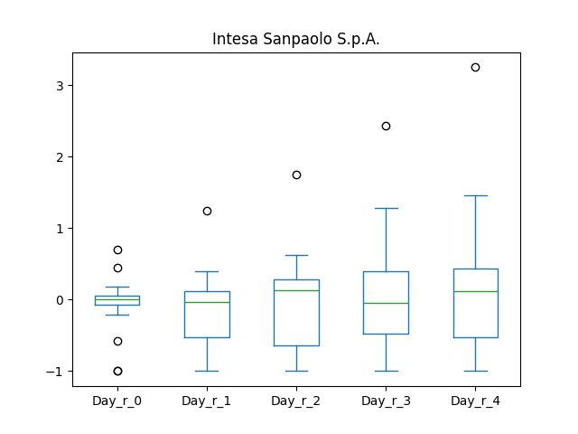
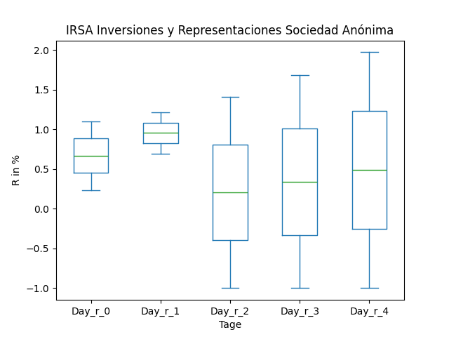
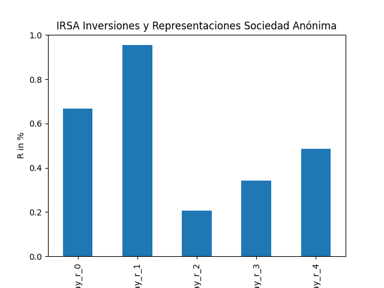
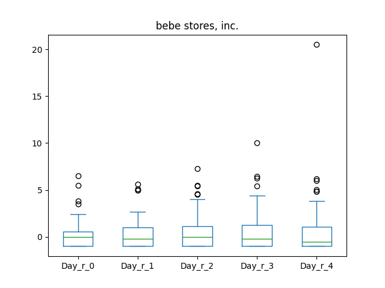

# dividend-shorter

bet on falling prices on payday

## Signale

| Ticker   |   Divid Rate |   Close |   Volume |   last_close_volume |   Divid % | 5_Days_pos   | above_SMA_50   |
|:---------|-------------:|--------:|---------:|--------------------:|----------:|:-------------|:---------------|
| SGAPY    |         0.66 |   23.3  |    24500 |              570850 |      2.85 | False        | False          |
| ISNPY    |         1.08 |   23.57 |   137800 |             3247946 |      4.59 | False        | False          |
| IRS      |         1.02 |   15.79 |   345200 |             5450708 |      6.45 | True         | True           |
| BEBE     |         2    |    3.52 |    42900 |              151008 |     56.82 | True         | True           |

## SGAPY

### Erwartung in R
|      |   Day_0 |   Day_1 |   Day_2 |   Day_3 |   Day_4 |   Treffer |
|:-----|--------:|--------:|--------:|--------:|--------:|----------:|
| ohne |     0   |     0.9 |     0.9 |     0.6 |     1.1 |        34 |
| mit  |     0.8 |     1.9 |     0.8 |    -0   |     1.2 |         2 |

### Ohne Filter

### Mit Filter

## ISNPY

### Erwartung in R
|      |   Day_0 |   Day_1 |   Day_2 |   Day_3 |   Day_4 |   Treffer |
|:-----|--------:|--------:|--------:|--------:|--------:|----------:|
| ohne |       0 |    -0.1 |     0.9 |    -0.3 |     0.7 |        18 |
| mit  |       0 |    -0.1 |     1.2 |     1.5 |     1.2 |        14 |

### Ohne Filter

### Mit Filter

## IRS

### Erwartung in R
|      |   Day_0 |   Day_1 |   Day_2 |   Day_3 |   Day_4 |   Treffer |
|:-----|--------:|--------:|--------:|--------:|--------:|----------:|
| ohne |     0.3 |     1.4 |    -0.5 |     1.7 |     1.9 |        14 |
| mit  |     3.5 |     6.1 |     1.9 |     4.5 |     6.6 |         2 |

### Ohne Filter

### Mit Filter

## BEBE

### Erwartung in R
|      |   Day_0 |   Day_1 |   Day_2 |   Day_3 |   Day_4 |   Treffer |
|:-----|--------:|--------:|--------:|--------:|--------:|----------:|
| ohne |       0 |       0 |     0.3 |     0.3 |       0 |        65 |
| mit  |     nan |     nan |   nan   |   nan   |     nan |         0 |

### Ohne Filter

### Mit Filter

