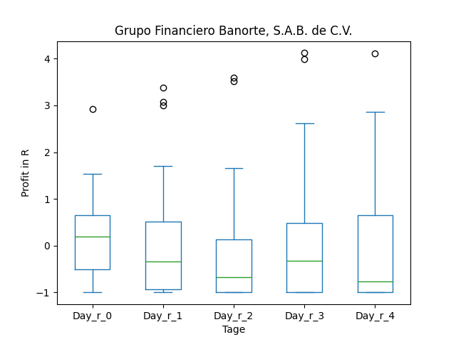

# dividend-shorter

bet on falling prices on payday **2025-05-05**.

## Signale

| Ticker   |   Divid Rate |   Close |          Volume |   last_close_volume |   Divid % | 5_Days_pos   | above_SMA_50   |
|:---------|-------------:|--------:|----------------:|--------------------:|----------:|:-------------|:---------------|
| RWEOY    |         1.21 |   38.89 |  16900          |              657241 |      3.12 | True         | True           |
| MURGY    |         0.44 |   13.59 | 237100          |             3222189 |      3.21 | False        | True           |
| GBOOY    |         2.46 |   44.06 |  16600          |              731396 |      5.57 | True         | True           |
| EDPFY    |         2.27 |   38.97 |  16100          |              627417 |      5.84 | True         | True           |
| AMBP     |         0.1  |    3.65 |      2.2591e+06 |             8245715 |      2.74 | False        | True           |

## RWEOY

### Erwartung in R
|      |   Day_r_0 |   Day_r_1 |   Day_r_2 |   Day_r_3 |   Day_r_4 |   Treffer |
|:-----|----------:|----------:|----------:|----------:|----------:|----------:|
| ohne |         0 |       0.1 |       0.1 |      -0.3 |       0.1 |        17 |
| mit  |         0 |      -0.3 |      -0.2 |      -0.2 |       0.1 |         4 |

### Ohne Filter

### Mit Filter

## MURGY

### Erwartung in R
|      |   Day_r_0 |   Day_r_1 |   Day_r_2 |   Day_r_3 |   Day_r_4 |   Treffer |
|:-----|----------:|----------:|----------:|----------:|----------:|----------:|
| ohne |      -0   |        -0 |       0.1 |       0.2 |       0.3 |        13 |
| mit  |       0.1 |        -0 |       0.1 |       0.2 |       0.3 |         7 |

### Ohne Filter

### Mit Filter

## GBOOY

### Erwartung in R
|      |   Day_r_0 |   Day_r_1 |   Day_r_2 |   Day_r_3 |   Day_r_4 |   Treffer |
|:-----|----------:|----------:|----------:|----------:|----------:|----------:|
| ohne |       0.2 |      -0.3 |      -0.7 |      -0.3 |      -0.8 |        31 |
| mit  |      -0.7 |      -0.7 |      -0.8 |      -0.8 |      -0.8 |         1 |

### Ohne Filter

### Mit Filter

## EDPFY

### Erwartung in R
|      |   Day_r_0 |   Day_r_1 |   Day_r_2 |   Day_r_3 |   Day_r_4 |   Treffer |
|:-----|----------:|----------:|----------:|----------:|----------:|----------:|
| ohne |       0.1 |      -0.1 |       0.1 |      -0.1 |      -0.3 |        16 |
| mit  |       0.1 |      -0   |      -0   |      -0.1 |      -0.2 |         4 |

### Ohne Filter

### Mit Filter

## AMBP

### Erwartung in R
|      |   Day_r_0 |   Day_r_1 |   Day_r_2 |   Day_r_3 |   Day_r_4 |   Treffer |
|:-----|----------:|----------:|----------:|----------:|----------:|----------:|
| ohne |       0.1 |      -0   |       0.4 |       0.3 |       0.2 |        12 |
| mit  |       0.1 |      -0.8 |      -0.3 |      -0.6 |       0   |         5 |

### Ohne Filter

### Mit Filter

