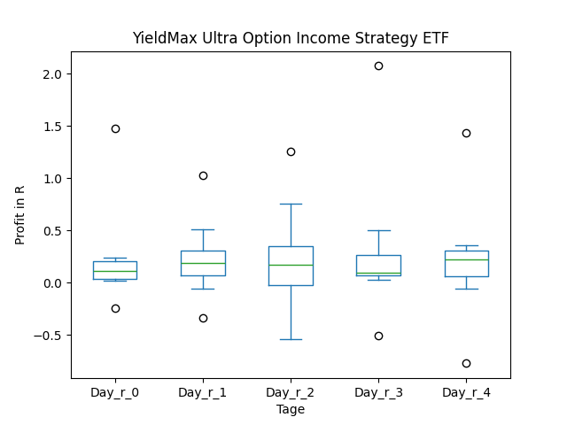
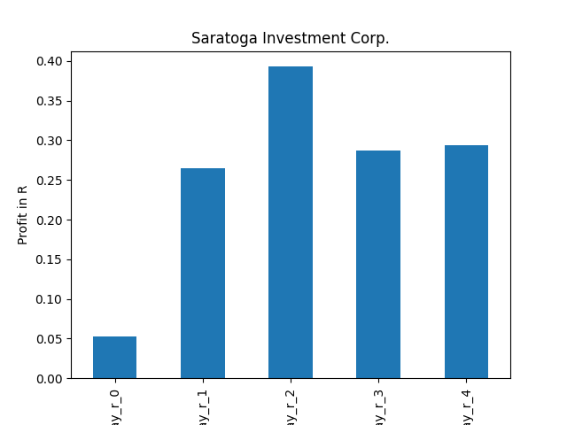
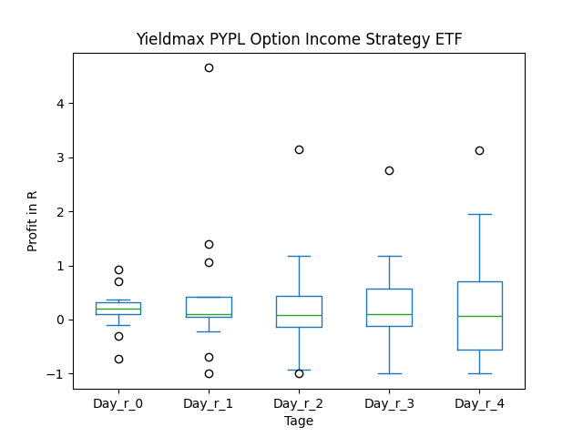
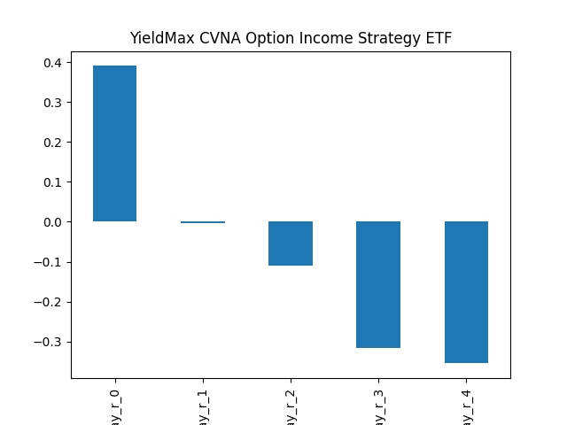
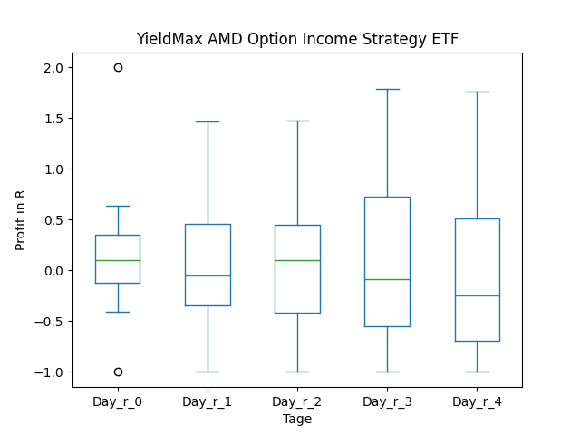
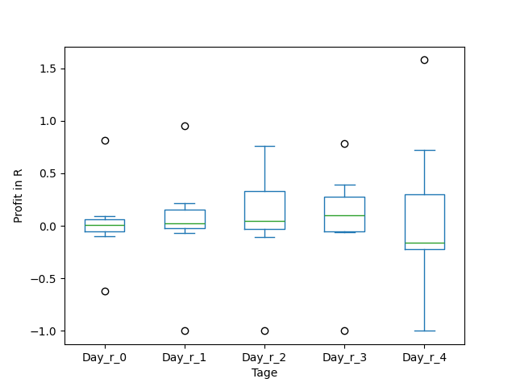
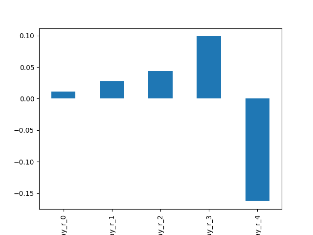

# dividend-shorter

bet on falling prices on payday **2025-03-06**.

## Signale

| Ticker   |   Divid Rate |   Close |          Volume |   last_close_volume |   Divid % | 5_Days_pos   | above_SMA_50   |
|:---------|-------------:|--------:|----------------:|--------------------:|----------:|:-------------|:---------------|
| ULTY     |         0.47 |    7.54 |      1.3505e+06 |            10182770 |      6.17 | True         | False          |
| SAR      |         0.74 |   25.03 | 305800          |             7654174 |      2.96 | False        | True           |
| QBIEY    |         0.4  |   13.7  |  27000          |              369900 |      2.92 | True         | True           |
| PYPY     |         0.38 |   14.02 |  54700          |              766894 |      2.69 | False        | False          |
| FIAT     |         0.68 |    8.48 | 985700          |             8358736 |      8.06 | False        | True           |
| CVNY     |         3.91 |   45.52 | 223300          |            10164616 |      8.6  | False        | False          |
| CONY     |         0.6  |   10.17 |      7.1288e+06 |            72499896 |      5.89 | True         | False          |
| AVACF    |         0.75 |    1.09 | 371300          |              404717 |     68.81 | False        | False          |
| AMDY     |         0.25 |    8.16 | 492200          |             4016352 |      3.1  | True         | False          |
| ABNY     |         0.48 |   14.98 |  40700          |              609686 |      3.21 | True         | True           |

## ULTY

### Erwartung in R
|      |   Day_r_0 |   Day_r_1 |   Day_r_2 |   Day_r_3 |   Day_r_4 |   Treffer |
|:-----|----------:|----------:|----------:|----------:|----------:|----------:|
| ohne |       0.1 |       0.2 |       0.2 |       0.1 |       0.2 |        12 |
| mit  |       0.1 |       0.2 |       0.2 |       0.1 |       0.2 |        12 |

### Ohne Filter

### Mit Filter

## SAR

### Erwartung in R
|      |   Day_r_0 |   Day_r_1 |   Day_r_2 |   Day_r_3 |   Day_r_4 |   Treffer |
|:-----|----------:|----------:|----------:|----------:|----------:|----------:|
| ohne |       0.1 |       0.2 |       0.3 |       0.4 |       0.4 |        57 |
| mit  |       0.1 |       0.3 |       0.4 |       0.3 |       0.3 |         4 |

### Ohne Filter

### Mit Filter

## QBIEY

### Erwartung in R
|      |   Day_r_0 |   Day_r_1 |   Day_r_2 |   Day_r_3 |   Day_r_4 |   Treffer |
|:-----|----------:|----------:|----------:|----------:|----------:|----------:|
| ohne |        -0 |       0.1 |      -0.2 |         0 |      -0.1 |        26 |
| mit  |       nan |     nan   |     nan   |       nan |     nan   |         0 |

### Ohne Filter

### Mit Filter

## PYPY

### Erwartung in R
|      |   Day_r_0 |   Day_r_1 |   Day_r_2 |   Day_r_3 |   Day_r_4 |   Treffer |
|:-----|----------:|----------:|----------:|----------:|----------:|----------:|
| ohne |       0.2 |       0.1 |       0.1 |       0.1 |       0.1 |        16 |
| mit  |       0.3 |       0.4 |       0.3 |       0.5 |       0.6 |         6 |

### Ohne Filter

### Mit Filter

## FIAT

### Erwartung in R
|      |   Day_r_0 |   Day_r_1 |   Day_r_2 |   Day_r_3 |   Day_r_4 |   Treffer |
|:-----|----------:|----------:|----------:|----------:|----------:|----------:|
| ohne |      -0.1 |      -0.1 |        -0 |      -0.2 |        -0 |         7 |
| mit  |      -0.1 |      -0.1 |        -0 |      -0.2 |        -0 |         7 |

### Ohne Filter

### Mit Filter

## CVNY

### Erwartung in R
|      |   Day_r_0 |   Day_r_1 |   Day_r_2 |   Day_r_3 |   Day_r_4 |   Treffer |
|:-----|----------:|----------:|----------:|----------:|----------:|----------:|
| ohne |       nan |       nan |       nan |       nan |       nan |         0 |
| mit  |       nan |       nan |       nan |       nan |       nan |         0 |

### Ohne Filter

### Mit Filter

## CONY

### Erwartung in R
|      |   Day_r_0 |   Day_r_1 |   Day_r_2 |   Day_r_3 |   Day_r_4 |   Treffer |
|:-----|----------:|----------:|----------:|----------:|----------:|----------:|
| ohne |         0 |      -0.1 |        -0 |         0 |      -0.1 |        17 |
| mit  |         0 |      -0.1 |        -0 |         0 |      -0.1 |        17 |

### Ohne Filter

### Mit Filter

## AVACF

### Erwartung in R
|      |   Day_r_0 |   Day_r_1 |   Day_r_2 |   Day_r_3 |   Day_r_4 |   Treffer |
|:-----|----------:|----------:|----------:|----------:|----------:|----------:|
| ohne |         0 |      -0.3 |      -0.2 |      -0.1 |      -0.2 |        21 |
| mit  |       nan |     nan   |     nan   |     nan   |     nan   |         0 |

### Ohne Filter

### Mit Filter

## AMDY

### Erwartung in R
|      |   Day_r_0 |   Day_r_1 |   Day_r_2 |   Day_r_3 |   Day_r_4 |   Treffer |
|:-----|----------:|----------:|----------:|----------:|----------:|----------:|
| ohne |       0   |        -0 |      -0.1 |      -0.2 |      -0.2 |        16 |
| mit  |       0.1 |        -0 |       0   |      -0.1 |      -0.2 |        15 |

### Ohne Filter

### Mit Filter

## ABNY

### Erwartung in R
|      |   Day_r_0 |   Day_r_1 |   Day_r_2 |   Day_r_3 |   Day_r_4 |   Treffer |
|:-----|----------:|----------:|----------:|----------:|----------:|----------:|
| ohne |         0 |         0 |         0 |       0.1 |      -0.2 |         7 |
| mit  |       nan |       nan |       nan |     nan   |     nan   |         0 |

### Ohne Filter

### Mit Filter

