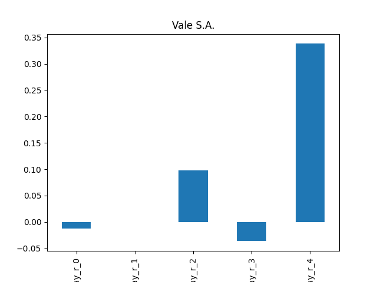

# dividend-shorter

bet on falling prices on payday **2025-08-13**.

## Signale

| Ticker   |   Divid Rate |   Close |      Volume |   last_close_volume |   Divid % | 5_Days_pos   | above_SMA_50   |
|:---------|-------------:|--------:|------------:|--------------------:|----------:|:-------------|:---------------|
| VALE     |         0.34 |    10.4 | 4.05719e+07 |           421947760 |      3.29 | True         | True           |

## VALE

### Erwartung in R
|      |   Day_r_0 |   Day_r_1 |   Day_r_2 |   Day_r_3 |   Day_r_4 |   Treffer |
|:-----|----------:|----------:|----------:|----------:|----------:|----------:|
| ohne |        -0 |       0   |       0.1 |        -0 |       0.3 |        65 |
| mit  |        -0 |      -0.4 |      -0.2 |        -0 |       0   |        18 |

### Ohne Filter

### Mit Filter

