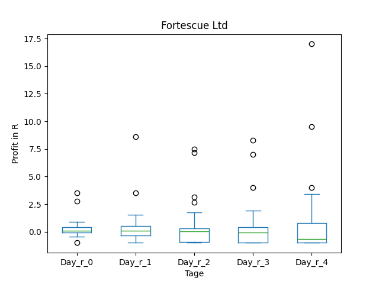
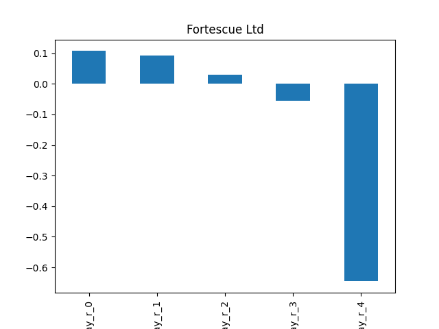
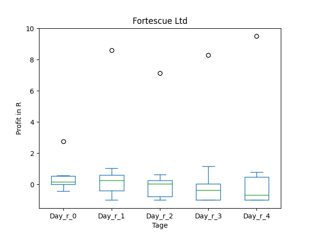
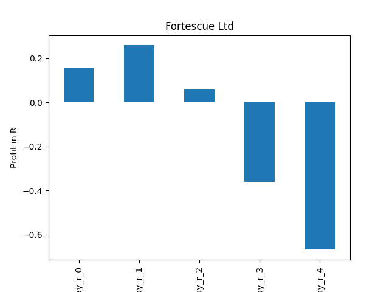
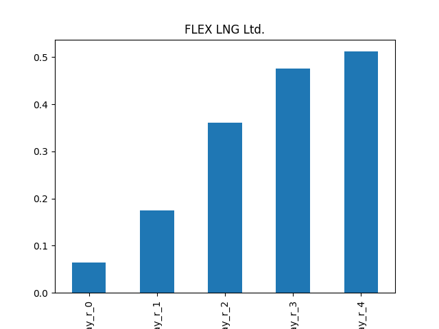
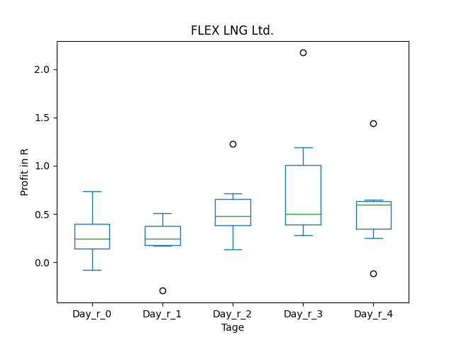
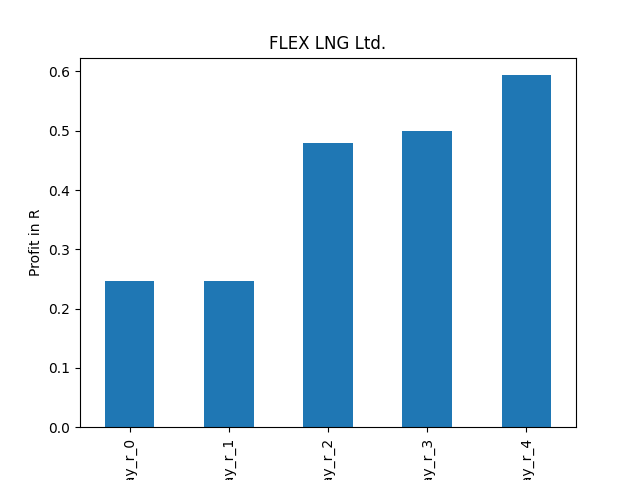

# dividend-shorter

bet on falling prices on payday **2025-09-05**.

## Signale

| Ticker   |   Divid Rate |   Close |         Volume |   last_close_volume |   Divid % | 5_Days_pos   | above_SMA_50   |
|:---------|-------------:|--------:|---------------:|--------------------:|----------:|:-------------|:---------------|
| NDBKY    |         0.58 |   12.61 | 25700          |              324077 |      4.56 | False        | False          |
| FSUGY    |         0.78 |   25.44 | 31600          |              803904 |      3.06 | True         | True           |
| FLNG     |         0.75 |   27.11 |     1.0451e+06 |            28332661 |      2.77 | False        | True           |

## NDBKY

### Erwartung in R
|      |   Day_r_0 |   Day_r_1 |   Day_r_2 |   Day_r_3 |   Day_r_4 |   Treffer |
|:-----|----------:|----------:|----------:|----------:|----------:|----------:|
| ohne |        -0 |        -0 |       0.2 |      -0.1 |      -0.6 |        25 |
| mit  |       nan |       nan |     nan   |     nan   |     nan   |         0 |

### Ohne Filter

### Mit Filter

## FSUGY

### Erwartung in R
|      |   Day_r_0 |   Day_r_1 |   Day_r_2 |   Day_r_3 |   Day_r_4 |   Treffer |
|:-----|----------:|----------:|----------:|----------:|----------:|----------:|
| ohne |       0.1 |       0.1 |       0   |      -0.1 |      -0.6 |        26 |
| mit  |       0.2 |       0.3 |       0.1 |      -0.4 |      -0.7 |        10 |

### Ohne Filter

### Mit Filter

## FLNG

### Erwartung in R
|      |   Day_r_0 |   Day_r_1 |   Day_r_2 |   Day_r_3 |   Day_r_4 |   Treffer |
|:-----|----------:|----------:|----------:|----------:|----------:|----------:|
| ohne |       0.1 |       0.2 |       0.4 |       0.5 |       0.5 |        24 |
| mit  |       0.2 |       0.2 |       0.5 |       0.5 |       0.6 |         7 |

### Ohne Filter

### Mit Filter

