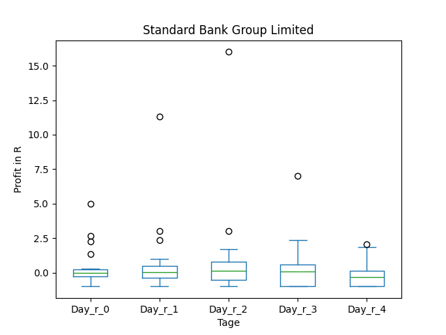

# dividend-shorter

bet on falling prices on payday **2025-09-12**.

## Signale

| Ticker   |   Divid Rate |   Close |         Volume |   last_close_volume |   Divid % | 5_Days_pos   | above_SMA_50   |
|:---------|-------------:|--------:|---------------:|--------------------:|----------:|:-------------|:---------------|
| SGBLY    |         0.46 |   14.15 | 16600          |              234890 |      3.28 | True         | True           |
| NAT      |         0.1  |    3.27 |     2.6503e+06 |             8666481 |      3.06 | True         | True           |
| CRWS     |         0.08 |    3.02 | 71900          |              217138 |      2.65 | False        | True           |

## SGBLY

### Erwartung in R
|      |   Day_r_0 |   Day_r_1 |   Day_r_2 |   Day_r_3 |   Day_r_4 |   Treffer |
|:-----|----------:|----------:|----------:|----------:|----------:|----------:|
| ohne |        -0 |         0 |       0.1 |       0.1 |      -0.3 |        26 |
| mit  |       nan |       nan |     nan   |     nan   |     nan   |         0 |

### Ohne Filter

### Mit Filter

## NAT

### Erwartung in R
|      |   Day_r_0 |   Day_r_1 |   Day_r_2 |   Day_r_3 |   Day_r_4 |   Treffer |
|:-----|----------:|----------:|----------:|----------:|----------:|----------:|
| ohne |       0.3 |       0.4 |       0.3 |       0.3 |       0.4 |        86 |
| mit  |       0.3 |       0.4 |       0.3 |       0.7 |       0.6 |        27 |

### Ohne Filter

### Mit Filter

## CRWS

### Erwartung in R
|      |   Day_r_0 |   Day_r_1 |   Day_r_2 |   Day_r_3 |   Day_r_4 |   Treffer |
|:-----|----------:|----------:|----------:|----------:|----------:|----------:|
| ohne |         0 |      -0.1 |         0 |        -0 |       0.1 |        67 |
| mit  |       nan |     nan   |       nan |       nan |     nan   |         0 |

### Ohne Filter

### Mit Filter

