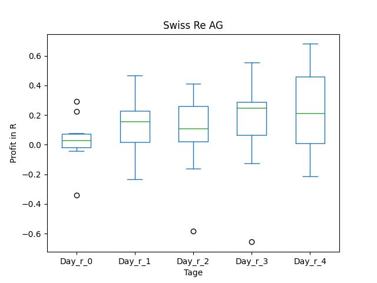
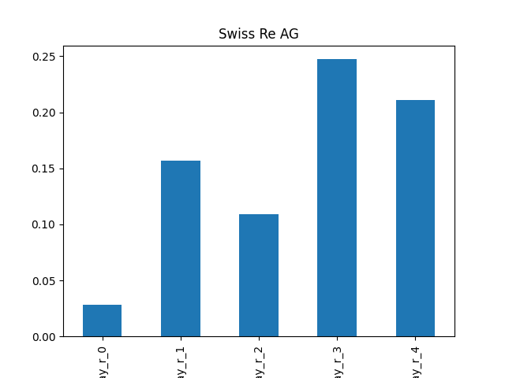

# dividend-shorter

bet on falling prices on payday **2025-04-16**.

## Signale

| Ticker   |   Divid Rate |   Close |         Volume |   last_close_volume |   Divid % | 5_Days_pos   | above_SMA_50   |
|:---------|-------------:|--------:|---------------:|--------------------:|----------:|:-------------|:---------------|
| SSREY    |         1.84 |   44.35 | 29400          |             1303890 |      4.14 | True         | True           |
| GES      |         0.3  |    9.67 |     1.5217e+06 |            14714839 |      3.1  | False        | False          |
| FINV     |         0.28 |    7.61 |     1.7632e+06 |            13417952 |      3.64 | False        | False          |

## SSREY

### Erwartung in R
|      |   Day_r_0 |   Day_r_1 |   Day_r_2 |   Day_r_3 |   Day_r_4 |   Treffer |
|:-----|----------:|----------:|----------:|----------:|----------:|----------:|
| ohne |         0 |       0.2 |       0.1 |       0.2 |       0.2 |        15 |
| mit  |         0 |       0.1 |       0.1 |       0.1 |       0.1 |         5 |

### Ohne Filter

### Mit Filter

## GES

### Erwartung in R
|      |   Day_r_0 |   Day_r_1 |   Day_r_2 |   Day_r_3 |   Day_r_4 |   Treffer |
|:-----|----------:|----------:|----------:|----------:|----------:|----------:|
| ohne |      -0.1 |         0 |       0   |      -0.2 |      -0.6 |        73 |
| mit  |      -0.1 |         0 |       0.2 |      -0.1 |      -0.3 |         3 |

### Ohne Filter

### Mit Filter

## FINV

### Erwartung in R
|      |   Day_r_0 |   Day_r_1 |   Day_r_2 |   Day_r_3 |   Day_r_4 |   Treffer |
|:-----|----------:|----------:|----------:|----------:|----------:|----------:|
| ohne |         0 |       0.2 |       0.3 |      -0.3 |       0.3 |         6 |
| mit  |        -0 |       0.3 |       0.4 |      -0.2 |       0.2 |         5 |

### Ohne Filter

### Mit Filter

