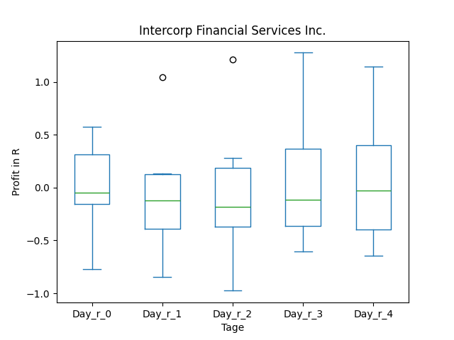
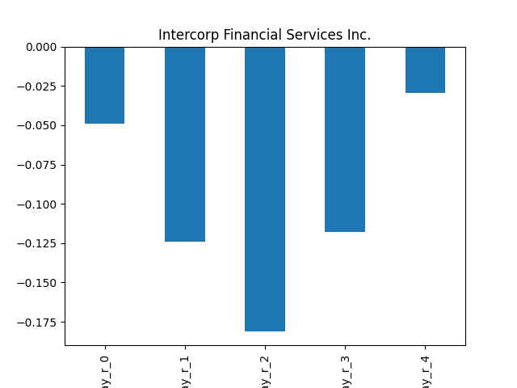
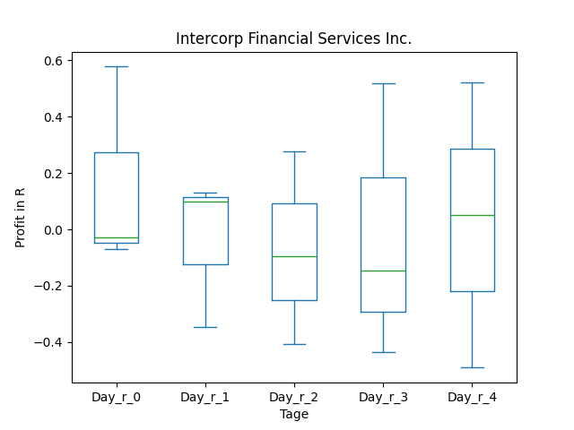
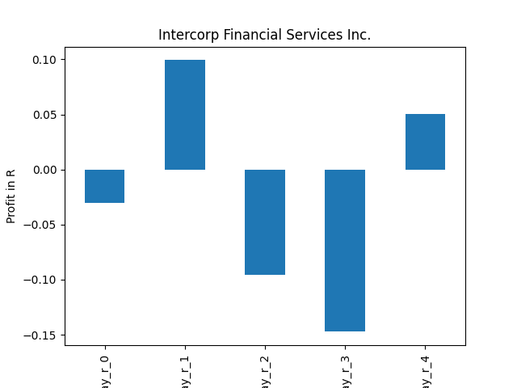
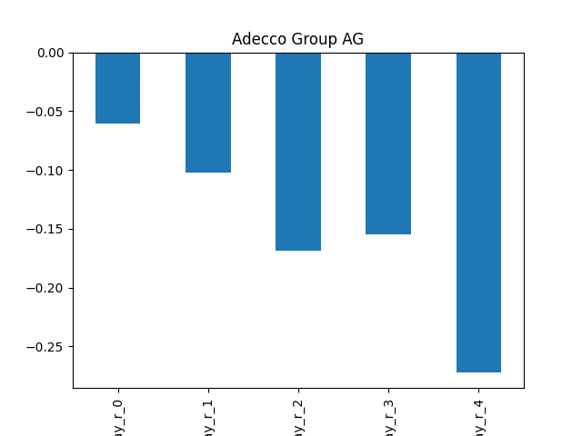

# dividend-shorter

bet on falling prices on payday **2025-04-24**.

## Signale

| Ticker   |   Divid Rate |   Close |   Volume |   last_close_volume |   Divid % | 5_Days_pos   | above_SMA_50   |
|:---------|-------------:|--------:|---------:|--------------------:|----------:|:-------------|:---------------|
| VBREY    |         0.18 |    6.29 |    18300 |              115107 |      2.82 | True         | False          |
| SWKH     |         4    |   19.22 |   120500 |             2316010 |     20.81 | True         | True           |
| IFS      |         1    |   32.21 |   167600 |             5398396 |      3.1  | True         | False          |
| AHEXY    |         0.6  |   13.58 |    14200 |              192836 |      4.38 | True         | False          |

## VBREY

### Erwartung in R
|      |   Day_r_0 |   Day_r_1 |   Day_r_2 |   Day_r_3 |   Day_r_4 |   Treffer |
|:-----|----------:|----------:|----------:|----------:|----------:|----------:|
| ohne |       nan |       nan |       nan |       nan |       nan |         0 |
| mit  |       nan |       nan |       nan |       nan |       nan |         0 |

### Ohne Filter

### Mit Filter

## SWKH

### Erwartung in R
|      |   Day_r_0 |   Day_r_1 |   Day_r_2 |   Day_r_3 |   Day_r_4 |   Treffer |
|:-----|----------:|----------:|----------:|----------:|----------:|----------:|
| ohne |       nan |       nan |       nan |       nan |       nan |         0 |
| mit  |       nan |       nan |       nan |       nan |       nan |         0 |

### Ohne Filter

### Mit Filter

## IFS

### Erwartung in R
|      |   Day_r_0 |   Day_r_1 |   Day_r_2 |   Day_r_3 |   Day_r_4 |   Treffer |
|:-----|----------:|----------:|----------:|----------:|----------:|----------:|
| ohne |        -0 |      -0.1 |      -0.2 |      -0.1 |      -0   |         6 |
| mit  |        -0 |       0.1 |      -0.1 |      -0.1 |       0.1 |         3 |

### Ohne Filter

### Mit Filter

## AHEXY

### Erwartung in R
|      |   Day_r_0 |   Day_r_1 |   Day_r_2 |   Day_r_3 |   Day_r_4 |   Treffer |
|:-----|----------:|----------:|----------:|----------:|----------:|----------:|
| ohne |      -0.1 |      -0.1 |      -0.2 |      -0.2 |      -0.3 |        14 |
| mit  |      -0   |      -0.2 |      -0.2 |      -0.1 |      -0.4 |         3 |

### Ohne Filter

### Mit Filter

