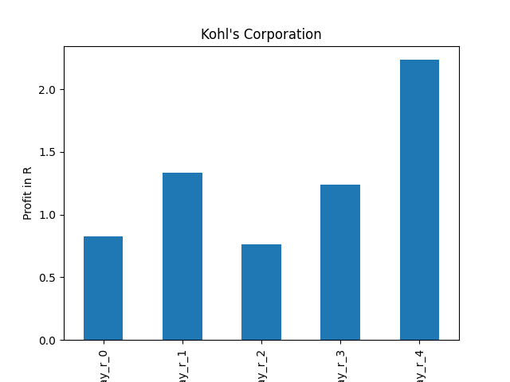

# dividend-shorter

bet on falling prices on payday **2024-12-11**.

## Signale

| Ticker   |   Divid Rate |   Close |           Volume |   last_close_volume |   Divid % | 5_Days_pos   | above_SMA_50   |
|:---------|-------------:|--------:|-----------------:|--------------------:|----------:|:-------------|:---------------|
| KSS      |         0.5  |   15.22 |      1.44013e+07 |           219187786 |      3.29 | False        | False          |
| ENGGY    |         0.21 |    6.85 |  23200           |              158920 |      3.06 | True         | False          |
| AVACF    |         3.5  |    7    | 269500           |             1886500 |     50    | False        | False          |

## KSS

### Erwartung in R
|      |   Day_r_0 |   Day_r_1 |   Day_r_2 |   Day_r_3 |   Day_r_4 |   Treffer |
|:-----|----------:|----------:|----------:|----------:|----------:|----------:|
| ohne |       0.1 |      -0   |       0   |       0.1 |       0.1 |        52 |
| mit  |       0.8 |       1.3 |       0.8 |       1.2 |       2.2 |         1 |

### Ohne Filter

### Mit Filter

## ENGGY

### Erwartung in R
|      |   Day_r_0 |   Day_r_1 |   Day_r_2 |   Day_r_3 |   Day_r_4 |   Treffer |
|:-----|----------:|----------:|----------:|----------:|----------:|----------:|
| ohne |       0.3 |       0.2 |       0.1 |       0.2 |      -0.1 |        25 |
| mit  |       0.1 |       0.1 |       0.2 |       0.9 |       1.3 |         2 |

### Ohne Filter

### Mit Filter

## AVACF

### Erwartung in R
|      |   Day_r_0 |   Day_r_1 |   Day_r_2 |   Day_r_3 |   Day_r_4 |   Treffer |
|:-----|----------:|----------:|----------:|----------:|----------:|----------:|
| ohne |        -0 |      -0.2 |      -0.2 |      -0.1 |      -0.3 |        18 |
| mit  |       nan |     nan   |     nan   |     nan   |     nan   |         0 |

### Ohne Filter

### Mit Filter

