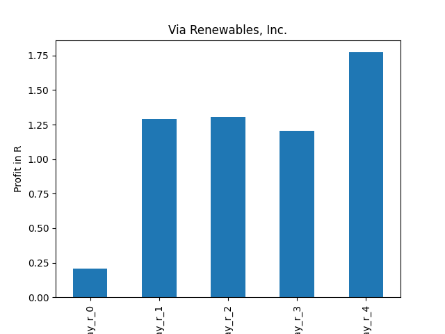

# dividend-shorter

bet on falling prices on payday **2025-07-01**.

## Signale

| Ticker   |   Divid Rate |   Close |          Volume |   last_close_volume |   Divid % | 5_Days_pos   | above_SMA_50   |
|:---------|-------------:|--------:|----------------:|--------------------:|----------:|:-------------|:---------------|
| VIASP    |         0.69 |   25.73 |  26500          |              681845 |      2.7  | True         | True           |
| NYMTM    |         0.69 |   24.55 | 179700          |             4411635 |      2.82 | False        | True           |
| HUYA     |         1.47 |    3.52 |      5.2808e+06 |            18588416 |     41.76 | False        | False          |
| HOVNP    |         0.48 |   16.4  |  17500          |              287000 |      2.91 | True         | True           |
| ADKT     |        29.5  | 1010.75 |    100          |              101075 |      2.92 | False        | False          |

## VIASP

### Erwartung in R
|      |   Day_r_0 |   Day_r_1 |   Day_r_2 |   Day_r_3 |   Day_r_4 |   Treffer |
|:-----|----------:|----------:|----------:|----------:|----------:|----------:|
| ohne |       0.1 |       0.2 |       0.3 |       0.5 |       0.6 |        32 |
| mit  |       0.2 |       1.3 |       1.3 |       1.2 |       1.8 |         2 |

### Ohne Filter

### Mit Filter

## NYMTM

### Erwartung in R
|      |   Day_r_0 |   Day_r_1 |   Day_r_2 |   Day_r_3 |   Day_r_4 |   Treffer |
|:-----|----------:|----------:|----------:|----------:|----------:|----------:|
| ohne |         0 |      -0.2 |      -0.1 |      -0.2 |       0.1 |        21 |
| mit  |       nan |     nan   |     nan   |     nan   |     nan   |         0 |

### Ohne Filter

### Mit Filter

## HUYA

### Erwartung in R
|      |   Day_r_0 |   Day_r_1 |   Day_r_2 |   Day_r_3 |   Day_r_4 |   Treffer |
|:-----|----------:|----------:|----------:|----------:|----------:|----------:|
| ohne |      -0.2 |      -0.3 |      -0.5 |      -0.4 |      -0.3 |         2 |
| mit  |      -0.2 |      -0.3 |      -0.5 |      -0.4 |      -0.3 |         2 |

### Ohne Filter

### Mit Filter

## HOVNP

### Erwartung in R
|      |   Day_r_0 |   Day_r_1 |   Day_r_2 |   Day_r_3 |   Day_r_4 |   Treffer |
|:-----|----------:|----------:|----------:|----------:|----------:|----------:|
| ohne |      -0.1 |      -0.2 |      -0.2 |      -0.1 |      -0.1 |        22 |
| mit  |     nan   |     nan   |     nan   |     nan   |     nan   |         0 |

### Ohne Filter

### Mit Filter

## ADKT

### Erwartung in R
|      |   Day_r_0 |   Day_r_1 |   Day_r_2 |   Day_r_3 |   Day_r_4 |   Treffer |
|:-----|----------:|----------:|----------:|----------:|----------:|----------:|
| ohne |        -1 |        -1 |        -1 |        -1 |        -1 |        26 |
| mit  |       nan |       nan |       nan |       nan |       nan |         0 |

### Ohne Filter

### Mit Filter

