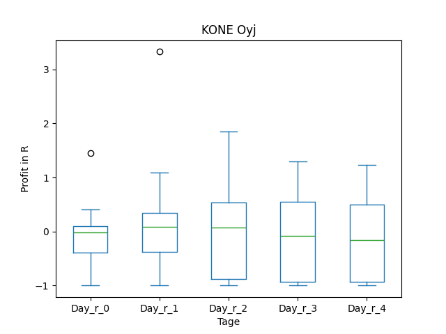
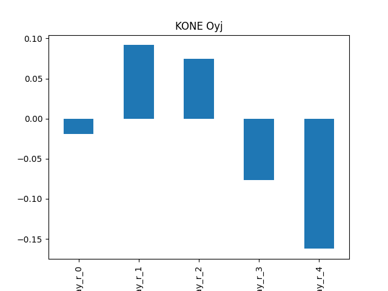
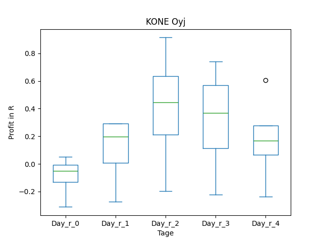
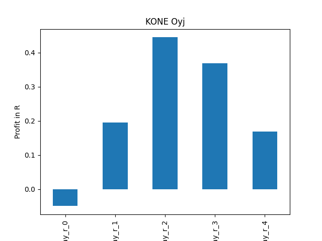
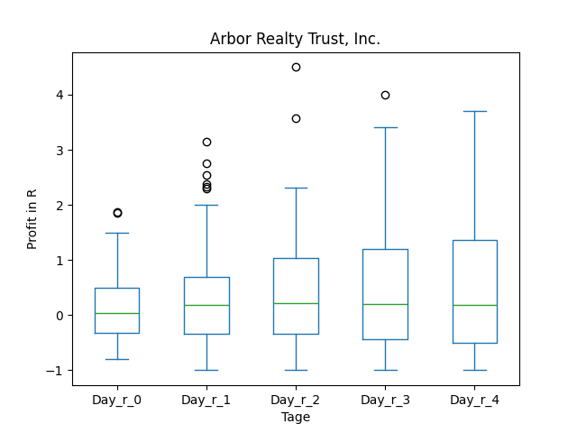
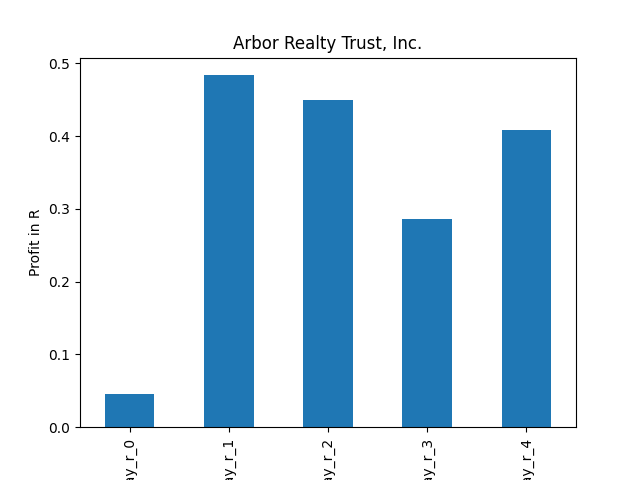

# dividend-shorter

bet on falling prices on payday **2025-03-07**.

## Signale

| Ticker   |   Divid Rate |   Close |        Volume |   last_close_volume |   Divid % | 5_Days_pos   | above_SMA_50   |
|:---------|-------------:|--------:|--------------:|--------------------:|----------:|:-------------|:---------------|
| WDS      |         0.53 |   15.09 |    1.1254e+06 |            16982286 |      3.51 | False        | False          |
| RIO      |         2.25 |   63.94 |    3.2466e+06 |           207587604 |      3.52 | True         | True           |
| KNYJY    |         0.94 |   29.7  | 9300          |              276210 |      3.16 | True         | True           |
| HSBC     |         1.8  |   59.55 |    4.2197e+06 |           251283135 |      3.02 | False        | True           |
| ABR      |         0.43 |   12.29 |    4.415e+06  |            54260350 |      3.5  | False        | False          |

## WDS

### Erwartung in R
|      |   Day_r_0 |   Day_r_1 |   Day_r_2 |   Day_r_3 |   Day_r_4 |   Treffer |
|:-----|----------:|----------:|----------:|----------:|----------:|----------:|
| ohne |       0.2 |      -0.3 |       0.2 |       0.5 |         0 |         5 |
| mit  |       0.2 |      -0.3 |       0.2 |       0.5 |         0 |         5 |

### Ohne Filter

### Mit Filter

## RIO

### Erwartung in R
|      |   Day_r_0 |   Day_r_1 |   Day_r_2 |   Day_r_3 |   Day_r_4 |   Treffer |
|:-----|----------:|----------:|----------:|----------:|----------:|----------:|
| ohne |       0.1 |       0.2 |       0.2 |       0.4 |       0.7 |        46 |
| mit  |       0.1 |       0.2 |       0.2 |       0   |       0.3 |        26 |

### Ohne Filter

### Mit Filter

## KNYJY

### Erwartung in R
|      |   Day_r_0 |   Day_r_1 |   Day_r_2 |   Day_r_3 |   Day_r_4 |   Treffer |
|:-----|----------:|----------:|----------:|----------:|----------:|----------:|
| ohne |        -0 |       0.1 |       0.1 |      -0.1 |      -0.2 |        14 |
| mit  |        -0 |       0.2 |       0.4 |       0.4 |       0.2 |         4 |

### Ohne Filter

### Mit Filter

## HSBC

### Erwartung in R
|      |   Day_r_0 |   Day_r_1 |   Day_r_2 |   Day_r_3 |   Day_r_4 |   Treffer |
|:-----|----------:|----------:|----------:|----------:|----------:|----------:|
| ohne |         0 |      -0   |      -0.1 |      -0.1 |      -0.1 |        79 |
| mit  |        -0 |       0.2 |      -0.2 |      -0.1 |      -0.1 |         5 |

### Ohne Filter

### Mit Filter

## ABR

### Erwartung in R
|      |   Day_r_0 |   Day_r_1 |   Day_r_2 |   Day_r_3 |   Day_r_4 |   Treffer |
|:-----|----------:|----------:|----------:|----------:|----------:|----------:|
| ohne |         0 |       0.2 |       0.2 |       0.2 |       0.2 |        69 |
| mit  |         0 |       0.5 |       0.4 |       0.3 |       0.4 |        15 |

### Ohne Filter

### Mit Filter

