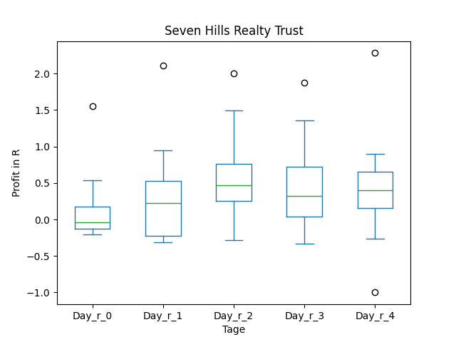

# dividend-shorter

bet on falling prices on payday **2025-01-27**.

## Signale

| Ticker   |   Divid Rate |   Close |   Volume |   last_close_volume |   Divid % | 5_Days_pos   | above_SMA_50   |
|:---------|-------------:|--------:|---------:|--------------------:|----------:|:-------------|:---------------|
| SLVYY    |         0.1  |    3.16 |    76900 |              243004 |      3.14 | True         | False          |
| SEVN     |         0.35 |   13.87 |   133800 |             1855806 |      2.52 | True         | True           |
| AATC     |         1.05 |    9.83 |    87300 |              858159 |     10.68 | True         | True           |

## SLVYY

### Erwartung in R
|      |   Day_r_0 |   Day_r_1 |   Day_r_2 |   Day_r_3 |   Day_r_4 |   Treffer |
|:-----|----------:|----------:|----------:|----------:|----------:|----------:|
| ohne |      -0.2 |         0 |      -0.4 |        -1 |        -1 |         6 |
| mit  |     nan   |       nan |     nan   |       nan |       nan |         0 |

### Ohne Filter

### Mit Filter

## SEVN

### Erwartung in R
|      |   Day_r_0 |   Day_r_1 |   Day_r_2 |   Day_r_3 |   Day_r_4 |   Treffer |
|:-----|----------:|----------:|----------:|----------:|----------:|----------:|
| ohne |       0   |       0.2 |       0.4 |       0.3 |       0.3 |        12 |
| mit  |      -0.1 |       0.9 |       0.7 |       0.8 |       0.6 |         1 |

### Ohne Filter

### Mit Filter

## AATC

### Erwartung in R
|      |   Day_r_0 |   Day_r_1 |   Day_r_2 |   Day_r_3 |   Day_r_4 |   Treffer |
|:-----|----------:|----------:|----------:|----------:|----------:|----------:|
| ohne |       0.1 |       0.5 |       0.4 |       0.4 |       0.4 |        14 |
| mit  |     nan   |     nan   |     nan   |     nan   |     nan   |         0 |

### Ohne Filter

### Mit Filter

