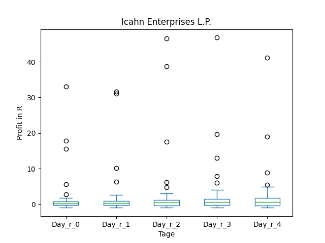
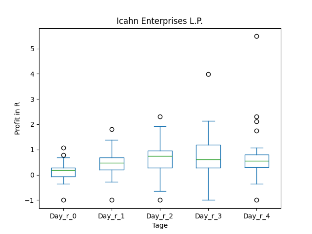
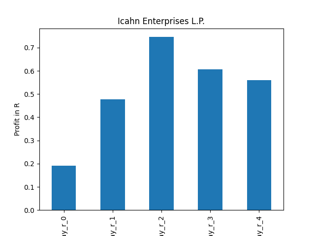

# dividend-shorter

bet on falling prices on payday **2025-03-10**.

## Signale

| Ticker   |   Divid Rate |   Close |           Volume |   last_close_volume |   Divid % | 5_Days_pos   | above_SMA_50   |
|:---------|-------------:|--------:|-----------------:|--------------------:|----------:|:-------------|:---------------|
| VALE     |         0.38 |    9.9  |      3.00495e+07 |           297490050 |      3.8  | True         | True           |
| UGP      |         0.08 |    2.86 | 812400           |             2323464 |      2.71 | True         | True           |
| IEP      |         0.5  |   10    |      1.0322e+06  |            10322000 |      5    | False        | True           |
| BWLP     |         0.42 |   11.06 | 583600           |             6454616 |      3.8  | False        | False          |

## VALE

### Erwartung in R
|      |   Day_r_0 |   Day_r_1 |   Day_r_2 |   Day_r_3 |   Day_r_4 |   Treffer |
|:-----|----------:|----------:|----------:|----------:|----------:|----------:|
| ohne |        -0 |       0   |       0.1 |       0   |       0.4 |        64 |
| mit  |        -0 |      -0.4 |      -0.2 |      -0.1 |       0.4 |        17 |

### Ohne Filter

### Mit Filter

## UGP

### Erwartung in R
|      |   Day_r_0 |   Day_r_1 |   Day_r_2 |   Day_r_3 |   Day_r_4 |   Treffer |
|:-----|----------:|----------:|----------:|----------:|----------:|----------:|
| ohne |       0.1 |       0.2 |      -0.3 |      -0.2 |      -0.3 |        41 |
| mit  |       0   |       0.4 |      -0.5 |      -0.2 |      -0.4 |        12 |

### Ohne Filter

### Mit Filter

## IEP

### Erwartung in R
|      |   Day_r_0 |   Day_r_1 |   Day_r_2 |   Day_r_3 |   Day_r_4 |   Treffer |
|:-----|----------:|----------:|----------:|----------:|----------:|----------:|
| ohne |       0.2 |       0.4 |       0.5 |       0.6 |       0.6 |        77 |
| mit  |       0.2 |       0.5 |       0.7 |       0.6 |       0.6 |        24 |

### Ohne Filter

### Mit Filter

## BWLP

### Erwartung in R
|      |   Day_r_0 |   Day_r_1 |   Day_r_2 |   Day_r_3 |   Day_r_4 |   Treffer |
|:-----|----------:|----------:|----------:|----------:|----------:|----------:|
| ohne |       0.1 |       0.5 |       0.3 |       0.9 |       1.2 |         3 |
| mit  |       0.1 |       0.5 |       0.3 |       0.9 |       1.2 |         3 |

### Ohne Filter

### Mit Filter

