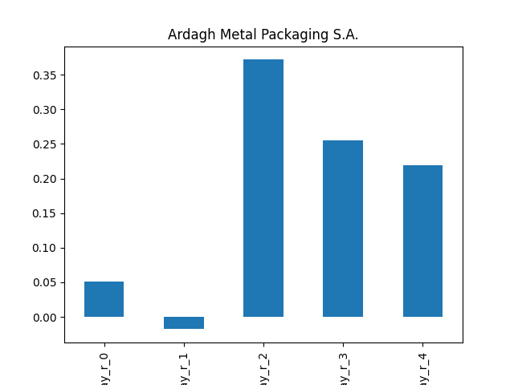
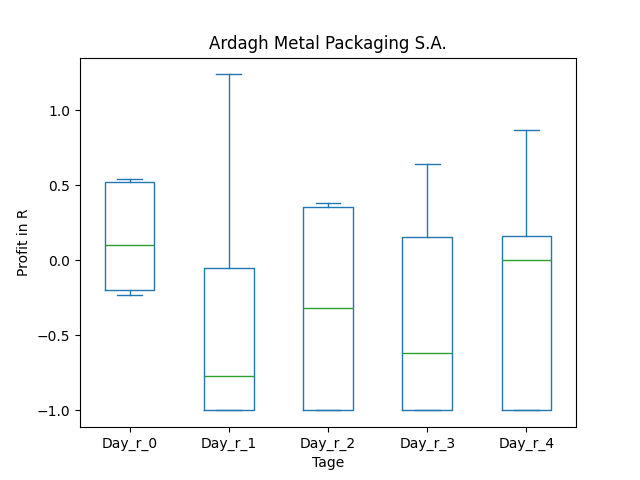

# dividend-shorter

bet on falling prices on payday **2024-12-05**.

## Signale

| Ticker   |   Divid Rate |   Close |          Volume |   last_close_volume |   Divid % | 5_Days_pos   | above_SMA_50   |
|:---------|-------------:|--------:|----------------:|--------------------:|----------:|:-------------|:---------------|
| SBLK     |         0.6  |   16.86 |      3.5731e+06 |            60242466 |      3.56 | False        | False          |
| AMBP     |         0.1  |    3.71 | 960900          |             3564939 |      2.7  | True         | False          |
| AGESY    |         1.58 |   51.8  |   2800          |              145040 |      3.06 | True         | False          |

## SBLK

### Erwartung in R
|      |   Day_r_0 |   Day_r_1 |   Day_r_2 |   Day_r_3 |   Day_r_4 |   Treffer |
|:-----|----------:|----------:|----------:|----------:|----------:|----------:|
| ohne |       0.1 |       0   |      -0   |       0.4 |       0.4 |        33 |
| mit  |       0.3 |       0.3 |       0.2 |       0.3 |       0.7 |         8 |

### Ohne Filter

### Mit Filter

## AMBP

### Erwartung in R
|      |   Day_r_0 |   Day_r_1 |   Day_r_2 |   Day_r_3 |   Day_r_4 |   Treffer |
|:-----|----------:|----------:|----------:|----------:|----------:|----------:|
| ohne |       0.1 |      -0   |       0.4 |       0.3 |       0.2 |        10 |
| mit  |       0.3 |      -0.4 |       0   |      -0.2 |       0.1 |         4 |

### Ohne Filter

### Mit Filter

## AGESY

### Erwartung in R
|      |   Day_r_0 |   Day_r_1 |   Day_r_2 |   Day_r_3 |   Day_r_4 |   Treffer |
|:-----|----------:|----------:|----------:|----------:|----------:|----------:|
| ohne |       0   |       0.1 |      -0   |       0   |       0.2 |        24 |
| mit  |       0.2 |       0.1 |       0.1 |       0.3 |       0.1 |         1 |

### Ohne Filter

### Mit Filter

