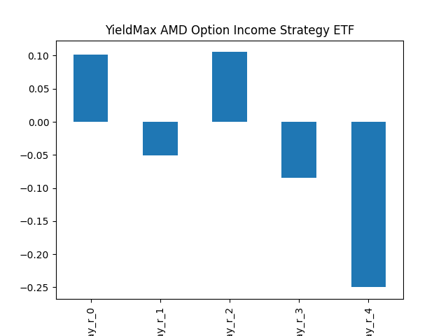
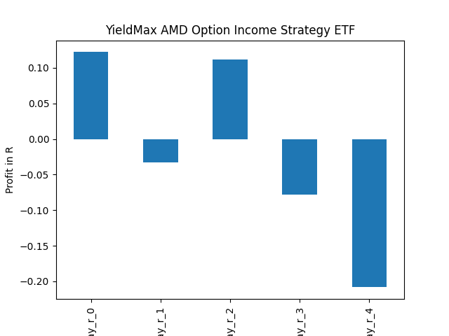

# dividend-shorter

bet on falling prices on payday **2025-09-18**.

## Signale

| Ticker   |   Divid Rate |   Close |           Volume |   last_close_volume |   Divid % | 5_Days_pos   | above_SMA_50   |
|:---------|-------------:|--------:|-----------------:|--------------------:|----------:|:-------------|:---------------|
| ICMB     |         0.12 |    3.07 | 124200           |              381294 |      3.91 | True         | True           |
| HOOY     |         3.86 |   69.25 | 504900           |            34964325 |      5.58 | True         | True           |
| FIAT     |         0.19 |    3.13 |      2.5173e+06  |             7879149 |      6.06 | True         | True           |
| DRAY     |         1.57 |   48.49 |  11500           |              557635 |      3.23 | False        | False          |
| CVNY     |         1.9  |   42.32 | 131200           |             5552384 |      4.49 | True         | True           |
| CONY     |         0.45 |    7.14 |      1.79116e+07 |           127888824 |      6.33 | False        | False          |
| AMDY     |         0.24 |    7.76 |      1.5332e+06  |            11897632 |      3.15 | True         | False          |

## ICMB

### Erwartung in R
|      |   Day_r_0 |   Day_r_1 |   Day_r_2 |   Day_r_3 |   Day_r_4 |   Treffer |
|:-----|----------:|----------:|----------:|----------:|----------:|----------:|
| ohne |       0.4 |       0.6 |       0.6 |       0.5 |       0.6 |        56 |
| mit  |      -0.1 |      -0   |      -0.1 |      -0.3 |      -0.2 |         1 |

### Ohne Filter

### Mit Filter

## HOOY

### Erwartung in R
|      |   Day_r_0 |   Day_r_1 |   Day_r_2 |   Day_r_3 |   Day_r_4 |   Treffer |
|:-----|----------:|----------:|----------:|----------:|----------:|----------:|
| ohne |        -0 |      -0.1 |      -0.4 |      -0.5 |      -0.5 |         4 |
| mit  |        -0 |      -0.1 |      -0.4 |      -0.5 |      -0.5 |         4 |

### Ohne Filter

### Mit Filter

## FIAT

### Erwartung in R
|      |   Day_r_0 |   Day_r_1 |   Day_r_2 |   Day_r_3 |   Day_r_4 |   Treffer |
|:-----|----------:|----------:|----------:|----------:|----------:|----------:|
| ohne |      -0.1 |      -0.1 |      -0.1 |      -0.2 |        -0 |        14 |
| mit  |      -0.1 |      -0.1 |      -0.1 |      -0.2 |        -0 |        14 |

### Ohne Filter

### Mit Filter

## DRAY

### Erwartung in R
|      |   Day_r_0 |   Day_r_1 |   Day_r_2 |   Day_r_3 |   Day_r_4 |   Treffer |
|:-----|----------:|----------:|----------:|----------:|----------:|----------:|
| ohne |      -0.3 |      -0.6 |      -0.6 |      -0.9 |      -0.8 |         1 |
| mit  |     nan   |     nan   |     nan   |     nan   |     nan   |         0 |

### Ohne Filter

### Mit Filter

## CVNY

### Erwartung in R
|      |   Day_r_0 |   Day_r_1 |   Day_r_2 |   Day_r_3 |   Day_r_4 |   Treffer |
|:-----|----------:|----------:|----------:|----------:|----------:|----------:|
| ohne |       0.4 |        -0 |      -0.1 |      -0.3 |      -0.4 |         7 |
| mit  |       0.4 |        -0 |      -0.1 |      -0.3 |      -0.4 |         7 |

### Ohne Filter

### Mit Filter

## CONY

### Erwartung in R
|      |   Day_r_0 |   Day_r_1 |   Day_r_2 |   Day_r_3 |   Day_r_4 |   Treffer |
|:-----|----------:|----------:|----------:|----------:|----------:|----------:|
| ohne |         0 |       0.1 |       0.1 |       0.1 |         0 |        24 |
| mit  |         0 |       0.1 |       0.1 |       0.1 |         0 |        24 |

### Ohne Filter

### Mit Filter

## AMDY

### Erwartung in R
|      |   Day_r_0 |   Day_r_1 |   Day_r_2 |   Day_r_3 |   Day_r_4 |   Treffer |
|:-----|----------:|----------:|----------:|----------:|----------:|----------:|
| ohne |       0.1 |      -0.1 |       0.1 |      -0.1 |      -0.2 |        23 |
| mit  |       0.1 |      -0   |       0.1 |      -0.1 |      -0.2 |        22 |

### Ohne Filter

### Mit Filter

