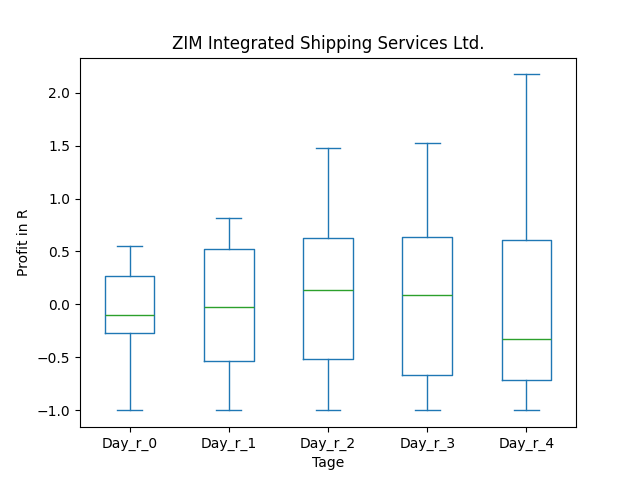
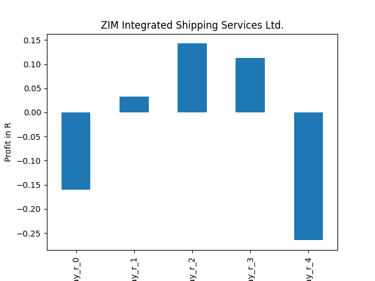
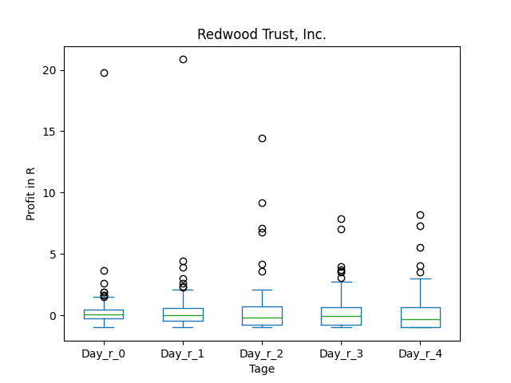
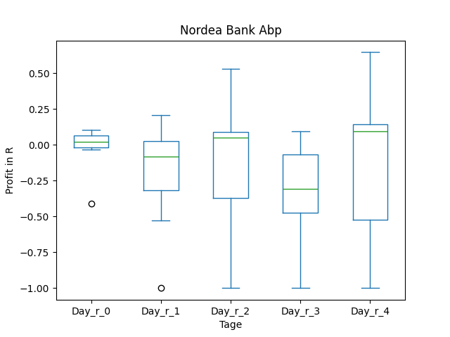
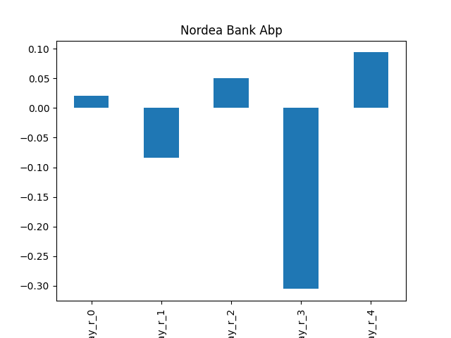
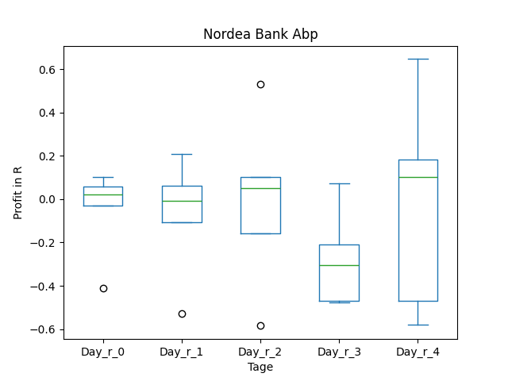
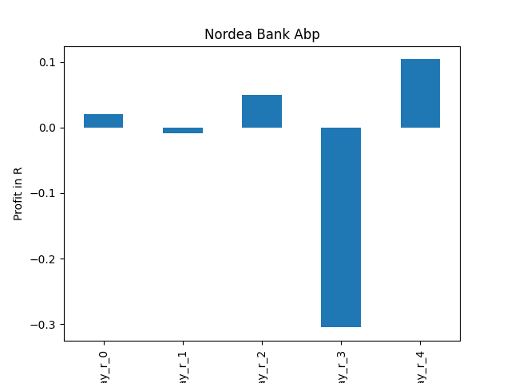

# dividend-shorter

bet on falling prices on payday **2025-03-24**.

## Signale

| Ticker   |   Divid Rate |   Close |           Volume |   last_close_volume |   Divid % | 5_Days_pos   | above_SMA_50   |
|:---------|-------------:|--------:|-----------------:|--------------------:|----------:|:-------------|:---------------|
| ZIM      |         3.17 |   17.82 |      1.00402e+07 |           178916364 |     17.79 | False        | False          |
| RWT      |         0.18 |    6.3  |      2.4988e+06  |            15742440 |      2.86 | False        | False          |
| PTMN     |         0.47 |   15.31 |  63700           |              975247 |      3.07 | False        | False          |
| PBCRY    |         0.38 |   12.2  |  90100           |             1099220 |      3.13 | False        | False          |
| NRDBY    |         0.98 |   13.99 | 245100           |             3428949 |      7    | False        | True           |
| DNKEY    |         1.07 |   17.91 |  36800           |              659088 |      6    | True         | True           |

## ZIM

### Erwartung in R
|      |   Day_r_0 |   Day_r_1 |   Day_r_2 |   Day_r_3 |   Day_r_4 |   Treffer |
|:-----|----------:|----------:|----------:|----------:|----------:|----------:|
| ohne |      -0.1 |        -0 |       0.1 |       0.1 |      -0.3 |        11 |
| mit  |      -0.2 |         0 |       0.1 |       0.1 |      -0.3 |        10 |

### Ohne Filter

### Mit Filter

## RWT

### Erwartung in R
|      |   Day_r_0 |   Day_r_1 |   Day_r_2 |   Day_r_3 |   Day_r_4 |   Treffer |
|:-----|----------:|----------:|----------:|----------:|----------:|----------:|
| ohne |       0.1 |         0 |      -0.2 |      -0   |      -0.3 |        90 |
| mit  |       0.3 |        -0 |      -0.1 |       0.1 |      -0.2 |        11 |

### Ohne Filter

### Mit Filter

## PTMN

### Erwartung in R
|      |   Day_r_0 |   Day_r_1 |   Day_r_2 |   Day_r_3 |   Day_r_4 |   Treffer |
|:-----|----------:|----------:|----------:|----------:|----------:|----------:|
| ohne |       0.1 |       0.4 |       0.4 |       0.6 |       0.5 |        71 |
| mit  |       0.1 |       0.3 |       0.3 |       0.4 |       0.5 |         2 |

### Ohne Filter

### Mit Filter

## PBCRY

### Erwartung in R
|      |   Day_r_0 |   Day_r_1 |   Day_r_2 |   Day_r_3 |   Day_r_4 |   Treffer |
|:-----|----------:|----------:|----------:|----------:|----------:|----------:|
| ohne |      -0.5 |      -0.8 |        -1 |        -1 |        -1 |        26 |
| mit  |     nan   |     nan   |       nan |       nan |       nan |         0 |

### Ohne Filter

### Mit Filter

## NRDBY

### Erwartung in R
|      |   Day_r_0 |   Day_r_1 |   Day_r_2 |   Day_r_3 |   Day_r_4 |   Treffer |
|:-----|----------:|----------:|----------:|----------:|----------:|----------:|
| ohne |         0 |      -0.1 |       0.1 |      -0.3 |       0.1 |         7 |
| mit  |         0 |      -0   |       0.1 |      -0.3 |       0.1 |         5 |

### Ohne Filter

### Mit Filter

## DNKEY

### Erwartung in R
|      |   Day_r_0 |   Day_r_1 |   Day_r_2 |   Day_r_3 |   Day_r_4 |   Treffer |
|:-----|----------:|----------:|----------:|----------:|----------:|----------:|
| ohne |      -0.1 |      -0.1 |      -0.2 |       0.1 |       0.4 |        12 |
| mit  |       0.1 |       0.2 |       0.1 |       0.1 |       0.4 |         2 |

### Ohne Filter

### Mit Filter

