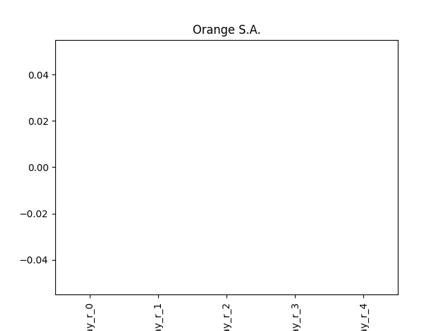
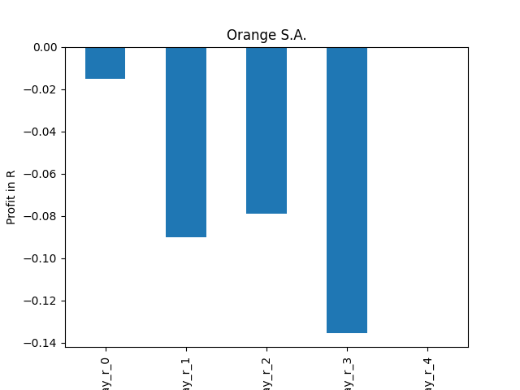
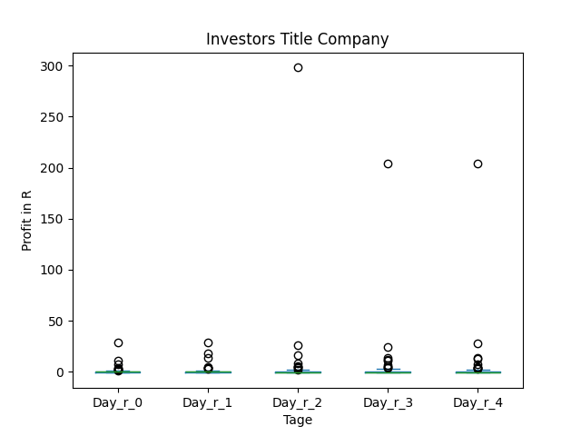
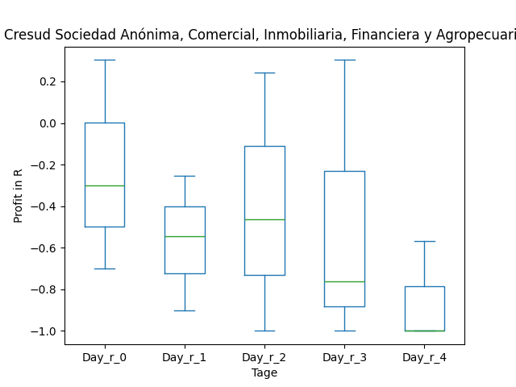

# dividend-shorter

bet on falling prices on payday **2024-12-02**.

## Signale

| Ticker   |   Divid Rate |   Close |          Volume |   last_close_volume |   Divid % | 5_Days_pos   | above_SMA_50   |
|:---------|-------------:|--------:|----------------:|--------------------:|----------:|:-------------|:---------------|
| ZIM      |         0.84 |   22.04 |      8.3827e+06 |           184754708 |      3.81 | False        | False          |
| ZIM      |         2.81 |   22.04 |      8.3827e+06 |           184754708 |     12.75 | False        | False          |
| QRTEP    |         2    |   42.48 | 215500          |             9154440 |      4.71 | True         | True           |
| ORANY    |         0.32 |   10.66 |  89300          |              951938 |      2.99 | True         | False          |
| ORAN     |         0.32 |   10.66 |  89296          |              951895 |      2.99 | True         | False          |
| ITIC     |        14    |  286.51 |   8800          |             2521288 |      4.89 | True         | True           |
| CRESY    |         0.61 |   12.93 | 319000          |             4124670 |      4.71 | True         | True           |
| CION     |         0.36 |   11.75 | 162000          |             1903500 |      3.06 | True         | False          |

## ZIM

### Erwartung in R
|      |   Day_r_0 |   Day_r_1 |   Day_r_2 |   Day_r_3 |   Day_r_4 |   Treffer |
|:-----|----------:|----------:|----------:|----------:|----------:|----------:|
| ohne |      -0.2 |       0.1 |       0.2 |       0.1 |      -0.2 |         9 |
| mit  |      -0.2 |       0.3 |       0.4 |       0.3 |      -0   |         8 |

### Ohne Filter

### Mit Filter

## ZIM

### Erwartung in R
|      |   Day_r_0 |   Day_r_1 |   Day_r_2 |   Day_r_3 |   Day_r_4 |   Treffer |
|:-----|----------:|----------:|----------:|----------:|----------:|----------:|
| ohne |      -0.2 |       0.1 |       0.2 |       0.1 |      -0.2 |         9 |
| mit  |      -0.2 |       0.3 |       0.4 |       0.3 |      -0   |         8 |

### Ohne Filter

### Mit Filter

## QRTEP

### Erwartung in R
|      |   Day_r_0 |   Day_r_1 |   Day_r_2 |   Day_r_3 |   Day_r_4 |   Treffer |
|:-----|----------:|----------:|----------:|----------:|----------:|----------:|
| ohne |       0.1 |       0   |       0.3 |       0.3 |       0.3 |        16 |
| mit  |       0.1 |       0.1 |       0.4 |       0.5 |       0.4 |        10 |

### Ohne Filter

### Mit Filter

## ORANY

### Erwartung in R
|      |   Day_r_0 |   Day_r_1 |   Day_r_2 |   Day_r_3 |   Day_r_4 |   Treffer |
|:-----|----------:|----------:|----------:|----------:|----------:|----------:|
| ohne |       nan |       nan |       nan |       nan |       nan |         0 |
| mit  |       nan |       nan |       nan |       nan |       nan |         0 |

### Ohne Filter

### Mit Filter

## ORAN

### Erwartung in R
|      |   Day_r_0 |   Day_r_1 |   Day_r_2 |   Day_r_3 |   Day_r_4 |   Treffer |
|:-----|----------:|----------:|----------:|----------:|----------:|----------:|
| ohne |         0 |      -0   |       0.1 |       0   |       0.2 |        37 |
| mit  |        -0 |      -0.1 |      -0.1 |      -0.1 |       0   |        23 |

### Ohne Filter

### Mit Filter

## ITIC

### Erwartung in R
|      |   Day_r_0 |   Day_r_1 |   Day_r_2 |   Day_r_3 |   Day_r_4 |   Treffer |
|:-----|----------:|----------:|----------:|----------:|----------:|----------:|
| ohne |        -0 |      -0.2 |      -0.3 |      -0.5 |      -0.8 |        91 |
| mit  |        -0 |      -0.1 |       0.2 |       0.4 |       0.3 |         4 |

### Ohne Filter

### Mit Filter

## CRESY

### Erwartung in R
|      |   Day_r_0 |   Day_r_1 |   Day_r_2 |   Day_r_3 |   Day_r_4 |   Treffer |
|:-----|----------:|----------:|----------:|----------:|----------:|----------:|
| ohne |       0   |      -0.4 |      -0.6 |      -0.7 |        -1 |        16 |
| mit  |      -0.3 |      -0.5 |      -0.5 |      -0.8 |        -1 |         3 |

### Ohne Filter

### Mit Filter

## CION

### Erwartung in R
|      |   Day_r_0 |   Day_r_1 |   Day_r_2 |   Day_r_3 |   Day_r_4 |   Treffer |
|:-----|----------:|----------:|----------:|----------:|----------:|----------:|
| ohne |        -0 |       0.1 |      -0.2 |       0   |      -0.2 |        18 |
| mit  |         0 |       0.1 |      -0.1 |       0.2 |      -0   |         9 |

### Ohne Filter

### Mit Filter

