# dividend-shorter

bet on falling prices on payday **2025-03-31**.

## Signale

| Ticker   |   Divid Rate |   Close |           Volume |   last_close_volume |   Divid % | 5_Days_pos   | above_SMA_50   |
|:---------|-------------:|--------:|-----------------:|--------------------:|----------:|:-------------|:---------------|
| UPMMY    |         0.77 |   28.01 |  57000           |             1596570 |      2.76 | False        | False          |
| TRIN     |         0.51 |   15.83 | 792200           |            12540526 |      3.22 | False        | True           |
| SUNS     |         0.3  |   11.21 | 154300           |             1729703 |      2.68 | False        | False          |
| SCMWY    |         2.48 |   61.03 |   9200           |              561476 |      4.06 | True         | True           |
| RWAY     |         0.33 |   10.75 | 880500           |             9465375 |      3.07 | True         | False          |
| REFI     |         0.47 |   15.3  | 179200           |             2741760 |      3.07 | False        | False          |
| RC       |         0.12 |    4.97 |      4.1939e+06  |            20843683 |      2.52 | False        | False          |
| RANJY    |         0.84 |   22.42 |  15600           |              349752 |      3.76 | True         | True           |
| NYMT     |         0.2  |    6.5  | 600600           |             3903900 |      3.08 | False        | True           |
| NLY      |         0.7  |   20.66 |      1.23905e+07 |           255987730 |      3.39 | False        | False          |
| NLCP     |         0.43 |   15.15 |  30300           |              459045 |      2.84 | True         | False          |
| NCDL     |         0.45 |   17.3  | 370000           |             6401000 |      2.6  | True         | True           |
| MSD      |         0.22 |    8.09 |  92700           |              749943 |      2.72 | False        | False          |
| MITT     |         0.2  |    7.49 | 264400           |             1980356 |      2.67 | False        | True           |
| MFA      |         0.36 |   10.56 |      1.3428e+06  |            14179968 |      3.41 | False        | False          |
| LFT      |         0.08 |    2.68 | 168800           |              452384 |      2.99 | False        | False          |
| IIPR     |         1.9  |   63.75 | 360400           |            22975500 |      2.98 | False        | False          |
| GSBD     |         0.32 |   12.11 |      1.1321e+06  |            13709731 |      2.64 | False        | False          |
| GHI      |         0.37 |   12.76 |  34000           |              433840 |      2.9  | False        | True           |
| FBRT     |         0.36 |   12.98 | 454200           |             5895516 |      2.73 | False        | False          |
| EDD      |         0.16 |    4.84 | 185500           |              897820 |      3.31 | True         | True           |
| CIM      |         0.37 |   13.1  |      1.0512e+06  |            13770720 |      2.82 | False        | False          |
| CIB      |         3.81 |   43.79 | 562200           |            24618738 |      8.71 | True         | True           |
| CHMI     |         0.15 |    3.44 | 565800           |             1946352 |      4.36 | False        | True           |
| BRSP     |         0.16 |    5.68 | 672000           |             3816960 |      2.82 | False        | False          |
| BGS      |         0.19 |    6.63 |      2.5602e+06  |            16974126 |      2.87 | False        | False          |
| ARI      |         0.25 |    9.66 |      1.0172e+06  |             9826152 |      2.59 | False        | True           |
| AFCG     |         0.23 |    6.09 | 298000           |             1814820 |      3.78 | False        | False          |
| ACRE     |         0.15 |    4.7  | 816800           |             3838960 |      3.19 | False        | False          |

## UPMMY

### Erwartung in R
|      |   Day_r_0 |   Day_r_1 |   Day_r_2 |   Day_r_3 |   Day_r_4 |   Treffer |
|:-----|----------:|----------:|----------:|----------:|----------:|----------:|
| ohne |      -0   |       0.2 |      -0   |      -0.2 |      -0.2 |         7 |
| mit  |       0.1 |       0.6 |       0.3 |       0.5 |       0.2 |         1 |

### Ohne Filter
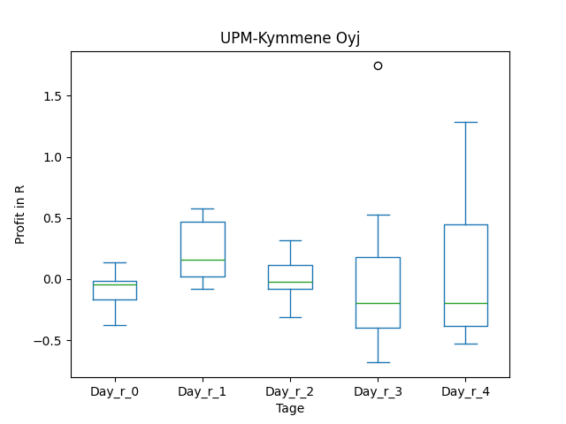
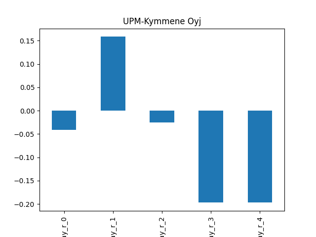

### Mit Filter
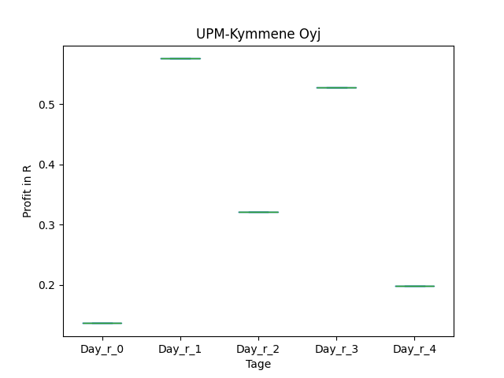
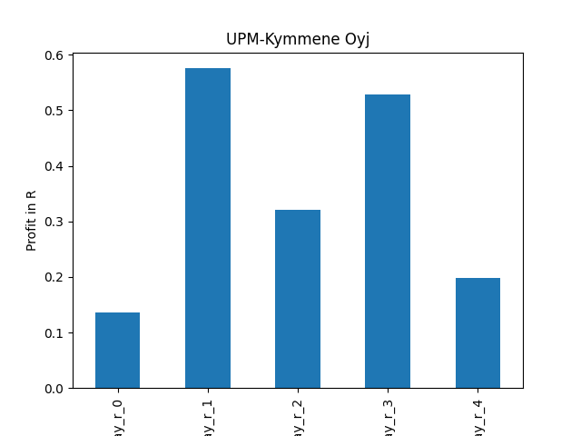

## TRIN

### Erwartung in R
|      |   Day_r_0 |   Day_r_1 |   Day_r_2 |   Day_r_3 |   Day_r_4 |   Treffer |
|:-----|----------:|----------:|----------:|----------:|----------:|----------:|
| ohne |        -0 |        -0 |      -0.2 |      -0.3 |      -0.1 |        22 |
| mit  |        -0 |         0 |      -0.2 |      -0.3 |      -0   |        11 |

### Ohne Filter

### Mit Filter

## SUNS

### Erwartung in R
|      |   Day_r_0 |   Day_r_1 |   Day_r_2 |   Day_r_3 |   Day_r_4 |   Treffer |
|:-----|----------:|----------:|----------:|----------:|----------:|----------:|
| ohne |       0.6 |       0.8 |       1.1 |       2.7 |       0.7 |         2 |
| mit  |     nan   |     nan   |     nan   |     nan   |     nan   |         0 |

### Ohne Filter

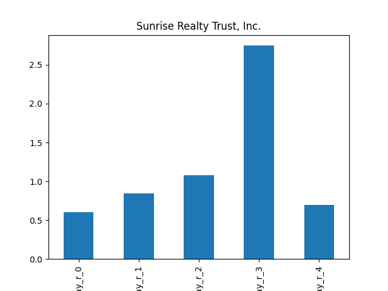

### Mit Filter

## SCMWY

### Erwartung in R
|      |   Day_r_0 |   Day_r_1 |   Day_r_2 |   Day_r_3 |   Day_r_4 |   Treffer |
|:-----|----------:|----------:|----------:|----------:|----------:|----------:|
| ohne |        -0 |       0   |        -0 |      -0.1 |        -0 |        16 |
| mit  |         0 |       0.1 |        -0 |       0   |         0 |         3 |

### Ohne Filter

### Mit Filter

## RWAY

### Erwartung in R
|      |   Day_r_0 |   Day_r_1 |   Day_r_2 |   Day_r_3 |   Day_r_4 |   Treffer |
|:-----|----------:|----------:|----------:|----------:|----------:|----------:|
| ohne |      -0.2 |      -0.1 |         0 |       0.1 |       0.1 |        20 |
| mit  |      -0.2 |      -0.2 |        -0 |      -0.2 |      -0.1 |         8 |

### Ohne Filter

### Mit Filter

## REFI

### Erwartung in R
|      |   Day_r_0 |   Day_r_1 |   Day_r_2 |   Day_r_3 |   Day_r_4 |   Treffer |
|:-----|----------:|----------:|----------:|----------:|----------:|----------:|
| ohne |       0   |       0.2 |       0   |       0.1 |       0.2 |        15 |
| mit  |       0.1 |       0.2 |       0.3 |       0.2 |       0.3 |         6 |

### Ohne Filter

### Mit Filter

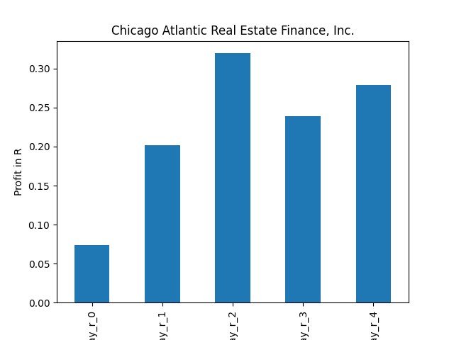

## RC

### Erwartung in R
|      |   Day_r_0 |   Day_r_1 |   Day_r_2 |   Day_r_3 |   Day_r_4 |   Treffer |
|:-----|----------:|----------:|----------:|----------:|----------:|----------:|
| ohne |      -0   |        -0 |      -0.1 |      -0.1 |      -0.1 |        51 |
| mit  |      -0.1 |        -0 |      -0.3 |      -0.3 |      -0.2 |        13 |

### Ohne Filter

### Mit Filter

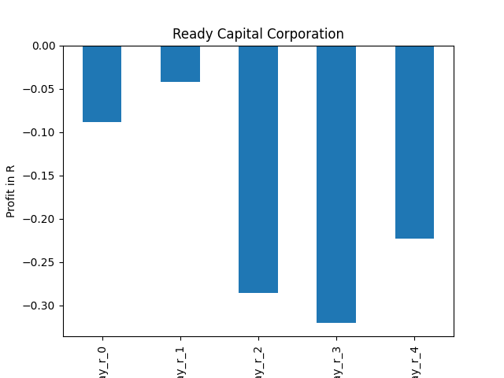

## RANJY

### Erwartung in R
|      |   Day_r_0 |   Day_r_1 |   Day_r_2 |   Day_r_3 |   Day_r_4 |   Treffer |
|:-----|----------:|----------:|----------:|----------:|----------:|----------:|
| ohne |      -0   |       0   |       0   |       0.5 |       0.8 |        16 |
| mit  |      -0.2 |      -0.3 |      -0.5 |      -1   |      -0.8 |         1 |

### Ohne Filter

### Mit Filter

## NYMT

### Erwartung in R
|      |   Day_r_0 |   Day_r_1 |   Day_r_2 |   Day_r_3 |   Day_r_4 |   Treffer |
|:-----|----------:|----------:|----------:|----------:|----------:|----------:|
| ohne |       0   |       0   |       0.1 |       0.2 |       0.1 |        67 |
| mit  |      -0.1 |       0.2 |       0.1 |       0.1 |       0.4 |         6 |

### Ohne Filter

### Mit Filter

## NLY

### Erwartung in R
|      |   Day_r_0 |   Day_r_1 |   Day_r_2 |   Day_r_3 |   Day_r_4 |   Treffer |
|:-----|----------:|----------:|----------:|----------:|----------:|----------:|
| ohne |      -0   |         0 |       0.1 |      -0   |      -0   |        88 |
| mit  |      -0.1 |        -0 |       0.3 |       0.1 |       0.3 |        10 |

### Ohne Filter

### Mit Filter
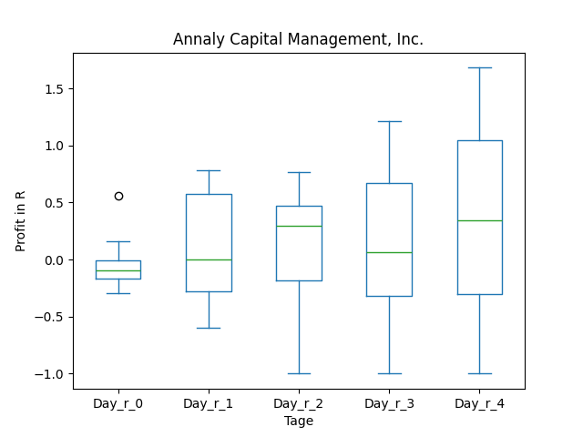

## NLCP

### Erwartung in R
|      |   Day_r_0 |   Day_r_1 |   Day_r_2 |   Day_r_3 |   Day_r_4 |   Treffer |
|:-----|----------:|----------:|----------:|----------:|----------:|----------:|
| ohne |        -0 |      -0.3 |      -0.1 |      -0.4 |      -0.2 |        13 |
| mit  |       nan |     nan   |     nan   |     nan   |     nan   |         0 |

### Ohne Filter

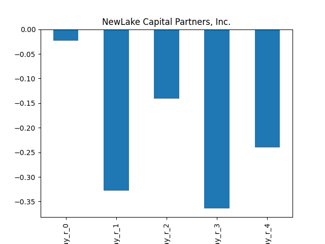

### Mit Filter

## NCDL

### Erwartung in R
|      |   Day_r_0 |   Day_r_1 |   Day_r_2 |   Day_r_3 |   Day_r_4 |   Treffer |
|:-----|----------:|----------:|----------:|----------:|----------:|----------:|
| ohne |        -0 |       0.1 |      -0.2 |      -0.3 |      -0.3 |         8 |
| mit  |       nan |     nan   |     nan   |     nan   |     nan   |         0 |

### Ohne Filter

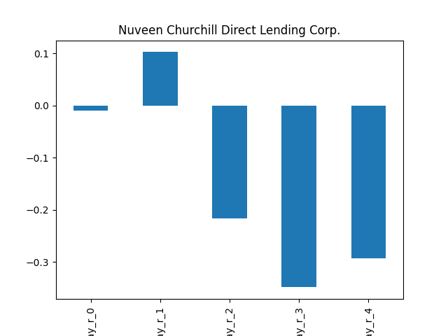

### Mit Filter

## MSD

### Erwartung in R
|      |   Day_r_0 |   Day_r_1 |   Day_r_2 |   Day_r_3 |   Day_r_4 |   Treffer |
|:-----|----------:|----------:|----------:|----------:|----------:|----------:|
| ohne |       0.1 |       0.1 |       0   |      -0   |       0   |        73 |
| mit  |      -0   |      -0.1 |       0.2 |       0.4 |       0.4 |         2 |

### Ohne Filter

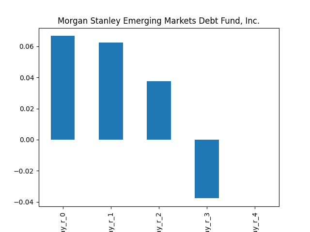

### Mit Filter

## MITT

### Erwartung in R
|      |   Day_r_0 |   Day_r_1 |   Day_r_2 |   Day_r_3 |   Day_r_4 |   Treffer |
|:-----|----------:|----------:|----------:|----------:|----------:|----------:|
| ohne |      -0.1 |      -0.2 |      -0.2 |      -0.1 |        -0 |        54 |
| mit  |      -0.2 |      -0.1 |      -0.5 |      -0.2 |        -0 |         5 |

### Ohne Filter
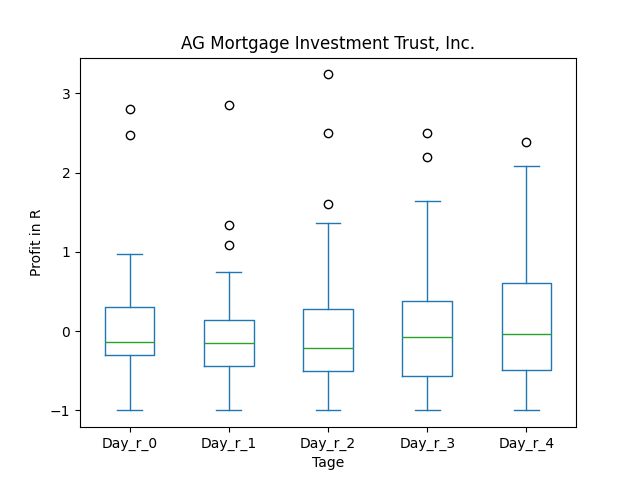

### Mit Filter
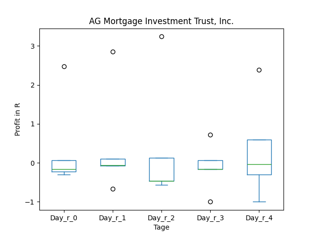

## MFA

### Erwartung in R
|      |   Day_r_0 |   Day_r_1 |   Day_r_2 |   Day_r_3 |   Day_r_4 |   Treffer |
|:-----|----------:|----------:|----------:|----------:|----------:|----------:|
| ohne |       0.1 |       0.1 |      -0   |         0 |       0   |        87 |
| mit  |      -0.1 |       0   |      -0.2 |        -0 |       0.1 |        10 |

### Ohne Filter

### Mit Filter

## LFT

### Erwartung in R
|      |   Day_r_0 |   Day_r_1 |   Day_r_2 |   Day_r_3 |   Day_r_4 |   Treffer |
|:-----|----------:|----------:|----------:|----------:|----------:|----------:|
| ohne |       0.2 |       0.4 |       0.3 |       0.5 |       0.2 |        92 |
| mit  |      -0.2 |      -0.2 |      -0.1 |      -0.1 |      -0.1 |         1 |

### Ohne Filter
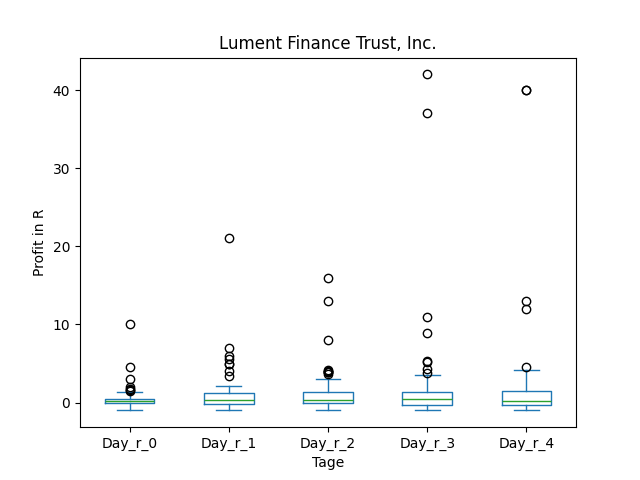

### Mit Filter

## IIPR

### Erwartung in R
|      |   Day_r_0 |   Day_r_1 |   Day_r_2 |   Day_r_3 |   Day_r_4 |   Treffer |
|:-----|----------:|----------:|----------:|----------:|----------:|----------:|
| ohne |      -0.1 |       0.2 |       0.3 |       0.6 |       0.2 |        31 |
| mit  |      -0.4 |      -1   |      -1   |      -1   |      -1   |         1 |

### Ohne Filter
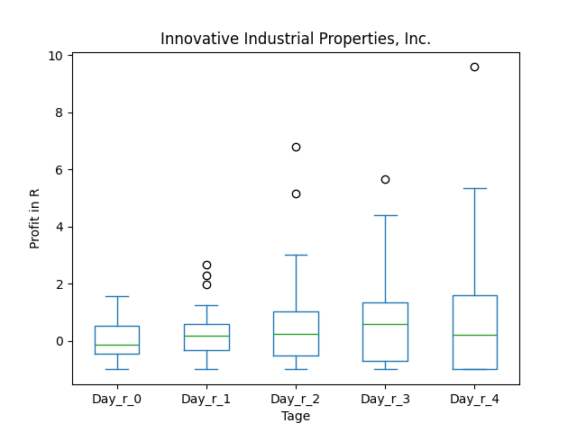

### Mit Filter

## GSBD

### Erwartung in R
|      |   Day_r_0 |   Day_r_1 |   Day_r_2 |   Day_r_3 |   Day_r_4 |   Treffer |
|:-----|----------:|----------:|----------:|----------:|----------:|----------:|
| ohne |       0.2 |       0.2 |       0.1 |       0.1 |       0.2 |        43 |
| mit  |       0.4 |       0.5 |       0.2 |       0.3 |       0.5 |        12 |

### Ohne Filter
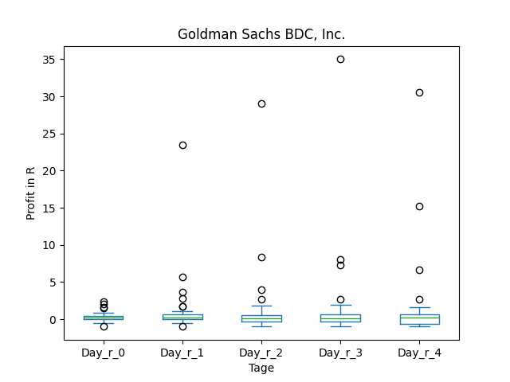

### Mit Filter

## GHI

### Erwartung in R
|      |   Day_r_0 |   Day_r_1 |   Day_r_2 |   Day_r_3 |   Day_r_4 |   Treffer |
|:-----|----------:|----------:|----------:|----------:|----------:|----------:|
| ohne |      -0.2 |      -0   |      -0.2 |      -0.1 |      -0.1 |        11 |
| mit  |      -0.1 |      -0.6 |      -1   |      -1   |      -1   |         1 |

### Ohne Filter

### Mit Filter

## FBRT

### Erwartung in R
|      |   Day_r_0 |   Day_r_1 |   Day_r_2 |   Day_r_3 |   Day_r_4 |   Treffer |
|:-----|----------:|----------:|----------:|----------:|----------:|----------:|
| ohne |       0.1 |       0.1 |      -0.2 |      -0.1 |       0.1 |        13 |
| mit  |      -0.1 |      -0.1 |      -0.6 |      -0.6 |      -0.5 |         4 |

### Ohne Filter

### Mit Filter

## EDD

### Erwartung in R
|      |   Day_r_0 |   Day_r_1 |   Day_r_2 |   Day_r_3 |   Day_r_4 |   Treffer |
|:-----|----------:|----------:|----------:|----------:|----------:|----------:|
| ohne |       0.1 |       0.1 |       0.1 |         0 |      -0.1 |        67 |
| mit  |       0.1 |       0.2 |       0.2 |         0 |      -0.1 |         8 |

### Ohne Filter
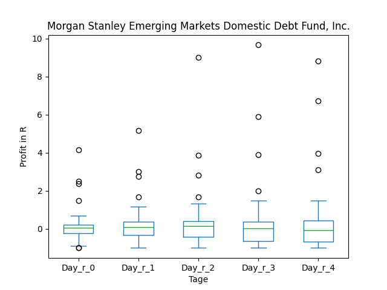
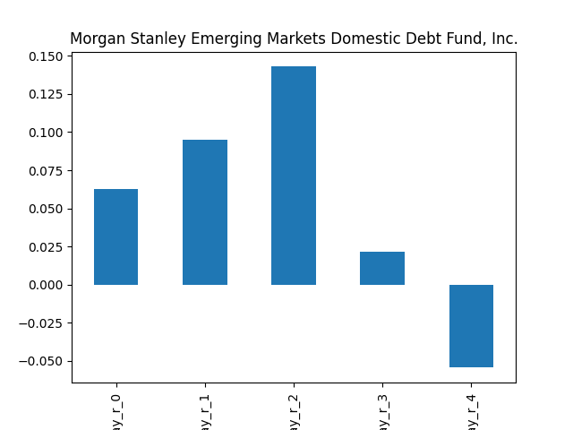

### Mit Filter
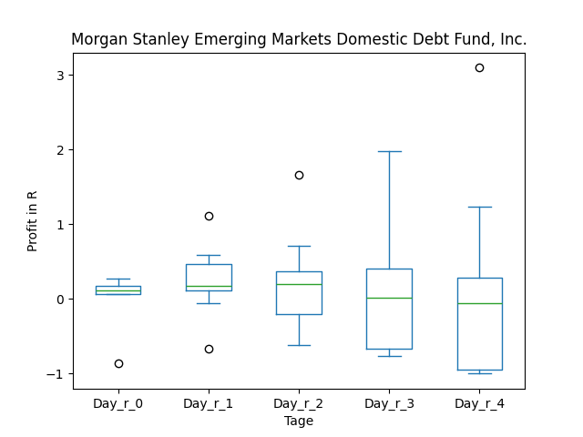
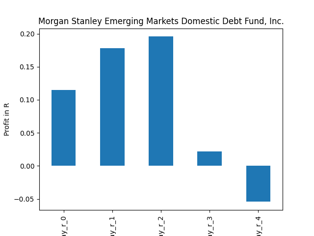

## CIM

### Erwartung in R
|      |   Day_r_0 |   Day_r_1 |   Day_r_2 |   Day_r_3 |   Day_r_4 |   Treffer |
|:-----|----------:|----------:|----------:|----------:|----------:|----------:|
| ohne |       0.1 |       0.2 |       0.1 |         0 |       0.2 |        71 |
| mit  |     nan   |     nan   |     nan   |       nan |     nan   |         0 |

### Ohne Filter

### Mit Filter

## CIB

### Erwartung in R
|      |   Day_r_0 |   Day_r_1 |   Day_r_2 |   Day_r_3 |   Day_r_4 |   Treffer |
|:-----|----------:|----------:|----------:|----------:|----------:|----------:|
| ohne |      -0.1 |      -0.4 |      -0.5 |      -1   |      -1   |        88 |
| mit  |      -0.3 |      -0.7 |      -0.2 |       0.2 |       1.1 |         3 |

### Ohne Filter
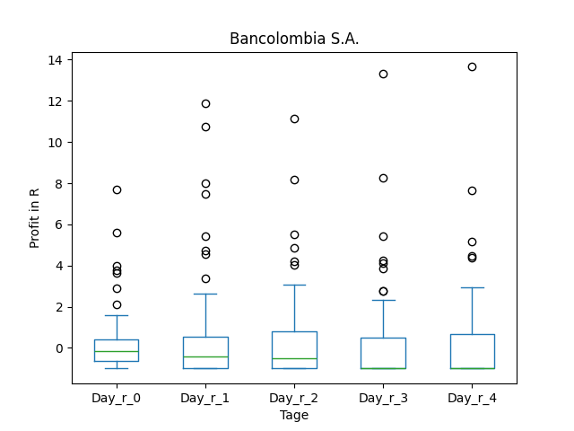

### Mit Filter

## CHMI

### Erwartung in R
|      |   Day_r_0 |   Day_r_1 |   Day_r_2 |   Day_r_3 |   Day_r_4 |   Treffer |
|:-----|----------:|----------:|----------:|----------:|----------:|----------:|
| ohne |       0.1 |       0   |       0   |       0   |       0   |        47 |
| mit  |       0.1 |       0.1 |       0.4 |       0.5 |       0.5 |        17 |

### Ohne Filter
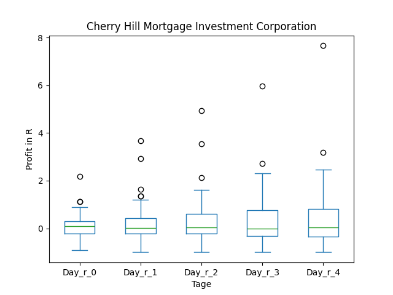

### Mit Filter

## BRSP

### Erwartung in R
|      |   Day_r_0 |   Day_r_1 |   Day_r_2 |   Day_r_3 |   Day_r_4 |   Treffer |
|:-----|----------:|----------:|----------:|----------:|----------:|----------:|
| ohne |      -0.1 |      -0.2 |      -0.2 |      -0.5 |      -0.4 |        42 |
| mit  |      -0.2 |      -0.3 |       0.1 |      -0.4 |      -0.3 |         9 |

### Ohne Filter
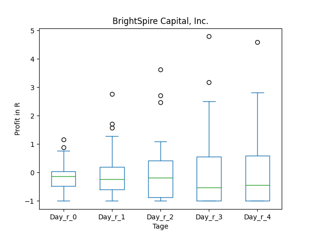
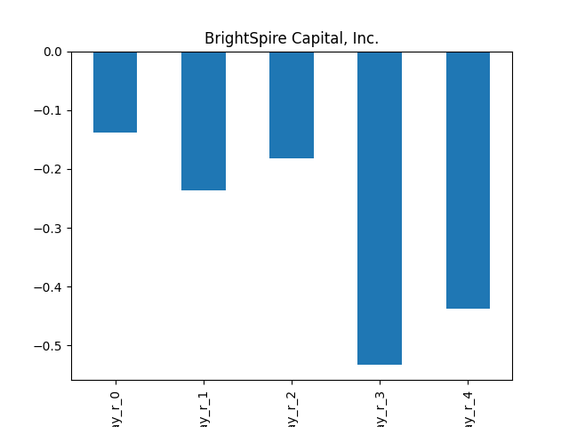

### Mit Filter

## BGS

### Erwartung in R
|      |   Day_r_0 |   Day_r_1 |   Day_r_2 |   Day_r_3 |   Day_r_4 |   Treffer |
|:-----|----------:|----------:|----------:|----------:|----------:|----------:|
| ohne |       0.3 |       0.4 |       0.3 |       0.3 |       0.4 |        70 |
| mit  |      -0.5 |      -1   |      -1   |      -1   |      -1   |         1 |

### Ohne Filter

### Mit Filter

## ARI

### Erwartung in R
|      |   Day_r_0 |   Day_r_1 |   Day_r_2 |   Day_r_3 |   Day_r_4 |   Treffer |
|:-----|----------:|----------:|----------:|----------:|----------:|----------:|
| ohne |      -0.1 |       0   |       0   |      -0.1 |      -0.1 |        60 |
| mit  |      -0.1 |      -0.1 |      -0.2 |      -0.1 |      -0   |        18 |

### Ohne Filter

### Mit Filter

## AFCG

### Erwartung in R
|      |   Day_r_0 |   Day_r_1 |   Day_r_2 |   Day_r_3 |   Day_r_4 |   Treffer |
|:-----|----------:|----------:|----------:|----------:|----------:|----------:|
| ohne |       0.3 |       0.5 |       0.4 |       0.6 |       0.7 |        16 |
| mit  |       0.3 |       0.4 |       0.4 |       0.6 |       0.7 |        14 |

### Ohne Filter

### Mit Filter
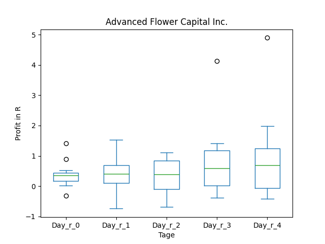

## ACRE

### Erwartung in R
|      |   Day_r_0 |   Day_r_1 |   Day_r_2 |   Day_r_3 |   Day_r_4 |   Treffer |
|:-----|----------:|----------:|----------:|----------:|----------:|----------:|
| ohne |      -0.1 |      -0.1 |      -0.3 |      -0.2 |      -0.2 |        61 |
| mit  |      -0.1 |      -0.2 |       0   |      -0.1 |       0.2 |        13 |

### Ohne Filter

### Mit Filter

