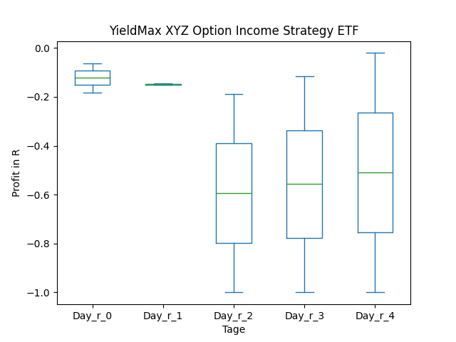
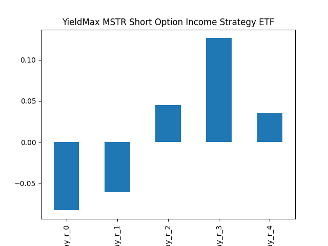
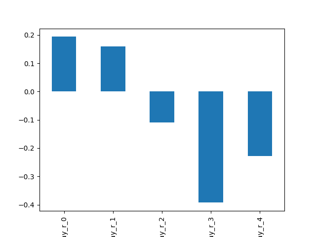
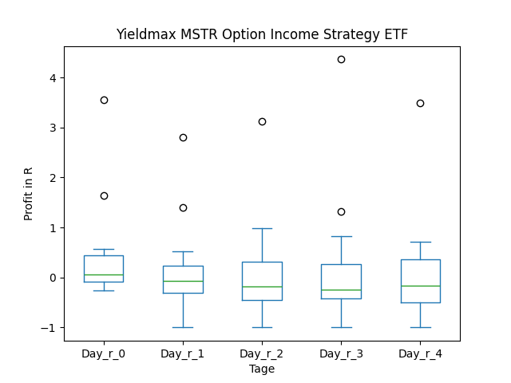
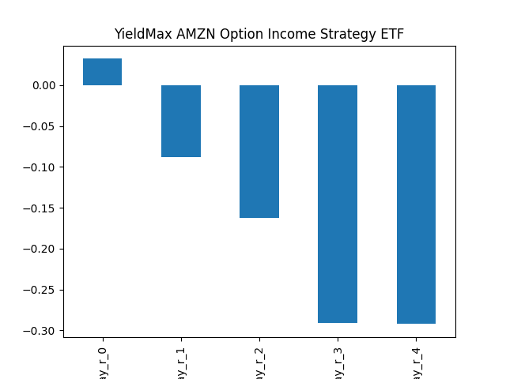
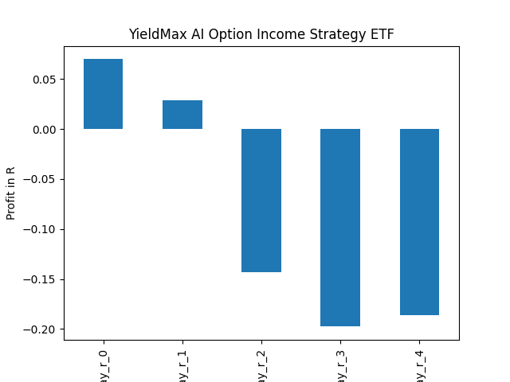

# dividend-shorter

bet on falling prices on payday **2025-09-25**.

## Signale

| Ticker   |   Divid Rate |   Close |           Volume |   last_close_volume |   Divid % | 5_Days_pos   | above_SMA_50   |
|:---------|-------------:|--------:|-----------------:|--------------------:|----------:|:-------------|:---------------|
| XYZY     |         0.28 |    9.5  | 168300           |             1598850 |      2.92 | False        | True           |
| WNTR     |         3.3  |   34.45 | 965700           |            33268365 |      9.56 | True         | True           |
| SMCY     |         0.91 |   16.03 |      2.6118e+06  |            41867154 |      5.71 | True         | False          |
| MSTY     |         1.01 |   15.18 |      1.17005e+07 |           177613590 |      6.66 | False        | False          |
| BNPQY    |         1.52 |   45.99 | 183000           |             8416170 |      3.31 | False        | False          |
| APLY     |         0.36 |   13.88 | 166000           |             2304080 |      2.57 | True         | True           |
| AMZY     |         0.46 |   14.69 | 394200           |             5790798 |      3.13 | False        | False          |
| AIYY     |         0.14 |    2.81 |      1.6379e+06  |             4602499 |      4.96 | True         | False          |
| ADAM     |         0.23 |    7.3  |      1.404e+06   |            10249200 |      3.15 | False        | True           |

## XYZY

### Erwartung in R
|      |   Day_r_0 |   Day_r_1 |   Day_r_2 |   Day_r_3 |   Day_r_4 |   Treffer |
|:-----|----------:|----------:|----------:|----------:|----------:|----------:|
| ohne |      -0   |       0.1 |      -0   |      -0   |       0   |         6 |
| mit  |      -0.1 |       0   |       0.2 |       0.1 |       0.1 |         5 |

### Ohne Filter

### Mit Filter

## WNTR

### Erwartung in R
|      |   Day_r_0 |   Day_r_1 |   Day_r_2 |   Day_r_3 |   Day_r_4 |   Treffer |
|:-----|----------:|----------:|----------:|----------:|----------:|----------:|
| ohne |         0 |      -0.2 |      -0.1 |       0.1 |         0 |         5 |
| mit  |         0 |      -0.2 |      -0.1 |       0.1 |         0 |         5 |

### Ohne Filter

### Mit Filter

## SMCY

### Erwartung in R
|      |   Day_r_0 |   Day_r_1 |   Day_r_2 |   Day_r_3 |   Day_r_4 |   Treffer |
|:-----|----------:|----------:|----------:|----------:|----------:|----------:|
| ohne |       0.2 |       0.3 |        -0 |      -0.3 |      -0.1 |        12 |
| mit  |       0.2 |       0.3 |        -0 |      -0.3 |      -0.1 |        12 |

### Ohne Filter

### Mit Filter

## MSTY

### Erwartung in R
|      |   Day_r_0 |   Day_r_1 |   Day_r_2 |   Day_r_3 |   Day_r_4 |   Treffer |
|:-----|----------:|----------:|----------:|----------:|----------:|----------:|
| ohne |         0 |         0 |       0.1 |      -0.2 |      -0.1 |        18 |
| mit  |         0 |         0 |       0.1 |      -0.2 |      -0.1 |        18 |

### Ohne Filter

### Mit Filter

## BNPQY

### Erwartung in R
|      |   Day_r_0 |   Day_r_1 |   Day_r_2 |   Day_r_3 |   Day_r_4 |   Treffer |
|:-----|----------:|----------:|----------:|----------:|----------:|----------:|
| ohne |         0 |        -0 |         0 |       0   |       0.1 |        19 |
| mit  |        -0 |        -0 |         0 |       0.1 |       0.1 |        14 |

### Ohne Filter

### Mit Filter

## APLY

### Erwartung in R
|      |   Day_r_0 |   Day_r_1 |   Day_r_2 |   Day_r_3 |   Day_r_4 |   Treffer |
|:-----|----------:|----------:|----------:|----------:|----------:|----------:|
| ohne |       0.2 |       0   |       0.1 |      -0.3 |      -0.4 |        28 |
| mit  |       0.2 |       0.3 |       0   |      -0.1 |      -0.4 |         4 |

### Ohne Filter

### Mit Filter

## AMZY

### Erwartung in R
|      |   Day_r_0 |   Day_r_1 |   Day_r_2 |   Day_r_3 |   Day_r_4 |   Treffer |
|:-----|----------:|----------:|----------:|----------:|----------:|----------:|
| ohne |         0 |      -0.1 |      -0.1 |      -0.2 |      -0.3 |        25 |
| mit  |        -0 |      -0   |      -0.1 |      -0.2 |      -0.2 |        16 |

### Ohne Filter

### Mit Filter

## AIYY

### Erwartung in R
|      |   Day_r_0 |   Day_r_1 |   Day_r_2 |   Day_r_3 |   Day_r_4 |   Treffer |
|:-----|----------:|----------:|----------:|----------:|----------:|----------:|
| ohne |       0.1 |       0   |      -0.3 |      -0.2 |      -0.2 |        21 |
| mit  |       0.1 |       0.2 |      -0.1 |      -0.1 |      -0   |        16 |

### Ohne Filter

### Mit Filter

## ADAM

### Erwartung in R
|      |   Day_r_0 |   Day_r_1 |   Day_r_2 |   Day_r_3 |   Day_r_4 |   Treffer |
|:-----|----------:|----------:|----------:|----------:|----------:|----------:|
| ohne |       nan |       nan |       nan |       nan |       nan |         0 |
| mit  |       nan |       nan |       nan |       nan |       nan |         0 |

### Ohne Filter

### Mit Filter

