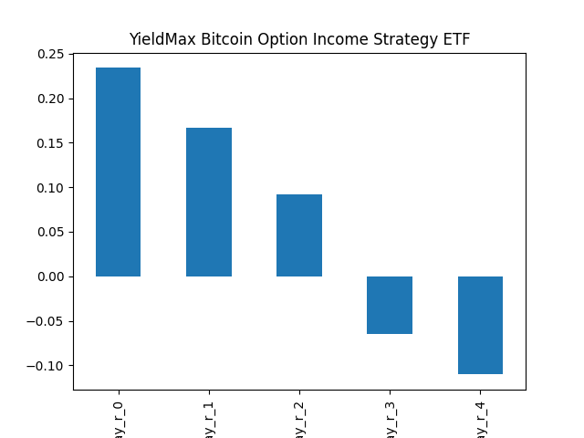
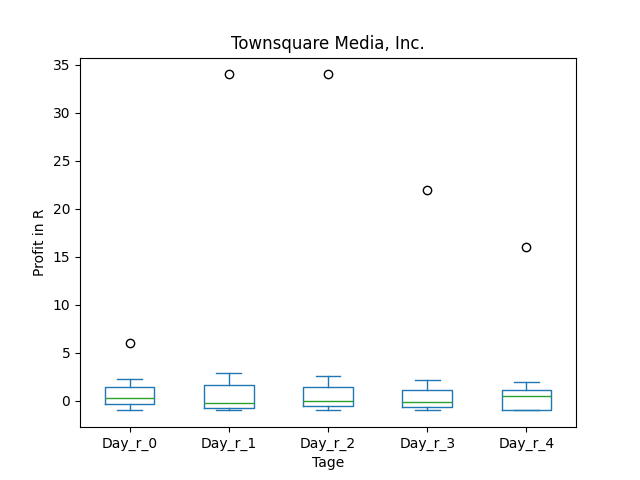
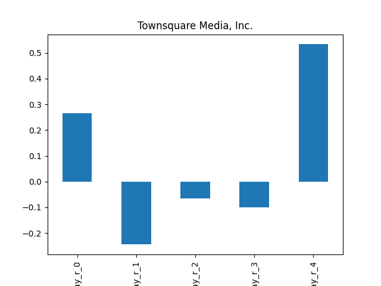
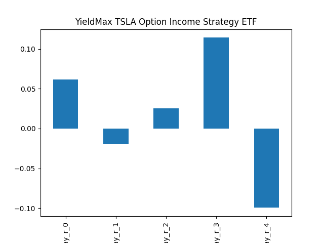
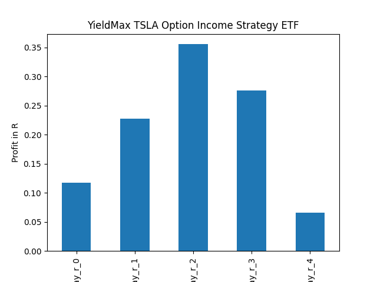

# dividend-shorter

bet on falling prices on payday **2025-04-17**.

## Signale

| Ticker   |   Divid Rate |   Close |          Volume |   last_close_volume |   Divid % | 5_Days_pos   | above_SMA_50   |
|:---------|-------------:|--------:|----------------:|--------------------:|----------:|:-------------|:---------------|
| YBIT     |         0.41 |   10.13 | 277000          |             2806010 |      4.06 | True         | False          |
| XOMO     |         0.35 |   13.12 |  38700          |              507744 |      2.67 | True         | False          |
| TSQ      |         0.2  |    7.28 |  64700          |              471016 |      2.75 | True         | False          |
| TSMY     |         0.56 |   13.74 |  75800          |             1041492 |      4.1  | True         | False          |
| TSLY     |         0.66 |    8.08 |      7.703e+06  |            62240240 |      8.17 | False        | False          |
| SNOY     |         0.69 |   14.94 | 212000          |             3167280 |      4.59 | True         | False          |
| OARK     |         0.29 |    7.24 | 257600          |             1865024 |      4.04 | True         | False          |
| KPCPY    |         0.95 |   18.67 |   6000          |              112020 |      5.1  | True         | True           |
| GOOY     |         0.37 |   11.92 | 111700          |             1331464 |      3.13 | True         | False          |
| FIVY     |         1.03 |   34.91 |  18600          |              649326 |      2.95 | True         | False          |
| FEAT     |         1.64 |   34.38 |  70100          |             2410038 |      4.78 | True         | False          |
| CRSH     |         0.56 |    7.6  |      1.2499e+06 |             9499240 |      7.39 | True         | True           |

## YBIT

### Erwartung in R
|      |   Day_r_0 |   Day_r_1 |   Day_r_2 |   Day_r_3 |   Day_r_4 |   Treffer |
|:-----|----------:|----------:|----------:|----------:|----------:|----------:|
| ohne |       0.2 |       0.2 |       0.1 |      -0.1 |      -0.1 |        11 |
| mit  |       0.2 |       0.2 |       0.1 |      -0.1 |      -0.1 |        11 |

### Ohne Filter

### Mit Filter

## XOMO

### Erwartung in R
|      |   Day_r_0 |   Day_r_1 |   Day_r_2 |   Day_r_3 |   Day_r_4 |   Treffer |
|:-----|----------:|----------:|----------:|----------:|----------:|----------:|
| ohne |       0.1 |       0   |      -0   |      -0.1 |      -0.1 |        19 |
| mit  |      -0.1 |      -0.1 |      -0.1 |       0.6 |       0.5 |         1 |

### Ohne Filter

### Mit Filter

## TSQ

### Erwartung in R
|      |   Day_r_0 |   Day_r_1 |   Day_r_2 |   Day_r_3 |   Day_r_4 |   Treffer |
|:-----|----------:|----------:|----------:|----------:|----------:|----------:|
| ohne |       0.3 |      -0.2 |      -0.1 |      -0.1 |       0.5 |        15 |
| mit  |     nan   |     nan   |     nan   |     nan   |     nan   |         0 |

### Ohne Filter

### Mit Filter

## TSMY

### Erwartung in R
|      |   Day_r_0 |   Day_r_1 |   Day_r_2 |   Day_r_3 |   Day_r_4 |   Treffer |
|:-----|----------:|----------:|----------:|----------:|----------:|----------:|
| ohne |      -0.2 |      -0.2 |      -0   |      -0.3 |      -0.1 |         7 |
| mit  |      -0.2 |      -0.5 |      -0.5 |      -0.6 |      -0.6 |         2 |

### Ohne Filter

### Mit Filter

## TSLY

### Erwartung in R
|      |   Day_r_0 |   Day_r_1 |   Day_r_2 |   Day_r_3 |   Day_r_4 |   Treffer |
|:-----|----------:|----------:|----------:|----------:|----------:|----------:|
| ohne |       0.1 |      -0   |       0   |       0.1 |      -0.1 |        28 |
| mit  |       0.1 |       0.2 |       0.4 |       0.3 |       0.1 |        15 |

### Ohne Filter

### Mit Filter

## SNOY

### Erwartung in R
|      |   Day_r_0 |   Day_r_1 |   Day_r_2 |   Day_r_3 |   Day_r_4 |   Treffer |
|:-----|----------:|----------:|----------:|----------:|----------:|----------:|
| ohne |       0.1 |       0.2 |       0.1 |      -0.3 |      -0.5 |        10 |
| mit  |       0.1 |       0.4 |       0.4 |      -0.1 |      -0.1 |         4 |

### Ohne Filter

### Mit Filter

## OARK

### Erwartung in R
|      |   Day_r_0 |   Day_r_1 |   Day_r_2 |   Day_r_3 |   Day_r_4 |   Treffer |
|:-----|----------:|----------:|----------:|----------:|----------:|----------:|
| ohne |       0.1 |      -0.1 |      -0.1 |      -0.2 |      -0.4 |        28 |
| mit  |       0.1 |       0.2 |       0.4 |       0.1 |      -0.1 |        14 |

### Ohne Filter

### Mit Filter

## KPCPY

### Erwartung in R
|      |   Day_r_0 |   Day_r_1 |   Day_r_2 |   Day_r_3 |   Day_r_4 |   Treffer |
|:-----|----------:|----------:|----------:|----------:|----------:|----------:|
| ohne |      -0.2 |      -0   |      -0.6 |      -0.8 |      -1   |        25 |
| mit  |       1.1 |       0.8 |       1.4 |      -0.1 |       1.9 |         1 |

### Ohne Filter

### Mit Filter

## GOOY

### Erwartung in R
|      |   Day_r_0 |   Day_r_1 |   Day_r_2 |   Day_r_3 |   Day_r_4 |   Treffer |
|:-----|----------:|----------:|----------:|----------:|----------:|----------:|
| ohne |       0.1 |      -0.1 |      -0.2 |      -0.2 |      -0.3 |        20 |
| mit  |       0.1 |       0.4 |       0.4 |       0.2 |       0   |         2 |

### Ohne Filter

### Mit Filter

## FIVY

### Erwartung in R
|      |   Day_r_0 |   Day_r_1 |   Day_r_2 |   Day_r_3 |   Day_r_4 |   Treffer |
|:-----|----------:|----------:|----------:|----------:|----------:|----------:|
| ohne |      -0.1 |        -0 |       0.3 |       0.3 |       0.1 |         3 |
| mit  |      -0.2 |        -0 |       0.3 |       0.3 |       0.1 |         1 |

### Ohne Filter

### Mit Filter

## FEAT

### Erwartung in R
|      |   Day_r_0 |   Day_r_1 |   Day_r_2 |   Day_r_3 |   Day_r_4 |   Treffer |
|:-----|----------:|----------:|----------:|----------:|----------:|----------:|
| ohne |      -0.1 |      -0   |       0.2 |       0.2 |       0.1 |         3 |
| mit  |       0   |       0.4 |       0.8 |       1.2 |       1.2 |         2 |

### Ohne Filter

### Mit Filter

## CRSH

### Erwartung in R
|      |   Day_r_0 |   Day_r_1 |   Day_r_2 |   Day_r_3 |   Day_r_4 |   Treffer |
|:-----|----------:|----------:|----------:|----------:|----------:|----------:|
| ohne |      -0.1 |      -0.1 |      -0.2 |      -0.2 |      -0.2 |        11 |
| mit  |      -0.1 |      -0.1 |      -0.4 |      -0.2 |      -0.3 |         8 |

### Ohne Filter

### Mit Filter

