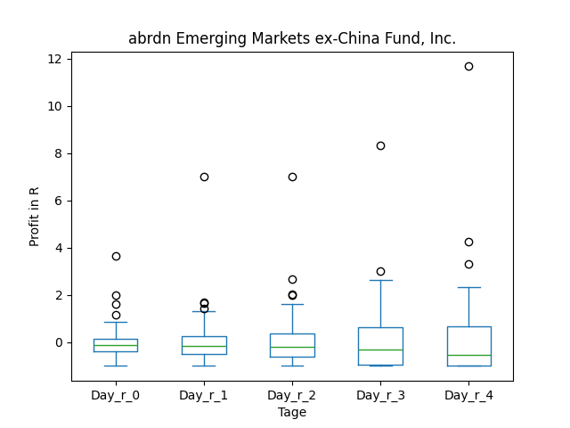
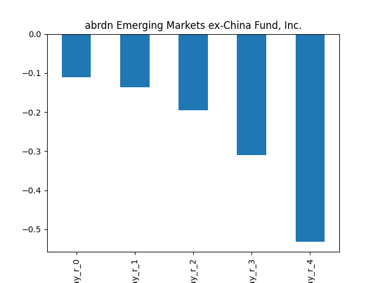
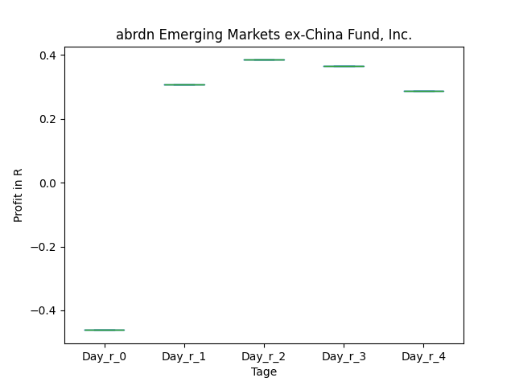
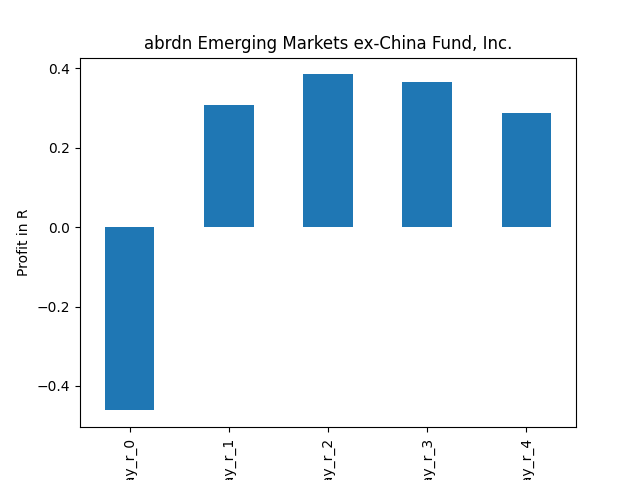

# dividend-shorter

bet on falling prices on payday **2025-03-25**.

## Signale

| Ticker   |   Divid Rate |   Close |   Volume |   last_close_volume |   Divid % | 5_Days_pos   | above_SMA_50   |
|:---------|-------------:|--------:|---------:|--------------------:|----------:|:-------------|:---------------|
| MNDO     |         0.22 |    2.05 |   283500 |              581175 |     10.73 | True         | True           |
| AEF      |         0.15 |    5.19 |   190900 |              990771 |      2.89 | True         | False          |

## MNDO

### Erwartung in R
|      |   Day_r_0 |   Day_r_1 |   Day_r_2 |   Day_r_3 |   Day_r_4 |   Treffer |
|:-----|----------:|----------:|----------:|----------:|----------:|----------:|
| ohne |       0.1 |       0.2 |       0.2 |       0.3 |       0.4 |        21 |
| mit  |     nan   |     nan   |     nan   |     nan   |     nan   |         0 |

### Ohne Filter

### Mit Filter

## AEF

### Erwartung in R
|      |   Day_r_0 |   Day_r_1 |   Day_r_2 |   Day_r_3 |   Day_r_4 |   Treffer |
|:-----|----------:|----------:|----------:|----------:|----------:|----------:|
| ohne |      -0.1 |      -0.1 |      -0.2 |      -0.3 |      -0.5 |        68 |
| mit  |      -0.5 |       0.3 |       0.4 |       0.4 |       0.3 |         1 |

### Ohne Filter

### Mit Filter

