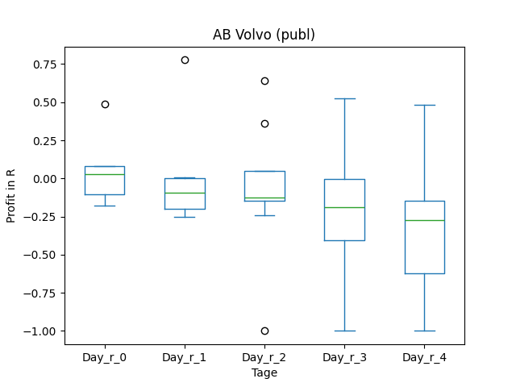
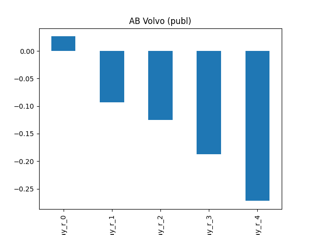
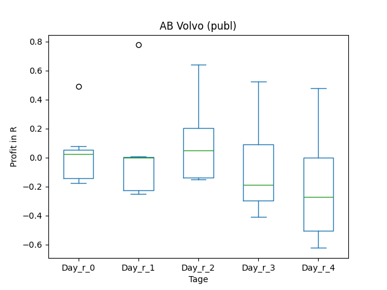
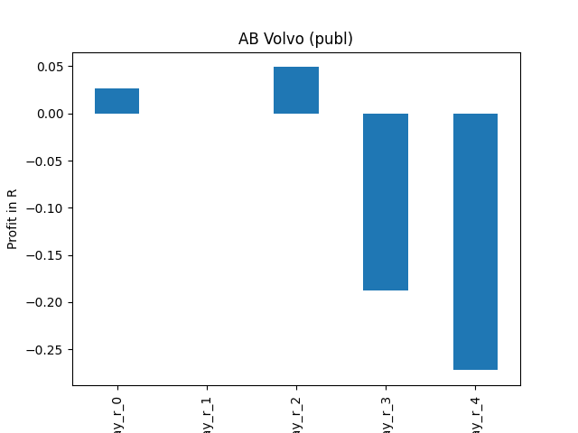
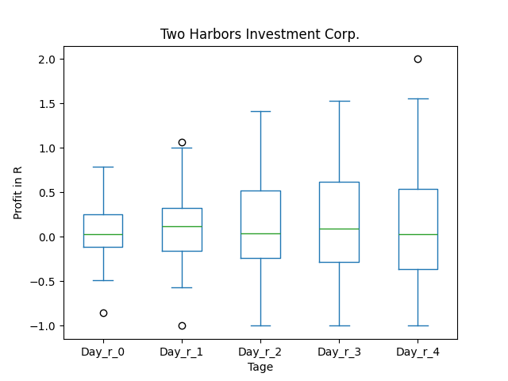
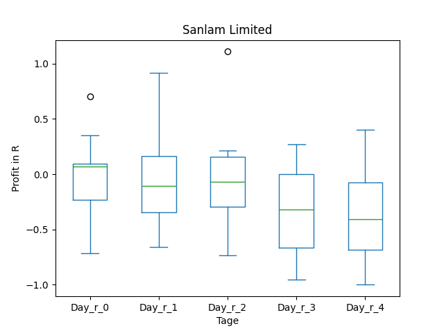
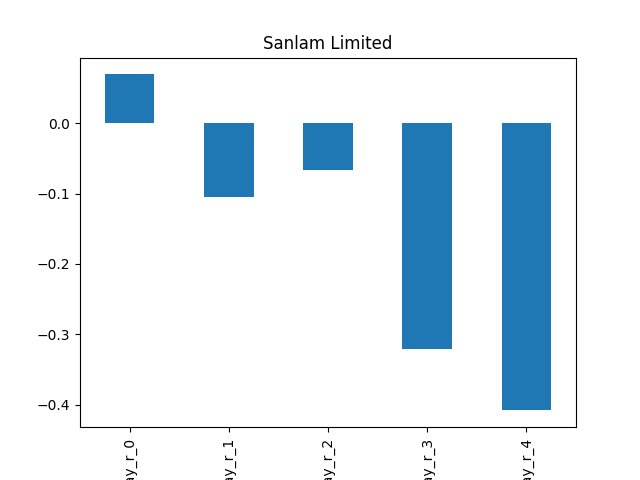

# dividend-shorter

bet on falling prices on payday **2025-04-04**.

## Signale

| Ticker   |   Divid Rate |   Close |          Volume |   last_close_volume |   Divid % | 5_Days_pos   | above_SMA_50   |
|:---------|-------------:|--------:|----------------:|--------------------:|----------:|:-------------|:---------------|
| VLVLY    |         0.73 |   28.03 |  83400          |             2337702 |      2.6  | False        | False          |
| VLVLY    |         0.95 |   28.03 |  83400          |             2337702 |      3.41 | False        | False          |
| TWO      |         0.45 |   12.87 |      2.6823e+06 |            34521201 |      3.5  | False        | False          |
| SLLDY    |         0.49 |    8.44 |  29300          |              247292 |      5.81 | False        | False          |
| NHPAP    |         0.46 |   14.2  |  10800          |              153360 |      3.25 | False        | False          |
| MONDY    |         1.01 |   28.89 |  25700          |              742473 |      3.49 | False        | False          |
| IGIC     |         0.85 |   26.02 | 150300          |             3910806 |      3.27 | True         | True           |
| CDZIP    |         0.55 |   19.43 |   7500          |              145725 |      2.83 | True         | True           |

## VLVLY

### Erwartung in R
|      |   Day_r_0 |   Day_r_1 |   Day_r_2 |   Day_r_3 |   Day_r_4 |   Treffer |
|:-----|----------:|----------:|----------:|----------:|----------:|----------:|
| ohne |         0 |      -0.1 |      -0.1 |      -0.2 |      -0.3 |         9 |
| mit  |         0 |       0   |       0   |      -0.2 |      -0.3 |         7 |

### Ohne Filter

### Mit Filter

## VLVLY

### Erwartung in R
|      |   Day_r_0 |   Day_r_1 |   Day_r_2 |   Day_r_3 |   Day_r_4 |   Treffer |
|:-----|----------:|----------:|----------:|----------:|----------:|----------:|
| ohne |         0 |      -0.1 |      -0.1 |      -0.2 |      -0.3 |         9 |
| mit  |         0 |       0   |       0   |      -0.2 |      -0.3 |         7 |

### Ohne Filter

### Mit Filter

## TWO

### Erwartung in R
|      |   Day_r_0 |   Day_r_1 |   Day_r_2 |   Day_r_3 |   Day_r_4 |   Treffer |
|:-----|----------:|----------:|----------:|----------:|----------:|----------:|
| ohne |       0   |       0.1 |       0   |       0   |       0   |        62 |
| mit  |       0.2 |       0.1 |       0.1 |       0.3 |       0.3 |         9 |

### Ohne Filter

### Mit Filter

## SLLDY

### Erwartung in R
|      |   Day_r_0 |   Day_r_1 |   Day_r_2 |   Day_r_3 |   Day_r_4 |   Treffer |
|:-----|----------:|----------:|----------:|----------:|----------:|----------:|
| ohne |       0.1 |      -0.1 |      -0.1 |      -0.3 |      -0.4 |        13 |
| mit  |      -0.4 |       0.2 |      -0.4 |      -1   |      -1   |         1 |

### Ohne Filter

### Mit Filter

## NHPAP

### Erwartung in R
|      |   Day_r_0 |   Day_r_1 |   Day_r_2 |   Day_r_3 |   Day_r_4 |   Treffer |
|:-----|----------:|----------:|----------:|----------:|----------:|----------:|
| ohne |       0.9 |       0.5 |       1.4 |         1 |       1.5 |         1 |
| mit  |     nan   |     nan   |     nan   |       nan |     nan   |         0 |

### Ohne Filter

### Mit Filter

## MONDY

### Erwartung in R
|      |   Day_r_0 |   Day_r_1 |   Day_r_2 |   Day_r_3 |   Day_r_4 |   Treffer |
|:-----|----------:|----------:|----------:|----------:|----------:|----------:|
| ohne |      -0.1 |         0 |      -0.3 |        -0 |      -0.1 |         8 |
| mit  |     nan   |       nan |     nan   |       nan |     nan   |         0 |

### Ohne Filter

### Mit Filter

## IGIC

### Erwartung in R
|      |   Day_r_0 |   Day_r_1 |   Day_r_2 |   Day_r_3 |   Day_r_4 |   Treffer |
|:-----|----------:|----------:|----------:|----------:|----------:|----------:|
| ohne |      -0   |      -0.1 |      -0.6 |      -0.7 |      -0.1 |        16 |
| mit  |       0.1 |       0.5 |      -0.4 |      -0.2 |      -0.1 |         1 |

### Ohne Filter

### Mit Filter

## CDZIP

### Erwartung in R
|      |   Day_r_0 |   Day_r_1 |   Day_r_2 |   Day_r_3 |   Day_r_4 |   Treffer |
|:-----|----------:|----------:|----------:|----------:|----------:|----------:|
| ohne |        -0 |       0.6 |       0.4 |       0.3 |       0.1 |        14 |
| mit  |       nan |     nan   |     nan   |     nan   |     nan   |         0 |

### Ohne Filter

### Mit Filter

