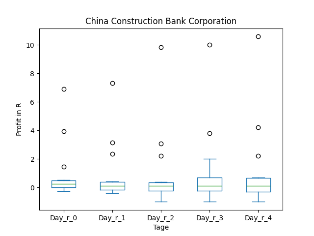
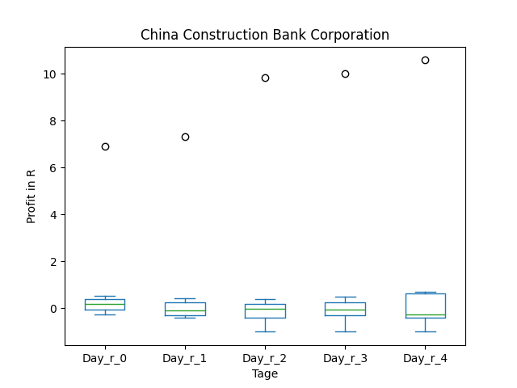
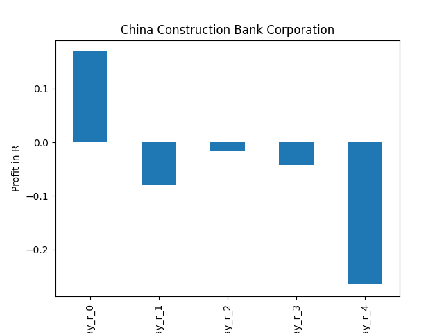
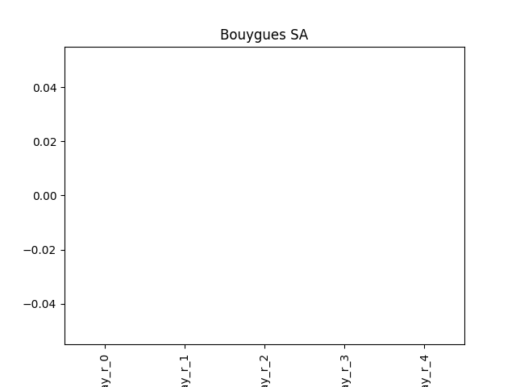
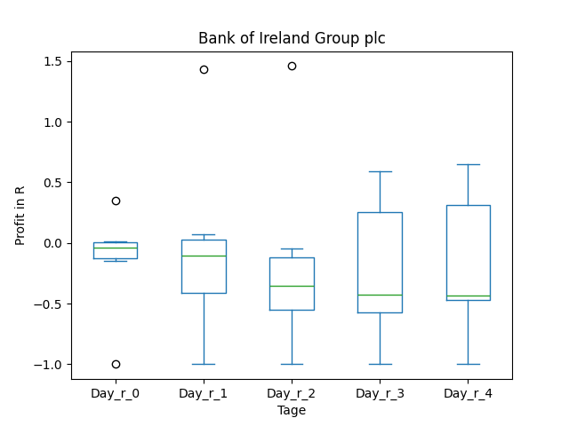
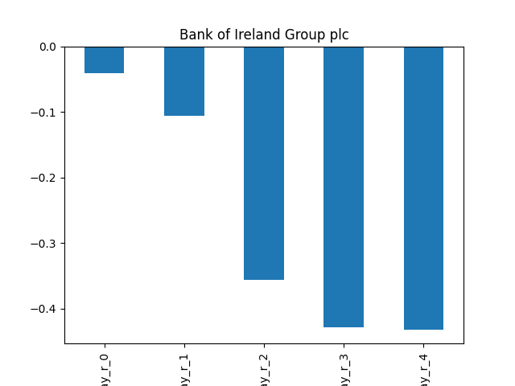

# dividend-shorter

bet on falling prices on payday **2025-05-02**.

## Signale

| Ticker   |   Divid Rate |   Close |   Volume |   last_close_volume |   Divid % | 5_Days_pos   | above_SMA_50   |
|:---------|-------------:|--------:|---------:|--------------------:|----------:|:-------------|:---------------|
| SDVKY    |         0.54 |   20.9  |    35800 |              748220 |      2.59 | False        | False          |
| JBSAY    |         0.68 |   15.91 |   234100 |             3724531 |      4.27 | False        | True           |
| DNBBY    |         1.49 |   26.38 |    21700 |              572446 |      5.65 | True         | True           |
| DANOY    |         0.47 |   17.26 |   147000 |             2537220 |      2.72 | True         | True           |
| CICHY    |         0.56 |   16.86 |    56200 |              947532 |      3.35 | False        | False          |
| BOUYY    |         0.44 |    8.9  |   168600 |             1500540 |      4.97 | True         | True           |
| BKRIY    |         0.31 |   12.14 |    12800 |              155392 |      2.55 | True         | True           |
| AXAHY    |         2.45 |   47.85 |    62800 |             3004980 |      5.12 | True         | True           |

## SDVKY

### Erwartung in R
|      |   Day_r_0 |   Day_r_1 |   Day_r_2 |   Day_r_3 |   Day_r_4 |   Treffer |
|:-----|----------:|----------:|----------:|----------:|----------:|----------:|
| ohne |         0 |       0   |      -0   |      -0.2 |      -0.3 |        15 |
| mit  |         0 |      -0.4 |      -0.4 |      -0.7 |      -0.7 |         1 |

### Ohne Filter

### Mit Filter

## JBSAY

### Erwartung in R
|      |   Day_r_0 |   Day_r_1 |   Day_r_2 |   Day_r_3 |   Day_r_4 |   Treffer |
|:-----|----------:|----------:|----------:|----------:|----------:|----------:|
| ohne |       0.1 |       0.5 |       0.5 |      -0.1 |      -1   |        16 |
| mit  |      -0.3 |      -0.2 |      -0.5 |      -0.5 |      -0.5 |         4 |

### Ohne Filter

### Mit Filter

## DNBBY

### Erwartung in R
|      |   Day_r_0 |   Day_r_1 |   Day_r_2 |   Day_r_3 |   Day_r_4 |   Treffer |
|:-----|----------:|----------:|----------:|----------:|----------:|----------:|
| ohne |       0.2 |         0 |      -0.1 |      -0.3 |      -0.2 |         4 |
| mit  |       0.2 |         0 |      -0.1 |      -0.3 |      -0.2 |         4 |

### Ohne Filter

### Mit Filter

## DANOY

### Erwartung in R
|      |   Day_r_0 |   Day_r_1 |   Day_r_2 |   Day_r_3 |   Day_r_4 |   Treffer |
|:-----|----------:|----------:|----------:|----------:|----------:|----------:|
| ohne |      -0.1 |      -0.1 |      -0.2 |       0.1 |       0.1 |        14 |
| mit  |       0.1 |      -0.1 |      -0.3 |       0.1 |       0.1 |         6 |

### Ohne Filter

### Mit Filter

## CICHY

### Erwartung in R
|      |   Day_r_0 |   Day_r_1 |   Day_r_2 |   Day_r_3 |   Day_r_4 |   Treffer |
|:-----|----------:|----------:|----------:|----------:|----------:|----------:|
| ohne |       0.3 |       0.1 |       0.1 |       0.1 |       0.1 |        14 |
| mit  |       0.2 |      -0.1 |      -0   |      -0   |      -0.3 |         8 |

### Ohne Filter

### Mit Filter

## BOUYY

### Erwartung in R
|      |   Day_r_0 |   Day_r_1 |   Day_r_2 |   Day_r_3 |   Day_r_4 |   Treffer |
|:-----|----------:|----------:|----------:|----------:|----------:|----------:|
| ohne |       nan |       nan |       nan |       nan |       nan |         0 |
| mit  |       nan |       nan |       nan |       nan |       nan |         0 |

### Ohne Filter

### Mit Filter

## BKRIY

### Erwartung in R
|      |   Day_r_0 |   Day_r_1 |   Day_r_2 |   Day_r_3 |   Day_r_4 |   Treffer |
|:-----|----------:|----------:|----------:|----------:|----------:|----------:|
| ohne |        -0 |      -0.1 |      -0.4 |      -0.4 |      -0.4 |         6 |
| mit  |       nan |     nan   |     nan   |     nan   |     nan   |         0 |

### Ohne Filter

### Mit Filter

## AXAHY

### Erwartung in R
|      |   Day_r_0 |   Day_r_1 |   Day_r_2 |   Day_r_3 |   Day_r_4 |   Treffer |
|:-----|----------:|----------:|----------:|----------:|----------:|----------:|
| ohne |         0 |       0.2 |       0.2 |       0.1 |         0 |        13 |
| mit  |         0 |       0.2 |       0.2 |       0.1 |         0 |        13 |

### Ohne Filter

### Mit Filter

