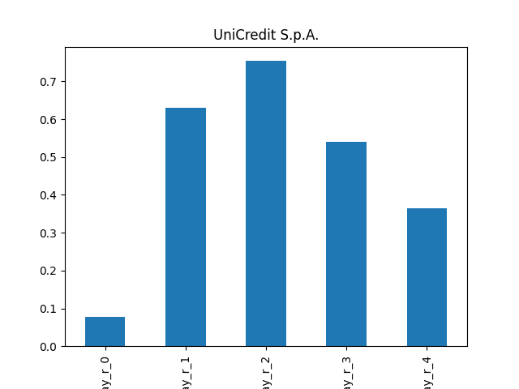
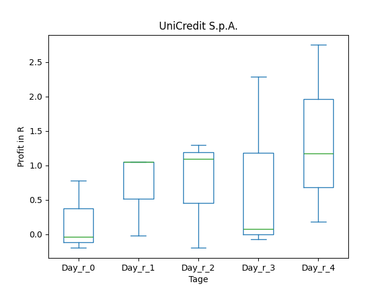
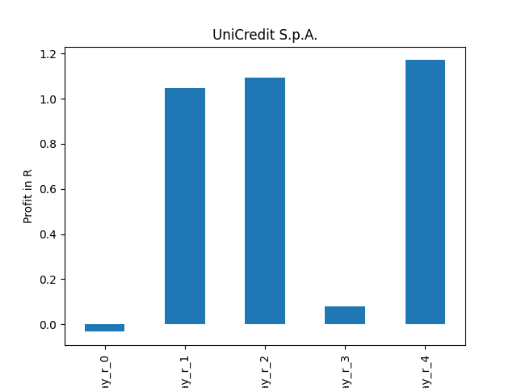
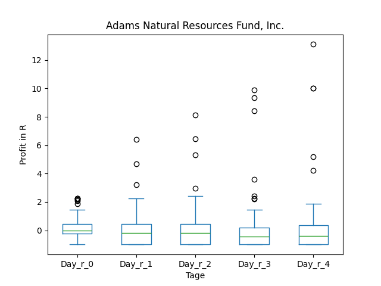
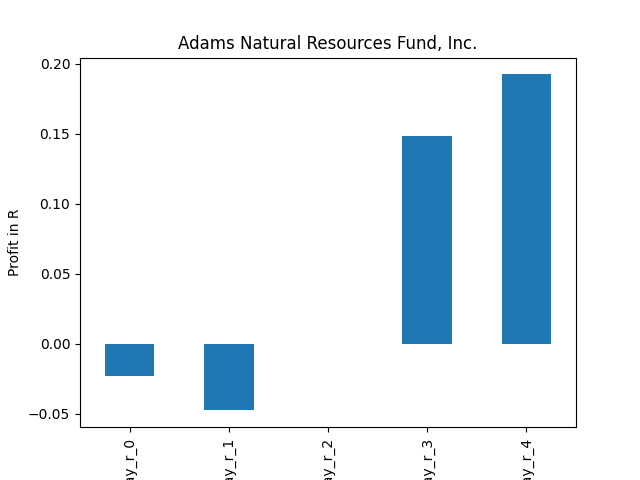
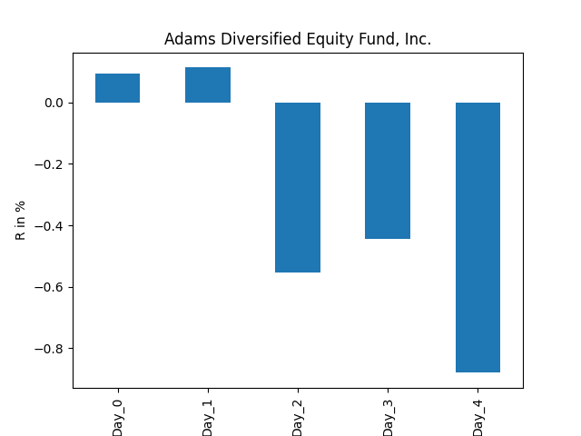

# dividend-shorter

bet on falling prices on payday

## VOD

### Erwartung
|      |   Day_0 |   Day_1 |   Day_2 |   Day_3 |   Day_4 |   Treffer |
|:-----|--------:|--------:|--------:|--------:|--------:|----------:|
| ohne |     0.2 |     0.6 |     0.4 |     0.8 |     0.5 |        42 |
| mit  |     0.5 |     0.6 |     1.1 |     1   |     0.4 |        22 |

### Ohne Filter

### Mit Filter

## UNCRY

### Erwartung in R
|      |   Day_0 |   Day_1 |   Day_2 |   Day_3 |   Day_4 |   Treffer |
|:-----|--------:|--------:|--------:|--------:|--------:|----------:|
| ohne |    -0.3 |     3.6 |     4.2 |     2.9 |     4.1 |         7 |
| mit  |    -0.3 |     4   |     4.7 |     0.3 |     4.5 |         3 |

### Ohne Filter

### Mit Filter

## PEO

### Erwartung in R
|      |   Day_0 |   Day_1 |   Day_2 |   Day_3 |   Day_4 |   Treffer |
|:-----|--------:|--------:|--------:|--------:|--------:|----------:|
| ohne |     0.1 |    -0.2 |     0.1 |    -0.1 |    -0.3 |        95 |
| mit  |    -0.1 |    -0.5 |    -0.2 |     0.5 |     1.2 |        12 |

### Ohne Filter

### Mit Filter

## ADX

### Erwartung in R
|      |   Day_0 |   Day_1 |   Day_2 |   Day_3 |   Day_4 |   Treffer |
|:-----|--------:|--------:|--------:|--------:|--------:|----------:|
| ohne |    -0.1 |    -0.2 |    -0.3 |    -0.5 |    -0.4 |       124 |
| mit  |     0.1 |     0.1 |    -0.6 |    -0.4 |    -0.9 |        18 |

### Ohne Filter

### Mit Filter

